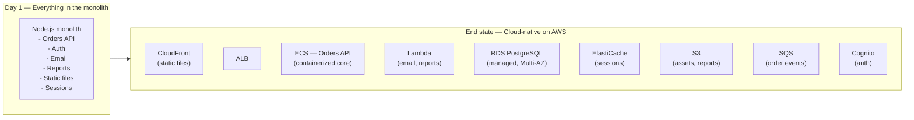

# Cloud Migration Lab — AWS


## Monolith to Cloud-Native on AWS

---

> **OrderFlow — 400,000 daily orders. Series B.**
>
> OrderFlow started five years ago as a weekend project — a single Node.js application, one PostgreSQL database, everything deployed on a single VPS. It worked. Orders came in. The company grew. Engineers were hired and they kept adding to the same codebase because it was easier than rebuilding. The VPS became a large EC2 instance. Then a larger one. Then two, load-balanced by hand.
>
> Now the CTO is facing the bill: a critical Black Friday outage caused by a single database connection pool exhausting under load. A deploy that takes 45 minutes and requires restarting the entire application. A codebase that three engineers touched last month and one of them just gave notice. Sessions stored in memory, so you cannot add a second server without users getting logged out.
>
> The board approved AWS migration. The CTO gave six months.
>
> The mandate: *"Move to AWS. Make it survive Black Friday. Make it something a new engineer can understand in their first week. Don't break orders in flight."*

---

## What makes this lab different

The GKE Platform Engineering Lab builds a platform from scratch. This lab simulates a **real migration** — the application already exists, already has users, already has constraints, and cannot simply be rewritten. Every phase is driven by a real business problem, and you solve it using the AWS service that was designed for exactly that problem.

You will learn AWS services the way you learn them in a job: by needing them.

---

## The monolith — what we start with

OrderFlow is a Node.js/Express application backed by PostgreSQL. Everything lives in a single repository and a single deployable unit:

```
orderflow/
├── src/
│   ├── routes/
│   │   ├── orders.js        # Create, read, update orders
│   │   ├── products.js      # Product catalog
│   │   ├── customers.js     # Customer management
│   │   └── auth.js          # Session-based auth
│   ├── models/              # Sequelize ORM models
│   ├── services/
│   │   ├── email.js         # Sends order confirmations via SMTP
│   │   ├── inventory.js     # Updates stock counts
│   │   └── reports.js       # Daily PDF reports (CPU-intensive)
│   └── app.js               # Express server
├── migrations/              # SQL schema migrations
├── public/                  # Static assets (images, JS, CSS)
├── Dockerfile
└── package.json
```

Everything that OrderFlow does — handle orders, authenticate users, send emails, generate reports, serve images — runs inside this single process. One crash kills all of it. One slow report blocks all API requests. One deploy restarts everything at once.

**The migration is not a rewrite. It is a series of targeted extractions and replacements, one problem at a time.**

---

## Migration strategy — the Strangler Fig pattern

Rather than rewriting the monolith, we use the [Strangler Fig pattern](https://martinfowler.com/bliki/StranglerFigApplication.html): incrementally route traffic away from the monolith to new cloud-native components, one capability at a time, until the monolith is retired.



Each phase extracts one concern and replaces it with the purpose-built AWS service. The monolith shrinks. The platform grows. Users notice nothing except that it is faster.

---

## Phases at a glance

| Phase | Title | What you build | AWS services introduced |
|---|---|---|---|
| 0 | Meet the Monolith | Containerize and run OrderFlow locally | Docker, docker-compose |
| 1 | AWS Foundations | VPC, IAM, Terraform state | VPC, IAM, S3 (Terraform state), EC2 |
| 2 | Lift and Shift | Move the monolith to AWS with minimal changes | EC2, RDS, ElastiCache, ALB, Route 53 |
| 3 | Containerize and ECS | Replace EC2 instances with managed containers | ECS Fargate, ECR, ALB target groups |
| 4 | CI/CD Pipeline | Automate build, test, and deploy | GitHub Actions, ECR, ECS rolling deploy |
| 5 | Extract Static Assets | Move files and images out of the monolith | S3, CloudFront, pre-signed URLs |
| 6 | Async with SQS/SNS | Decouple order events from the request path | SQS, SNS, EventBridge |
| 7 | Serverless for the Right Problems | Replace CPU-intensive and event-driven code with Lambda | Lambda, API Gateway, EventBridge Scheduler |
| 8 | Extract Auth to Cognito | Replace session-based auth with tokens | Cognito User Pools, JWT, ALB authentication |
| 9 | EKS — The Platform | Move the core API to Kubernetes for team scale | EKS, Helm, ALB Ingress Controller |
| 10 | Observability | Metrics, logs, traces across all components | CloudWatch, X-Ray, OpenTelemetry, Grafana |
| 11 | Security Hardening | Least privilege, secrets, WAF, threat detection | Secrets Manager, IAM policies, WAF, GuardDuty |
| 12 | Multi-Environment & Capstone | Production-grade promotion pipeline across dev/staging/prod | AWS Organizations, Terraform workspaces, GitOps |
| 13 | Data Platform & AI | Analytics data lake, real-time streaming, demand forecasting, and a GenAI order assistant | Kinesis, Glue, Athena, QuickSight, Bedrock, Forecast |

---

## Prerequisites

| Tool | Purpose |
|---|---|
| `docker` + `docker compose` | Run the monolith locally in Phase 0 |
| `aws` CLI v2 | Interact with AWS from the terminal |
| `terraform` 1.7+ | Provision all infrastructure as code |
| `kubectl` | Kubernetes CLI for Phase 9 onwards |
| `helm` | Kubernetes package manager |
| `node` 20 | Run the monolith locally |

**AWS account requirements:**
- An AWS account with billing enabled
- An IAM user or SSO profile with `AdministratorAccess` (scoped down in Phase 11)
- Estimated cost: ~$3–15/day when resources are running — always run `terraform destroy` when not actively working

**No prior AWS experience required.** Each phase introduces the services you need as you need them, with the context of why they exist.

---

## Phase instructions

Each phase has its own folder with full instructions, architecture diagrams, challenges, and cost breakdown.

| Phase | Folder |
|---|---|
| 0 — Meet the Monolith | [phase-0-meet-the-monolith/](phase-0-meet-the-monolith/README.md) |
| 1 — AWS Foundations | [phase-1-foundations/](phase-1-foundations/README.md) |
| 2 — Lift and Shift | [phase-2-lift-and-shift/](phase-2-lift-and-shift/README.md) |
| 3 — Containerize and ECS | [phase-3-ecs/](phase-3-ecs/README.md) |
| 4 — CI/CD Pipeline | [phase-4-cicd/](phase-4-cicd/README.md) |
| 5 — Static Assets | [phase-5-static-assets/](phase-5-static-assets/README.md) |
| 6 — Async with SQS/SNS | [phase-6-async/](phase-6-async/README.md) |
| 7 — Serverless | [phase-7-serverless/](phase-7-serverless/README.md) |
| 8 — Auth with Cognito | [phase-8-cognito/](phase-8-cognito/README.md) |
| 9 — EKS: The Platform | [phase-9-eks/](phase-9-eks/README.md) |
| 10 — Observability | [phase-10-observability/](phase-10-observability/README.md) |
| 11 — Security Hardening | [phase-11-security/](phase-11-security/README.md) |
| 12 — Multi-Environment & Capstone | [phase-12-capstone/](phase-12-capstone/README.md) |
| 13 — Data Platform & AI | [phase-13-data-ai/](phase-13-data-ai/README.md) |

---

## AWS certifications roadmap

This lab provides the practical foundation for all four AWS associate and professional certifications. Attempt them in order — each builds on the last.

| Certification | After completing | Key coverage in this lab |
|---|---|---|
| **AWS Solutions Architect Associate (SAA-C03)** | Phase 6 | VPC, EC2, RDS, S3, CloudFront, ECS, Lambda, IAM, Route 53, SQS/SNS |
| **AWS Developer Associate (DVA-C02)** | Phase 8 | CodePipeline, Lambda, X-Ray, DynamoDB, Cognito, API Gateway, ECS |
| **AWS SysOps Administrator Associate (SOA-C02)** | Phase 10 | CloudWatch, Config, Systems Manager, Trusted Advisor, Cost Explorer |
| **AWS Solutions Architect Professional (SAP-C02)** | Phase 12 | Organizations, Control Tower, multi-account, Cost Optimization, migration strategies |

---

## Cost breakdown by phase

All prices are AWS on-demand rates in `us-east-1` as of 2026. Costs assume resources run 24 hours — destroy at end of each session.

### Resource pricing reference

| Resource | Size | $/hour | $/day |
|---|---|---|---|
| NAT Gateway | — | $0.045 each | $1.08 each |
| EC2 | t3.small | $0.021 | $0.50 |
| EC2 | t3.medium | $0.042 | $1.00 |
| RDS PostgreSQL | db.t3.small Multi-AZ | $0.068 | $1.63 |
| RDS PostgreSQL | db.t3.micro Single-AZ | $0.017 | $0.41 |
| ElastiCache Redis | cache.t3.micro | $0.017 | $0.41 |
| ALB | — | $0.008 + LCU | ~$0.25 |
| ECS Fargate | 0.5 vCPU / 1 GB × 2 tasks | — | $1.19 |
| EKS control plane | — | $0.100 | $2.40 |
| EC2 node | t3.medium × 2 | $0.042 each | $2.00 |
| CloudWatch Logs | ~0.5 GB/day ingested | — | ~$0.30 |
| Managed Grafana | 1 active user | — | $0.30 |
| GuardDuty | small account (post-trial) | — | ~$1.00 |
| WAF Web ACL | — | — | $0.17 |
| AWS Config | ~50 resources | — | ~$0.20 |

---

### Phase-by-phase cost table

| Phase | Resources added | Resources removed | Net $/day | Cumulative $/day |
|---|---|---|---|---|
| **0** | None — local Docker only | — | $0 | $0 |
| **1** | VPC, 2× NAT GW, S3 bucket, DynamoDB lock | — | +$2.20 | **$2.20** |
| **2** | 2× EC2 t3.small, RDS Multi-AZ, ElastiCache, ALB, Route 53 | — | +$3.90 | **$6.10** |
| **3** | ECS Fargate ×2 (0.5 vCPU/1 GB), ECR | 2× EC2 | +$0.20 | **$6.30** |
| **4** | ECR image storage (~5 images) | — | +$0.05 | **$6.35** |
| **5** | S3 assets bucket, CloudFront distribution | — | +$0.05 | **$6.40** |
| **6** | SQS ×3, SNS topic, DLQ ×3 | — | ~$0 (free tier) | **$6.40** |
| **7** | Lambda functions, EventBridge Scheduler | — | ~$0 (free tier) | **$6.40** |
| **8** | Cognito User Pool | — | ~$0 (<50K MAU free) | **$6.40** |
| **9** | EKS control plane, 2× t3.medium nodes | ECS Fargate ×2 | +$3.21 | **$9.60** |
| **10** | CloudWatch Logs, Managed Prometheus, Managed Grafana | — | +$0.70 | **$10.30** |
| **11** | GuardDuty¹, Config, WAF, Security Hub, Inspector, Secrets Manager | — | +$1.65 | **$11.95** |
| **12** | ×3 environments (dev + staging + prod) + shared services | — | +$22 | **~$34** |
| **13** | Kinesis, Glue, Athena, QuickSight, Bedrock, Forecast (one-time train) | — | +$2.20 | **~$36** |

¹ GuardDuty has a **30-day free trial** per account. Phase 11 will cost ~$10.95/day during the trial, ~$11.95/day after.

---

### Phase 12 breakdown (multi-account)

Phase 12 is the only phase where costs jump significantly. Here is the per-account breakdown:

| Account | Key resources | $/day |
|---|---|---|
| **dev** | 1 NAT GW, EKS, 1× t3.small node, RDS Single-AZ | ~$5 |
| **staging** | 2 NAT GW, EKS, 2× t3.medium nodes, RDS Multi-AZ, ElastiCache | ~$10 |
| **prod** | 2 NAT GW, EKS, 2× t3.medium nodes, RDS Multi-AZ, ElastiCache, WAF | ~$11 |
| **shared** (audit + log archive) | GuardDuty, Config, Security Hub, CloudTrail (3 accounts) | ~$5 |
| **Total** | | **~$31–35/day** |

> Run Phase 12 in sprint mode — provision everything, complete the capstone scenario, destroy within 2–3 days. A full Phase 12 run costs ~$70–100.

---

### Monthly cost if you never destroy

This is what you would pay if resources stayed running all month — use this as the upper bound when setting billing alerts.

| Phase | Resources alive | Monthly cost |
|---|---|---|
| 1 | VPC + NAT GW | ~$66 |
| 2 | + EC2, RDS, ElastiCache, ALB | ~$183 |
| 3–8 | + ECS, S3, CloudFront, Lambda | ~$192 |
| 9 | + EKS, nodes (ECS removed) | ~$288 |
| 10 | + observability stack | ~$309 |
| 11 | + security stack | ~$358 |
| 12 | 3× environments | ~$1,000 |
| 13 | + data lake, Bedrock, QuickSight | ~$1,065 |

---

### Cost control checklist

Set these up before starting Phase 1:

```bash
# 1. Create a billing alert — pages you before costs spiral
aws budgets create-budget \
  --account-id $(aws sts get-caller-identity --query Account --output text) \
  --budget file://budget.json \
  --notifications-with-subscribers file://notifications.json

# 2. Tag every resource — makes Cost Explorer useful
# Every Terraform resource should have:
# tags = { Project = "orderflow", Phase = "2", Environment = "dev" }

# 3. Destroy when done with a phase
cd phase-X-*/terraform
terraform destroy -auto-approve
```

**The single most expensive resource to leave running:** NAT Gateway. Two NAT gateways cost $1,620/year doing nothing. Always destroy them when not actively working.

**Cheapest multi-day option:** After completing each phase, keep only RDS running (cheapest instance with a final snapshot) and destroy everything else. Restore from snapshot at the start of the next session.

> Always run `terraform destroy` when you finish a phase and are not actively working on the next.
> Set a **billing alert** in AWS Budgets at $50/month as a hard floor — increase it only when you intentionally start a new phase.

---

## Repository structure

```
cloud-migration-lab-aws/
├── orderflow/                    # The monolith — starting point
│   ├── src/
│   ├── Dockerfile
│   ├── docker-compose.yml
│   └── README.md
├── phase-0-meet-the-monolith/
├── phase-1-foundations/
│   └── terraform/
├── phase-2-lift-and-shift/
│   └── terraform/
├── phase-3-ecs/
│   └── terraform/
├── phase-4-cicd/
│   └── .github/workflows/
├── phase-5-static-assets/
├── phase-6-async/
├── phase-7-serverless/
├── phase-8-cognito/
├── phase-9-eks/
│   └── charts/
├── phase-10-observability/
├── phase-11-security/
├── phase-12-capstone/
├── phase-13-data-ai/
│   ├── terraform/           # Kinesis, Glue, Athena, Bedrock KB, Forecast
│   ├── glue-jobs/           # PySpark ETL scripts
│   ├── forecast/            # Dataset export scripts and predictor config
│   └── assistant/           # /assistant/ask Lambda handler
└── README.md
```

---

## How this lab compares to the GKE lab

| | GKE Platform Engineering Lab | AWS Cloud Migration Lab |
|---|---|---|
| **Starting point** | Blank repository | An existing monolithic application |
| **Cloud** | Google Cloud Platform | Amazon Web Services |
| **Theme** | Build a developer platform from scratch | Migrate and modernize a real application |
| **Learning model** | Technologies introduced by phase | Technologies introduced by the business problem they solve |
| **Container orchestration** | GKE (Kubernetes from day one) | ECS first, then EKS when the complexity justifies it |
| **Key skills** | Kubernetes, Helm, ArgoCD, Terraform | AWS services breadth, migration patterns, cost optimization |
| **Certification target** | CKA, CKS | SAA, DVA, SOA, SAP |
