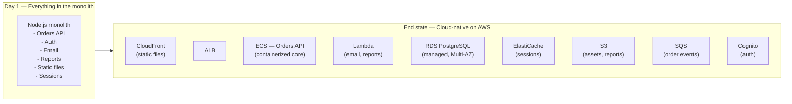
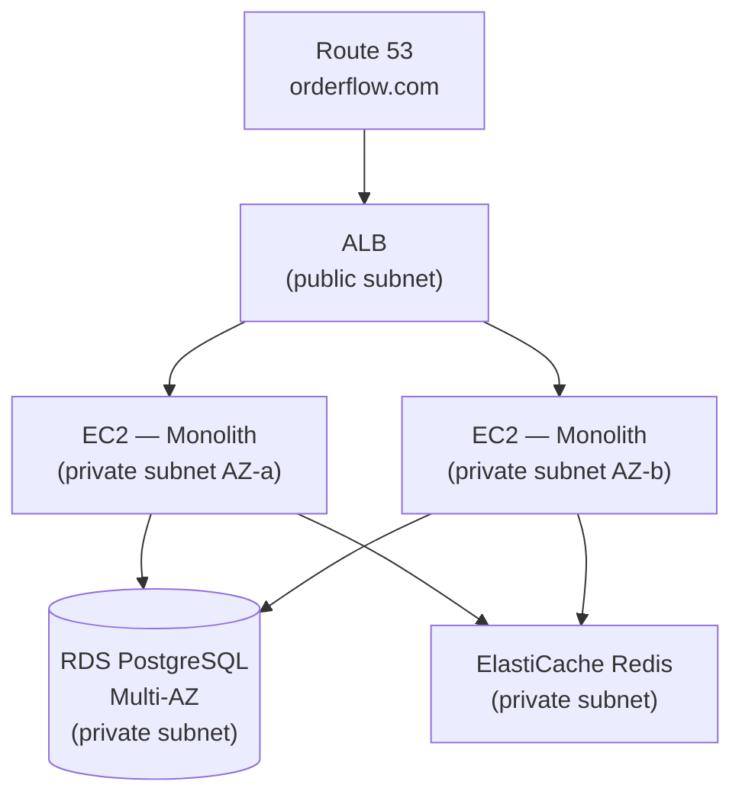
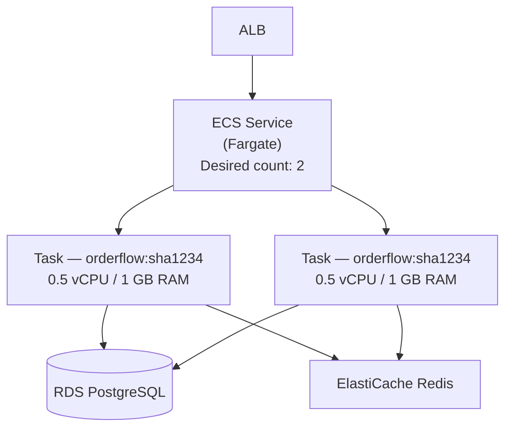
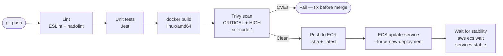
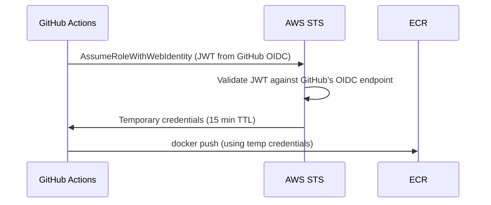
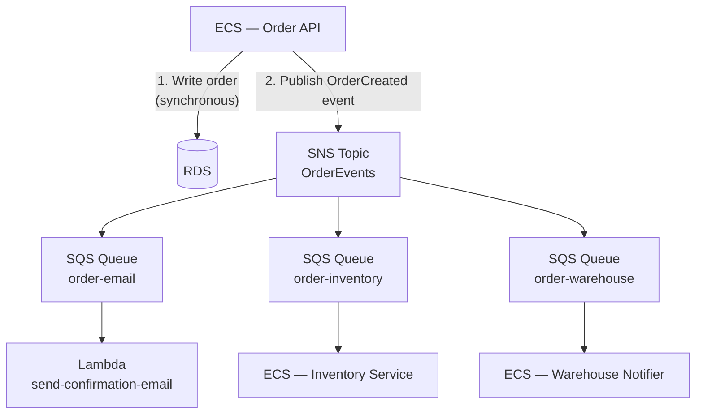
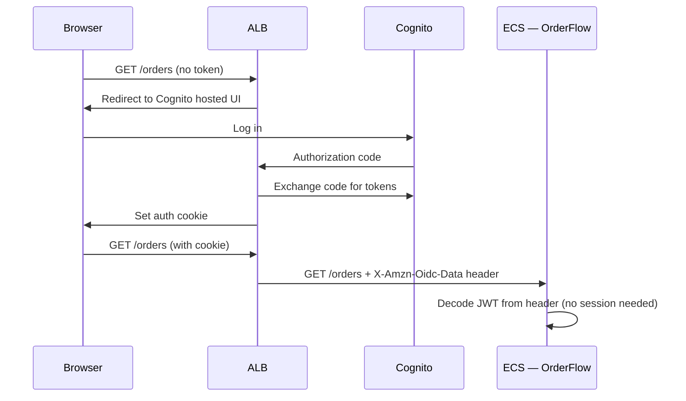
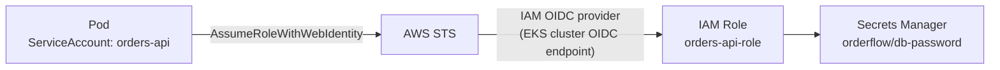
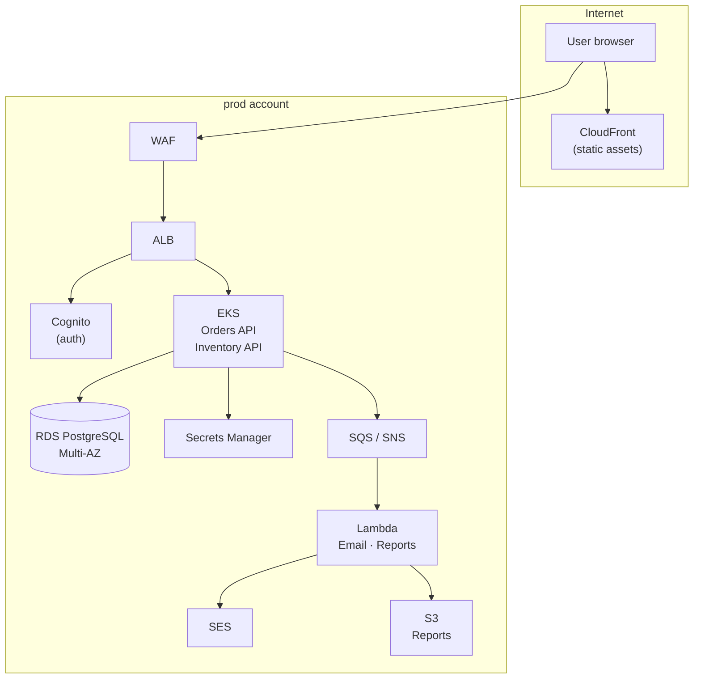

# Cloud Migration Lab — AWS

## Monolith to Cloud-Native on AWS

---

> **OrderFlow — 400,000 daily orders. Series B.**
>
> OrderFlow started five years ago as a weekend project — a single Node.js application, one PostgreSQL database, everything deployed on a single VPS. It worked. Orders came in. The company grew. Engineers were hired and they kept adding to the same codebase because it was easier than rebuilding. The VPS became a large EC2 instance. Then a larger one. Then two, load-balanced by hand.
>
> Now the CTO is facing the bill: a critical Black Friday outage caused by a single database connection pool exhausting under load. A deploy that takes 45 minutes and requires restarting the entire application. A codebase that three engineers touched last month and one of them just gave notice. Sessions stored in memory, so you cannot add a second server without users getting logged out.
>
> The board approved AWS migration. The CTO gave six months.
>
> The mandate: *"Move to AWS. Make it survive Black Friday. Make it something a new engineer can understand in their first week. Don't break orders in flight."*

---

## What makes this lab different

The GKE Platform Engineering Lab builds a platform from scratch. This lab simulates a **real migration** — the application already exists, already has users, already has constraints, and cannot simply be rewritten. Every phase is driven by a real business problem, and you solve it using the AWS service that was designed for exactly that problem.

You will learn AWS services the way you learn them in a job: by needing them.

---

## The monolith — what we start with

OrderFlow is a Node.js/Express application backed by PostgreSQL. Everything lives in a single repository and a single deployable unit:

```
orderflow/
├── src/
│   ├── routes/
│   │   ├── orders.js        # Create, read, update orders
│   │   ├── products.js      # Product catalog
│   │   ├── customers.js     # Customer management
│   │   └── auth.js          # Session-based auth
│   ├── models/              # Sequelize ORM models
│   ├── services/
│   │   ├── email.js         # Sends order confirmations via SMTP
│   │   ├── inventory.js     # Updates stock counts
│   │   └── reports.js       # Daily PDF reports (CPU-intensive)
│   └── app.js               # Express server
├── migrations/              # SQL schema migrations
├── public/                  # Static assets (images, JS, CSS)
├── Dockerfile
└── package.json
```

Everything that OrderFlow does — handle orders, authenticate users, send emails, generate reports, serve images — runs inside this single process. One crash kills all of it. One slow report blocks all API requests. One deploy restarts everything at once.

**The migration is not a rewrite. It is a series of targeted extractions and replacements, one problem at a time.**

---

## Migration strategy — the Strangler Fig pattern

Rather than rewriting the monolith, we use the [Strangler Fig pattern](https://martinfowler.com/bliki/StranglerFigApplication.html): incrementally route traffic away from the monolith to new cloud-native components, one capability at a time, until the monolith is retired.



Each phase extracts one concern and replaces it with the purpose-built AWS service. The monolith shrinks. The platform grows. Users notice nothing except that it is faster.

---

## Phases at a glance

| Phase | Title | What you build | AWS services introduced |
|---|---|---|---|
| 0 | Meet the Monolith | Containerize and run OrderFlow locally | Docker, docker-compose |
| 1 | AWS Foundations | VPC, IAM, Terraform state | VPC, IAM, S3 (Terraform state), EC2 |
| 2 | Lift and Shift | Move the monolith to AWS with minimal changes | EC2, RDS, ElastiCache, ALB, Route 53 |
| 3 | Containerize and ECS | Replace EC2 instances with managed containers | ECS Fargate, ECR, ALB target groups |
| 4 | CI/CD Pipeline | Automate build, test, and deploy | GitHub Actions, ECR, ECS rolling deploy |
| 5 | Extract Static Assets | Move files and images out of the monolith | S3, CloudFront, pre-signed URLs |
| 6 | Async with SQS/SNS | Decouple order events from the request path | SQS, SNS, EventBridge |
| 7 | Serverless for the Right Problems | Replace CPU-intensive and event-driven code with Lambda | Lambda, API Gateway, EventBridge Scheduler |
| 8 | Extract Auth to Cognito | Replace session-based auth with tokens | Cognito User Pools, JWT, ALB authentication |
| 9 | EKS — The Platform | Move the core API to Kubernetes for team scale | EKS, Helm, ALB Ingress Controller |
| 10 | Observability | Metrics, logs, traces across all components | CloudWatch, X-Ray, OpenTelemetry, Grafana |
| 11 | Security Hardening | Least privilege, secrets, WAF, threat detection | Secrets Manager, IAM policies, WAF, GuardDuty |
| 12 | Multi-Environment & Capstone | Production-grade promotion pipeline across dev/staging/prod | AWS Organizations, Terraform workspaces, GitOps |

---

## Prerequisites

| Tool | Purpose |
|---|---|
| `docker` + `docker compose` | Run the monolith locally in Phase 0 |
| `aws` CLI v2 | Interact with AWS from the terminal |
| `terraform` 1.7+ | Provision all infrastructure as code |
| `kubectl` | Kubernetes CLI for Phase 9 onwards |
| `helm` | Kubernetes package manager |
| `node` 20 | Run the monolith locally |

**AWS account requirements:**
- An AWS account with billing enabled
- An IAM user or SSO profile with `AdministratorAccess` (scoped down in Phase 11)
- Estimated cost: ~$3–15/day when resources are running — always run `terraform destroy` when not actively working

**No prior AWS experience required.** Each phase introduces the services you need as you need them, with the context of why they exist.

---

## Phase 0 — Meet the Monolith

### The problem

Before you can migrate anything, you must understand what you are migrating. The first failure mode in cloud migrations is moving a system nobody fully understands. You end up with the same problems, just hosted somewhere more expensive.

### What you will do

Run OrderFlow locally using Docker Compose. Break it intentionally. Understand its failure modes before you carry them into AWS.

```bash
git clone https://github.com/your-org/cloud-migration-lab-aws
cd cloud-migration-lab-aws/orderflow
docker compose up
```

The local stack runs:
- `app` — the Node.js monolith on port 3000
- `postgres` — PostgreSQL 15
- `redis` — for sessions (you will learn why this matters in Phase 2)

### Challenges

1. Run the monolith and place a test order via the API
2. Kill the app container mid-request — observe what happens to in-flight orders
3. Scale the app to 2 containers — log in on one, make a request on the other — observe the session problem
4. Generate a report while processing orders — observe request latency spike
5. Run `docker stats` and identify which operations use the most CPU and memory

### What you will observe

- Sessions stored in process memory break under horizontal scale
- Report generation blocks the Node.js event loop and delays order responses by 3–5 seconds
- There is no separation between stateless logic (order routing) and stateful storage (database, sessions, files)
- A single crash loses all in-flight state

These observations directly motivate the architecture choices in every subsequent phase.

### Outcome

A running local OrderFlow instance and a written list of the top 5 problems you need to solve before this can run reliably on AWS. Keep this list — every phase resolves one of them.

---

## Phase 1 — AWS Foundations

### AWS services introduced

| Service | What it does | Why we need it |
|---|---|---|
| **VPC** | Isolated private network | Nothing in AWS is reachable without a VPC — it is the foundation for everything |
| **IAM** | Identity and access management | Every AWS resource interaction requires an identity and a policy |
| **S3** | Object storage | Stores Terraform state — but also used in every subsequent phase |
| **EC2** (baseline) | Virtual machines | The starting point before we containerize |

### The problem

You cannot just start deploying to AWS. You need a network your resources will live in, identities that control who can do what, and a place to store Terraform state that is not your laptop.

### Approach: infrastructure as code from day one

Every resource in this lab is created with Terraform. Never click in the console to create production resources — the console does not version-control what you did or why.

```
phase-1-foundations/
├── terraform/
│   ├── backend.tf          # S3 + DynamoDB state backend
│   ├── vpc.tf              # VPC, subnets, route tables, NAT gateway
│   ├── iam.tf              # Roles and policies for app workloads
│   └── variables.tf
└── README.md
```

**VPC design:**

```
10.0.0.0/16
├── Public subnets (10.0.1.0/24, 10.0.2.0/24)   — ALB, NAT gateway
└── Private subnets (10.0.10.0/24, 10.0.11.0/24) — app servers, databases
```

Public subnets hold load balancers and NAT gateways. Application servers and databases live in private subnets with no direct internet access — they reach the internet through the NAT gateway when needed (e.g., to pull npm packages), but nothing outside can reach them directly.

**State backend:**

```hcl
terraform {
  backend "s3" {
    bucket         = "orderflow-tfstate-<account-id>"
    key            = "dev/terraform.tfstate"
    region         = "us-east-1"
    dynamodb_table = "orderflow-tfstate-lock"
    encrypt        = true
  }
}
```

The DynamoDB table provides state locking — if two engineers run `terraform apply` simultaneously, one waits rather than corrupting the state file.

### Challenges

1. Create the S3 bucket and DynamoDB lock table manually (this is the one thing you do in the console — because Terraform cannot store its own state before the bucket exists)
2. Write Terraform to provision the VPC with public and private subnets across 2 AZs
3. Add a NAT gateway in each public subnet so private resources can reach the internet
4. Create an IAM role for EC2 instances with `AmazonSSMManagedInstanceCore` so you can connect without SSH keys
5. Run `terraform plan` and verify all resources before applying
6. Tag every resource with `Environment=dev` and `Project=orderflow`

### AWS concept: Availability Zones

Every AWS region contains multiple Availability Zones — physically separate data centres within the same region. Spreading resources across 2 AZs means a data centre failure does not take down your application. Always provision at least 2 AZs for anything that needs to survive.

### Outcome

A VPC with public/private subnets across 2 AZs, Terraform state in S3 with locking, and IAM roles ready for the workloads in Phase 2.

---

## Phase 2 — Lift and Shift

### AWS services introduced

| Service | What it does | Why we need it |
|---|---|---|
| **EC2** | Virtual machines | Runs the monolith — same as the VPS, but managed by AWS |
| **RDS PostgreSQL** | Managed relational database | Removes the ops burden of running PostgreSQL yourself |
| **ElastiCache (Redis)** | Managed in-memory cache | Solves the session problem observed in Phase 0 |
| **ALB** | Application Load Balancer | Distributes traffic across multiple app servers |
| **Route 53** | DNS | Maps your domain to the ALB |
| **ACM** | Certificate Manager | Free TLS certificates, auto-renewed |

### The problem

The OrderFlow VPS will be decommissioned. The shortest path to AWS is a "lift and shift" — move the monolith to EC2 with minimum code changes. This is not the end state. It is a stable platform from which to run every subsequent phase.

### Why RDS instead of PostgreSQL on EC2?

Running PostgreSQL on an EC2 instance means you are responsible for: backups, failover, patching, storage scaling, and replication. RDS handles all of this. It costs more than a raw EC2 instance running Postgres, but when your database fails at 2 AM, you want AWS to page their on-call, not yours.

RDS Multi-AZ runs a synchronous standby in a second AZ. If the primary fails, AWS promotes the standby in under 60 seconds — automatically, without you doing anything.

### Why ElastiCache instead of Redis on EC2?

The same argument applies. ElastiCache also solves the session problem from Phase 0: when the monolith runs on 2 EC2 instances behind an ALB, both instances read and write session data to the same ElastiCache cluster rather than storing it in process memory.

```
Before Phase 2:
  User → EC2-A (session stored in EC2-A memory) → next request goes to EC2-B → logged out

After Phase 2:
  User → ALB → EC2-A or EC2-B → ElastiCache (shared sessions) → always logged in
```

### Architecture after Phase 2



### Challenges

1. Provision an RDS PostgreSQL instance in the private subnets from Phase 1. Enable Multi-AZ. Store the password in AWS Secrets Manager (not in Terraform state).
2. Provision an ElastiCache Redis cluster. Update the monolith's session store to point at it.
3. Create a launch template for EC2 and an Auto Scaling Group (min: 1, max: 3) in the private subnets.
4. Create an ALB in the public subnets. Add a target group pointing at the Auto Scaling Group. Configure health checks on `GET /health`.
5. Request a certificate in ACM. Add an HTTPS listener on the ALB. Redirect HTTP to HTTPS.
6. Run the same session test from Phase 0 — log in on one instance, make a request through the ALB (which may route to the other) — confirm sessions persist.
7. Simulate an RDS failover (`aws rds reboot-db-instance --force-failover`) — measure how long orders are unavailable.

### Outcome

OrderFlow runs on AWS, survives a server failure, and the session bug from Phase 0 is resolved. The monolith code is unchanged — only its environment changed.

---

## Phase 3 — Containerize and ECS

### AWS services introduced

| Service | What it does | Why we need it |
|---|---|---|
| **ECR** | Elastic Container Registry | Stores Docker images in AWS, integrated with IAM |
| **ECS Fargate** | Serverless containers | Runs containers without managing EC2 instances |
| **ECS Service** | Long-running container manager | Handles desired count, health checks, rolling deploys |
| **ECS Task Definition** | Container specification | Defines the image, CPU, memory, environment variables |

### The problem

EC2 Auto Scaling Groups require you to manage AMIs, instance types, patching, and bootstrapping scripts. Every deploy is: build image, push to registry, update the launch template, refresh the Auto Scaling Group, wait for instances to drain. It is slow and error-prone.

ECS Fargate removes the EC2 layer entirely. You define a task (a container with CPU, memory, and environment), a service (how many copies to run), and AWS handles the rest. Deploys become: push a new image, update the task definition, ECS does a rolling replacement.

### Why not just use Kubernetes?

ECS Fargate is the right choice at this stage because:
- No control plane to manage
- Simpler operational model — a team of 5 can run it without a dedicated platform engineer
- Native integration with IAM (task roles), ALB (target groups), CloudWatch (logs)
- Lower cost at small scale than EKS

When the team grows and needs multi-team service isolation, progressive delivery, and a self-service developer platform, the answer is EKS — that is Phase 9.

### Architecture after Phase 3



### Challenges

1. Create an ECR repository for `orderflow`. Push the image from Phase 0.
2. Write an ECS Task Definition for the monolith. Grant it an IAM task role with permission to read from Secrets Manager.
3. Update the app to read `DB_PASSWORD` from Secrets Manager at startup (replace the hardcoded env var).
4. Create an ECS Service with desired count 2 in the private subnets. Wire it to the ALB target group.
5. Deploy a new image version — observe the rolling replace: ECS starts new tasks, waits for health checks to pass, then drains and stops old tasks. No downtime.
6. Scale down to 0 tasks after hours using an ECS scheduled scaling action (cost control).

### AWS concept: IAM task roles

Unlike EC2 instance profiles (where all processes on the instance share one role), ECS task roles are per-container. The OrderFlow container can read from Secrets Manager. A future reporting container can write to S3. Neither can do what the other can do. Least privilege at the container level.

### Outcome

OrderFlow runs on ECS Fargate with zero EC2 instances to manage. Deploys take 2–3 minutes and require zero downtime. The EC2 Auto Scaling Group from Phase 2 is decommissioned.

---

## Phase 4 — CI/CD Pipeline

### AWS services introduced

| Service | What it does | Why we need it |
|---|---|---|
| **ECR image scanning** | Trivy-compatible vulnerability scanning | Catch CVEs before images reach production |

*(This phase uses GitHub Actions rather than AWS CodePipeline — same reason as the GKE lab: GitHub Actions is more widely used and teaches transferable skills.)*

### The problem

Right now, deploying a change requires running commands manually: `docker build`, `docker push`, `aws ecs update-service`. This is fine for one engineer. It breaks down at three.

The pipeline automates the path from commit to production with quality gates: lint, test, build, scan, push, deploy.

### Pipeline design



### Challenges

1. Set up GitHub Actions OIDC trust with AWS (no long-lived access keys — same principle as GKE Workload Identity)
2. Write the CI workflow: lint → test → build → Trivy scan → push to ECR
3. Write the CD step: update ECS task definition with new image SHA, force new deployment, wait for stability
4. Add a `workflow_dispatch` input for promoting a specific SHA to staging
5. Protect the `main` branch: require status checks to pass before merge
6. Simulate a CVE: add a vulnerable npm package, confirm the pipeline fails and prevents the push

### AWS concept: OIDC federation (no static keys)



Never store AWS access keys as GitHub secrets. OIDC federation issues temporary credentials that expire — there is nothing to leak and nothing to rotate.

### Outcome

Every push to `main` automatically builds, scans, and deploys to dev. No engineer runs deployment commands manually. CVEs in the image block the deploy.

---

## Phase 5 — Extract Static Assets to S3 + CloudFront

### AWS services introduced

| Service | What it does | Why we need it |
|---|---|---|
| **S3** | Object storage | Stores static files (images, CSS, JS) outside the app container |
| **CloudFront** | CDN | Caches static files at edge locations globally, reduces latency |
| **S3 pre-signed URLs** | Time-limited access to private objects | Let users upload/download order attachments without routing through the app |

### The problem

The OrderFlow monolith currently serves product images, CSS, and JavaScript from its own process. This means:
- Static files consume CPU and memory in the same container as the business logic
- A deploy replaces all containers simultaneously — users experience a brief gap where static assets are unavailable
- Users in London downloading a 5 MB product image are hitting servers in `us-east-1`

### How it works after this phase

```
Before:
  Browser → ALB → ECS (serves /public/images/product-123.jpg)

After:
  Browser → CloudFront → S3 (serves product-123.jpg from nearest edge)
  Browser → ALB → ECS (only handles API requests and HTML)
```

CloudFront has 600+ edge locations. An image cached at a Frankfurt edge point is served from Frankfurt — not from a US data centre. Page load times drop for international users without any application changes.

### Challenges

1. Create an S3 bucket for static assets with public access blocked (all access goes through CloudFront)
2. Create a CloudFront distribution with an Origin Access Control (OAC) pointing at the S3 bucket
3. Upload the OrderFlow static assets to S3. Update the app's static file references to use the CloudFront URL.
4. Implement order attachment upload: generate a pre-signed S3 URL in the API, return it to the browser, browser uploads directly to S3 — the file never passes through your application server.
5. Set cache-control headers: `max-age=31536000` for versioned assets (JS/CSS with content hashes), `max-age=3600` for product images
6. Invalidate the CloudFront cache for a specific path after an update — observe the cost ($0.005/1000 invalidation paths) and understand why versioned filenames are better

### Outcome

Static assets are served from CloudFront at edge. The ECS container CPU drops noticeably. Order attachment uploads bypass the app server. Deploying a new version of the app does not affect static asset availability.

---

## Phase 6 — Decouple with SQS and SNS

### AWS services introduced

| Service | What it does | Why we need it |
|---|---|---|
| **SQS** | Message queue | Decouples the order creation response from downstream processing |
| **SNS** | Pub/sub notifications | Fan out a single event to multiple consumers |
| **EventBridge** | Event bus with routing rules | Routes events from AWS services and custom apps to targets |

### The problem

When a customer places an order, the OrderFlow monolith currently does all of this synchronously in the same HTTP request:
1. Write the order to PostgreSQL
2. Deduct inventory
3. Send a confirmation email
4. Notify the warehouse system
5. Update the daily sales report

If the email service is slow, the customer waits. If the warehouse API is down, the order fails even though the customer's payment went through. If any step throws, the entire transaction rolls back.

The customer only needs to know the order was received. Everything else can happen asynchronously.

### Architecture after Phase 6



The HTTP response returns as soon as the order is written to the database and the event is published. Everything downstream is best-effort and retried automatically if it fails.

### AWS concept: at-least-once delivery

SQS guarantees that every message is delivered **at least once** but not necessarily exactly once. Your consumers must be **idempotent**: processing the same message twice should produce the same result as processing it once. For order confirmation emails: check if the email was already sent before sending it. For inventory deduction: use a database transaction with a unique order ID constraint.

### Challenges

1. Create an SNS topic `orderflow-order-events`
2. Create three SQS queues subscribing to the SNS topic. Add a dead-letter queue (DLQ) to each — messages that fail 3 times land in the DLQ for manual inspection
3. Refactor the order creation endpoint: write to DB, publish to SNS, return 201. Remove all synchronous downstream calls.
4. Write a Lambda function triggered by the `order-email` SQS queue. Use AWS SES to send the confirmation email.
5. Simulate a consumer failure: stop the inventory service while placing orders. Confirm orders still succeed and the inventory messages accumulate in the queue. Restart the service and watch it drain.
6. Set a SQS message visibility timeout larger than your consumer's processing time. Understand what happens if it is too short (duplicate processing).

### Outcome

Order placement response time drops by the time previously spent on email + inventory + warehouse calls. Downstream failures no longer cause order failures. The dead-letter queues give you visibility into what failed and why.

---

## Phase 7 — Serverless for the Right Problems

### AWS services introduced

| Service | What it does | Why we need it |
|---|---|---|
| **Lambda** | Functions as a service | Runs code in response to events without managing servers |
| **API Gateway** | Managed HTTP/WebSocket API layer | Routes HTTP requests to Lambda functions or other AWS services |
| **EventBridge Scheduler** | Cron-like scheduled invocations | Replaces cron jobs that ran inside the monolith |
| **Step Functions** | Orchestrated workflows | Coordinates multi-step processes with retries and branching |

### The problem

The daily sales report in OrderFlow runs as a cron job inside the Node.js process. It generates a PDF, emails it to finance, and writes a summary to PostgreSQL. It runs at 6 AM and takes 8 minutes. During those 8 minutes, Node's event loop is partially blocked and API latency spikes.

Lambda is not the answer for everything. But it is the right answer for:
- **Event-driven functions** that run for seconds in response to a trigger (send email, process upload)
- **Scheduled jobs** that run on a timer (daily reports, cleanup tasks)
- **Glue code** that connects AWS services without maintaining a server

### When Lambda is the wrong answer

Lambda has cold starts, a 15-minute maximum duration, and an execution model that is fundamentally different from a long-running server. Do not put your order API on Lambda. Keep it on ECS where it belongs. Use Lambda for what it was designed for.

### What moves to Lambda in this phase

| Current location | What it does | Lambda trigger |
|---|---|---|
| Monolith cron | Generate daily PDF report, email to finance | EventBridge Scheduler (cron) |
| Monolith email service | Send order confirmation emails | SQS (from Phase 6) |
| New | Resize uploaded product images on upload | S3 event notification |
| New | Send low-stock alerts when inventory drops | EventBridge rule on DynamoDB stream |

### Challenges

1. Extract the daily report generator into a Lambda function. Trigger it with EventBridge Scheduler at `cron(0 6 * * ? *)`. Write the PDF to S3 and send the S3 URL via SES.
2. The report takes 8 minutes — but Lambda has a 15-minute limit. Measure actual duration and confirm it fits. If it does not, refactor it into a Step Functions workflow that splits the work.
3. Add an S3 event notification: when a product image is uploaded to the `uploads/` prefix, invoke a Lambda that resizes it to 300×300 and writes to `thumbnails/`.
4. Write a Lambda to send low-stock SNS alerts when an inventory item drops below 10 units. Trigger it from the inventory SQS queue.
5. Delete the cron code from the monolith. Measure the reduction in container CPU during report generation time.

### AWS concept: Lambda pricing model

Lambda charges per request ($0.0000002/request) and per GB-second of compute time ($0.0000166667/GB-second). The report generator at 512 MB RAM running for 8 minutes = 0.5 GB × 480 seconds = 240 GB-seconds = $0.004 per run. Running daily: $0.12/month. The same workload on a dedicated EC2 instance would cost $15+/month. Lambda's economics are compelling for intermittent workloads.

### Outcome

The monolith no longer runs any cron jobs or non-request-path logic. The event-driven email and report functions are independently deployable. Container CPU profiles are flat during peak hours.

---

## Phase 8 — Extract Auth to Cognito

### AWS services introduced

| Service | What it does | Why we need it |
|---|---|---|
| **Cognito User Pools** | Managed user directory | Handles sign-up, sign-in, MFA, password reset — without writing auth code |
| **Cognito Identity Pools** | Federated identities | Maps authenticated users to AWS credentials for direct-to-S3 uploads |
| **ALB authentication** | OIDC integration on the load balancer | Enforces authentication before requests reach your containers |

### The problem

OrderFlow's auth is a custom session-based system: the user logs in, the server writes a session to Redis, every request reads the session to determine who the user is. This works but:
- Password reset, MFA, account lockout, social login — all custom code
- Sessions in Redis require ElastiCache to be available for every request
- No token-based API access for mobile or third-party integrations

Cognito provides all of this as a managed service. You define user pool configuration. Cognito handles the implementation.

### How ALB authentication works



The ALB handles the entire OAuth flow. Your application receives a signed JWT in a request header. No auth middleware. No session store. No Redis dependency for authentication.

### Challenges

1. Create a Cognito User Pool with email sign-in, MFA optional, and a hosted UI
2. Configure the ALB listener to use Cognito for authentication (`authenticate-cognito` action)
3. Migrate existing users: export from PostgreSQL, import to Cognito via the `AdminCreateUser` API (with a temporary password and `FORCE_CHANGE_PASSWORD` status)
4. Update OrderFlow to read the user identity from the `X-Amzn-Oidc-Data` JWT header instead of the Redis session
5. Remove the custom auth routes (`/login`, `/logout`, `/register`) from the monolith — Cognito's hosted UI replaces them
6. Remove the ElastiCache session store dependency from the app (ElastiCache is still used for query caching, but no longer for sessions)

### Outcome

Auth is fully managed by Cognito. The monolith has no auth code. Session infrastructure complexity is eliminated. MFA is available to all users with zero additional code.

---

## Phase 9 — EKS: The Platform Layer

### AWS services introduced

| Service | What it does | Why we need it |
|---|---|---|
| **EKS** | Managed Kubernetes | Kubernetes control plane managed by AWS |
| **EKS Fargate profiles** | Serverless Kubernetes nodes | Run pods without managing EC2 node groups |
| **ALB Ingress Controller** | Kubernetes ingress via ALB | Routes external traffic to Kubernetes services |
| **EBS CSI Driver** | Persistent volumes on EKS | Provision EBS volumes for stateful workloads |
| **AWS Load Balancer Controller** | ALB/NLB from Kubernetes | Manages ALB resources from Kubernetes manifests |

### The problem

OrderFlow has grown. What started as one team with one service is now four teams working on five services. ECS is operationally simple but does not scale well for multi-team environments:
- No namespace-based isolation between teams
- No standard way to define service-to-service policies
- Each new service requires manual ECS infrastructure setup
- No self-service deployment without IAM changes

Kubernetes solves the multi-team problem with namespaces, RBAC, NetworkPolicies, and a standard deployment model that any engineer can learn once and apply everywhere.

### What moves to EKS

Not everything. Lambda functions stay Lambda. RDS stays RDS. S3 stays S3. What moves is the **long-running API services** that need the Kubernetes feature set:

| Workload | Before | After |
|---|---|---|
| Orders API | ECS Service | EKS Deployment |
| Inventory Service | ECS Service | EKS Deployment |
| Warehouse Notifier | ECS Service | EKS Deployment |
| Report Generator | Lambda | Lambda (unchanged) |
| Email Sender | Lambda | Lambda (unchanged) |
| Static Assets | CloudFront/S3 | CloudFront/S3 (unchanged) |

### Challenges

1. Provision an EKS cluster with Terraform. Use managed node groups (not Fargate profiles for the core API — Fargate on EKS has limitations around DaemonSets and storage).
2. Install the AWS Load Balancer Controller via Helm. This controller watches Kubernetes `Ingress` resources and creates ALBs in AWS automatically.
3. Deploy the Orders API as a Helm chart. Configure the `Ingress` with ALB annotations. Confirm external traffic routes through.
4. Configure IRSA (IAM Roles for Service Accounts) — the Kubernetes equivalent of ECS task roles. The Orders API pod gets an IAM role that can read from Secrets Manager. Other pods cannot.
5. Set up cluster autoscaler or Karpenter (Karpenter is preferred — it provisions the right instance type for the workload rather than scaling a fixed node group).
6. Apply NetworkPolicies: default-deny-all in the `orderflow` namespace, then explicit allow rules between services.

### AWS concept: IRSA



IRSA binds a Kubernetes ServiceAccount to an IAM role. The binding is verified by the EKS OIDC provider. No credentials in environment variables. No shared instance profiles. One IAM role per service.

### Outcome

All long-running services run on EKS with namespace isolation, RBAC, and NetworkPolicies. Each service has its own IAM role via IRSA. New services are deployed with `helm install` — no manual AWS console work.

---

## Phase 10 — Observability

### AWS services introduced

| Service | What it does | Why we need it |
|---|---|---|
| **CloudWatch Logs** | Centralized log storage | All containers, Lambda functions, and AWS services log here |
| **CloudWatch Metrics** | AWS service metrics | ALB request counts, ECS CPU, RDS connections — all built-in |
| **CloudWatch Alarms** | Threshold-based alerts | Page on-call when error rate exceeds threshold |
| **X-Ray** | Distributed tracing | Trace a single request across Lambda → ECS → RDS |
| **Managed Grafana** | Dashboards | Unified view across CloudWatch, X-Ray, and custom metrics |

### The problem

OrderFlow is now distributed across ECS, EKS, Lambda, RDS, SQS, and CloudFront. A customer reports that their order confirmation email never arrived. Where do you start looking?

Without distributed tracing, you grep log files from five services hoping to find a correlation. With X-Ray, you open the trace for that request and see exactly which service failed, at what latency, with what error.

### Observability pillars in this architecture

```
Metrics   → CloudWatch (AWS services) + Prometheus (EKS workloads) → Grafana
Logs      → CloudWatch Logs (Lambda, ECS) + Fluent Bit (EKS) → CloudWatch Logs Insights
Traces    → X-Ray SDK in app code → X-Ray console → correlate with logs
Alerts    → CloudWatch Alarms → SNS → PagerDuty / Slack
```

### Challenges

1. Install the AWS X-Ray SDK in the OrderFlow Node.js app. Instrument the Express middleware and outbound HTTP calls. Confirm traces appear in the X-Ray console.
2. Add X-Ray to the Lambda functions — the Lambda runtime supports X-Ray with a single `TracingConfig: Active` flag.
3. Create a CloudWatch dashboard with: ALB 5xx rate, ECS CPU/memory, RDS connections, SQS queue depth (DLQ size is your error rate proxy), Lambda duration and error rate.
4. Create a CloudWatch Alarm: if `orderflow-order-email-dlq` message count > 0 for 5 minutes, send to an SNS topic that emails the on-call. A message in the DLQ means a confirmation email failed 3 times.
5. Install kube-prometheus-stack on EKS. Configure remote write to Amazon Managed Prometheus. Connect Managed Grafana to both CloudWatch and Managed Prometheus data sources so all metrics are in one dashboard.
6. Find the latency bottleneck: use X-Ray to identify which downstream call adds the most latency to `POST /orders`. Optimize it.

### Outcome

A single Grafana dashboard shows the health of the entire OrderFlow platform. An X-Ray trace can be pulled for any failing request. Alerts page on-call for DLQ depth, 5xx spikes, and RDS connection exhaustion.

---

## Phase 11 — Security Hardening

### AWS services introduced

| Service | What it does | Why we need it |
|---|---|---|
| **Secrets Manager** | Managed secret storage with rotation | Database passwords, API keys — never in env vars or code |
| **WAF** | Web Application Firewall | Block SQL injection, XSS, and malicious bots at the ALB |
| **GuardDuty** | Threat detection | ML-based detection of unusual API calls, crypto mining, data exfiltration |
| **Security Hub** | Aggregated security findings | Single view of GuardDuty, Config, Inspector, and IAM Access Analyzer findings |
| **Config** | Resource configuration audit | Detect configuration drift (e.g., security group opened to 0.0.0.0/0) |
| **Inspector** | Vulnerability scanning | Continuous CVE scanning of ECR images and EC2 instances |

### The problem

The earlier phases prioritized getting the system running. Now we harden it. The focus is on the principle of least privilege, detection, and response.

### Key controls in this phase

**IAM: replace broad policies with scoped ones**

Every IAM role in the lab inherited `AmazonECSFullAccess` or similar managed policies for convenience. Now audit each role and replace with a custom policy that lists only the exact actions the service needs. A Lambda that sends email needs `ses:SendEmail` — nothing else.

**Secrets Manager rotation**

RDS Secrets Manager integration enables automatic password rotation. Every 30 days, Secrets Manager generates a new password, updates RDS, and updates the secret value. Your application reads the current password from Secrets Manager on each connection — it never notices the rotation.

**WAF on the ALB**

Attach a WAF Web ACL to the ALB with the AWS Managed Rules: `AWSManagedRulesCommonRuleSet` (SQL injection, XSS) and `AWSManagedRulesAmazonIpReputationList` (known malicious IPs). Add a rate-limiting rule: block IPs that exceed 1000 requests per 5 minutes.

### Challenges

1. Enable GuardDuty in the account. Simulate a finding: make an API call from a Tor exit node (use a tool like `torify`). Confirm GuardDuty generates a `UnauthorizedAccess:IAMUser/TorIPCaller` finding.
2. Attach a WAF ACL to the ALB with the AWS Managed Common Rule Set. Attempt a SQL injection (`GET /orders?id=1' OR '1'='1`) — confirm WAF blocks it with a 403.
3. Enable Secrets Manager automatic rotation for the RDS password. Verify the application continues to function through a rotation cycle.
4. Enable AWS Config with the `restricted-ssh` and `restricted-common-ports` managed rules. Open port 22 on a security group — confirm Config marks the resource as non-compliant within 15 minutes. Close the port.
5. Run `aws iam generate-service-last-accessed-details` on each IAM role. Remove any permissions that have not been used in the past 90 days.
6. Enable Inspector on ECR repositories. Push an image with a known CVE. Confirm Inspector generates a finding and the finding appears in Security Hub.

### Outcome

GuardDuty, WAF, Config, and Inspector are active. All secrets rotate automatically. Every IAM role uses a scoped custom policy. Security Hub provides a single view of all findings.

---

## Phase 12 — Multi-Environment and Capstone

### AWS services introduced

| Service | What it does | Why we need it |
|---|---|---|
| **AWS Organizations** | Multi-account management | Separate AWS accounts for dev/staging/prod with consolidated billing |
| **Control Tower** | Landing zone guardrails | Enforces account-level security baseline automatically |
| **Service Catalog** | Self-service infrastructure | Teams provision standard resources without knowing Terraform |

### The problem

Running dev, staging, and prod in the same AWS account is a risk: a misconfigured IAM policy or accidental `terraform destroy` can affect all environments simultaneously. AWS Organizations solves this by providing separate accounts — with separate IAM namespaces, separate billing, and separate blast radius — unified under a single management account.

### Account structure

```
Management Account
├── Audit Account          — CloudTrail logs, Security Hub aggregation
├── Log Archive Account    — Centralized CloudWatch logs
└── Workloads OU
    ├── dev Account        — Shared by all developers for experimentation
    ├── staging Account    — Production-like, used for pre-release validation
    └── prod Account       — Customer traffic only, tightest guardrails
```

### The capstone scenario

Six months have passed. Black Friday is in two weeks. You need to demonstrate:

1. A code change that goes from `git push` → CI → dev EKS → staging (manual approval) → prod — fully automated, no manual AWS console clicks
2. GuardDuty and WAF are active in all three accounts. Security Hub aggregates findings into the audit account.
3. A simulated incident: the RDS Multi-AZ failover. Orders must continue with less than 60 seconds of elevated error rate. Show the X-Ray trace of the failing requests and the CloudWatch alarm that fired.
4. The cost report: show the AWS Cost Explorer breakdown by account, service, and environment. Identify the top three cost drivers. Propose one reduction (e.g., Savings Plan for ECS Fargate).
5. A new engineer joins. They can run `git clone`, `docker compose up`, and place an order — without any AWS access or tribal knowledge.

### Final architecture



### Outcome

A fully cloud-native OrderFlow running in three isolated AWS accounts, deployed via a GitOps promotion pipeline, with WAF/GuardDuty/Config active in all environments and a sub-60-second recovery from an RDS failover.

---

## AWS certifications roadmap

This lab provides the practical foundation for all four AWS associate and professional certifications. Attempt them in order — each builds on the last.

| Certification | After completing | Key coverage in this lab |
|---|---|---|
| **AWS Solutions Architect Associate (SAA-C03)** | Phase 6 | VPC, EC2, RDS, S3, CloudFront, ECS, Lambda, IAM, Route 53, SQS/SNS |
| **AWS Developer Associate (DVA-C02)** | Phase 8 | CodePipeline, Lambda, X-Ray, DynamoDB, Cognito, API Gateway, ECS |
| **AWS SysOps Administrator Associate (SOA-C02)** | Phase 10 | CloudWatch, Config, Systems Manager, Trusted Advisor, Cost Explorer |
| **AWS Solutions Architect Professional (SAP-C02)** | Phase 12 | Organizations, Control Tower, multi-account, Cost Optimization, migration strategies |

---

## Cost control

Every phase that provisions AWS resources includes a teardown section. The estimated cost per phase assumes resources are destroyed when not in active use.

| Phase | Resources running | Estimated cost/day |
|---|---|---|
| 1 | VPC, NAT gateway | $1 |
| 2 | EC2 × 2, RDS Multi-AZ, ElastiCache | $8–12 |
| 3 | ECS Fargate × 2, RDS, ElastiCache | $5–8 |
| 4–8 | ECS/Lambda, RDS, ElastiCache, SQS | $6–10 |
| 9+ | EKS cluster + nodes, RDS, others | $8–15 |

> Always run `terraform destroy` when you finish a phase and are not actively working on the next.
> Set a **billing alert** in AWS Budgets for $50/month to catch runaway resources.

---

## Repository structure

```
cloud-migration-lab-aws/
├── orderflow/                    # The monolith — starting point
│   ├── src/
│   ├── Dockerfile
│   ├── docker-compose.yml
│   └── README.md
├── phase-0-meet-the-monolith/
├── phase-1-foundations/
│   └── terraform/
├── phase-2-lift-and-shift/
│   └── terraform/
├── phase-3-ecs/
│   └── terraform/
├── phase-4-cicd/
│   └── .github/workflows/
├── phase-5-static-assets/
├── phase-6-async/
├── phase-7-serverless/
├── phase-8-cognito/
├── phase-9-eks/
│   └── charts/
├── phase-10-observability/
├── phase-11-security/
├── phase-12-capstone/
└── README.md
```

---

## How this lab compares to the GKE lab

| | GKE Platform Engineering Lab | AWS Cloud Migration Lab |
|---|---|---|
| **Starting point** | Blank repository | An existing monolithic application |
| **Cloud** | Google Cloud Platform | Amazon Web Services |
| **Theme** | Build a developer platform from scratch | Migrate and modernize a real application |
| **Learning model** | Technologies introduced by phase | Technologies introduced by the business problem they solve |
| **Container orchestration** | GKE (Kubernetes from day one) | ECS first, then EKS when the complexity justifies it |
| **Key skills** | Kubernetes, Helm, ArgoCD, Terraform | AWS services breadth, migration patterns, cost optimization |
| **Certification target** | CKA, CKS | SAA, DVA, SOA, SAP |
