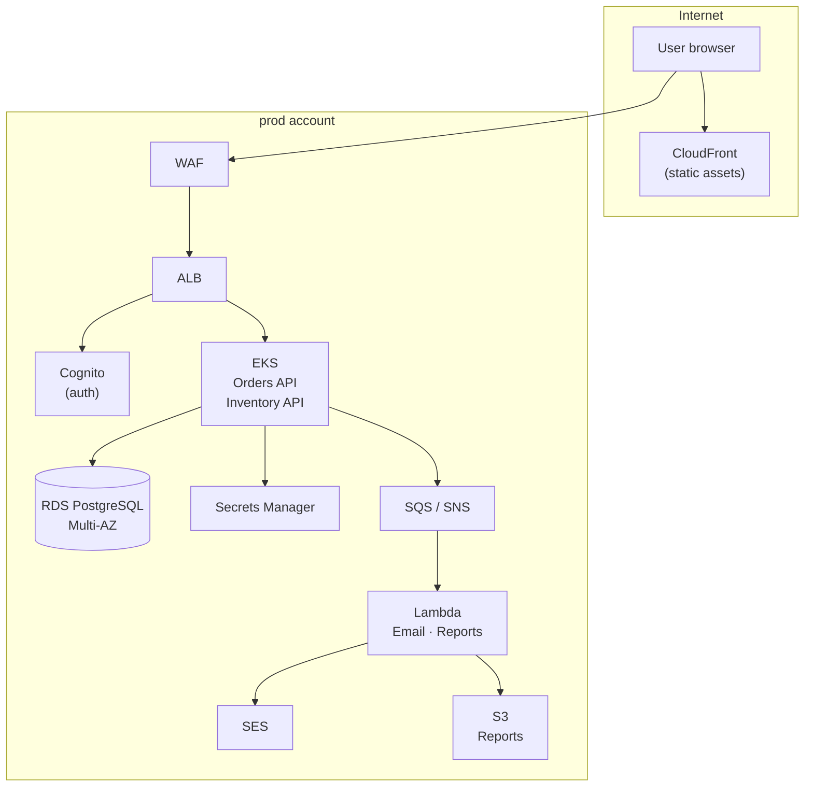

# Phase 12 — Multi-Environment and Capstone

> **AWS services introduced:** AWS Organizations, Control Tower, Terraform workspaces, GitOps promotion pipeline | **Daily cost:** ~$18–22/day (free-tier optimised)

---

## AWS services introduced

| Service | What it does | Why we need it |
|---|---|---|
| **AWS Organizations** | Multi-account management | Separate AWS accounts for dev/staging/prod with consolidated billing |
| **Control Tower** | Landing zone guardrails | Enforces account-level security baseline automatically |
| **Terraform workspaces** | Environment separation in IaC | Same Terraform code, different state per environment |
| **GitHub Actions environments** | Deployment gates | Require manual approval before promoting to prod |

## The problem

Running dev, staging, and prod in the same AWS account is a risk: a misconfigured IAM policy or accidental `terraform destroy` can affect all environments simultaneously. AWS Organizations solves this with separate accounts — separate IAM namespaces, separate billing, separate blast radius — unified under a single management account.

## Account structure

```
Management Account
├── Audit Account          — CloudTrail logs, Security Hub aggregation
├── Log Archive Account    — Centralized CloudWatch logs
└── Workloads OU
    ├── dev Account        — Shared by all developers; smaller instances, single-AZ
    ├── staging Account    — Production-like; used for pre-release validation
    └── prod Account       — Customer traffic only; tightest guardrails
```

## The capstone scenario

Six months have passed. Black Friday is in two weeks. You need to demonstrate:

1. A code change goes from `git push` → CI → dev → staging (manual approval) → prod — no manual AWS console clicks
2. Ten SCPs are attached to the Workloads OU. Every forbidden action returns `AccessDenied`.
3. GuardDuty and WAF are active in all three accounts. Security Hub aggregates findings into the audit account.
4. Simulated incident: RDS Multi-AZ failover. Orders continue with less than 60 seconds of elevated error rate.
5. Cost report: AWS Cost Explorer breakdown by account, service, and tag. Top three cost drivers identified.
6. A new engineer can `git clone`, `docker compose up`, and place an order without any AWS access.

---

## Challenge 1 — AWS Organizations and account structure

**Goal:** Create the Organizations structure with an OU for workloads. Understand how Control Tower sets up a landing zone with baseline guardrails.

### Step 1: Enable AWS Organizations

This step is done once from the management account and cannot be done via Terraform until Organizations is already enabled.

```bash
# Enable Organizations (management account only)
aws organizations create-organization --feature-set ALL

# Verify
aws organizations describe-organization \
  --query 'Organization.{Id:Id,MasterAccountId:MasterAccountId,FeatureSet:FeatureSet}' \
  --output table
```

Expected:

```
-----------------------------------------------
|          DescribeOrganization               |
+--------------------+------------------------+
|  FeatureSet        |  ALL                   |
|  Id                |  o-xxxxxxxxxxxx        |
|  MasterAccountId   |  123456789012          |
+--------------------+------------------------+
```

### Step 2: Create the Organizational Unit structure

```bash
ROOT_ID=$(aws organizations list-roots --query 'Roots[0].Id' --output text)

# Create the Workloads OU
WORKLOADS_OU=$(aws organizations create-organizational-unit \
  --parent-id "$ROOT_ID" \
  --name "Workloads" \
  --query 'OrganizationalUnit.Id' \
  --output text)

echo "Workloads OU: $WORKLOADS_OU"
```

### Step 3: Create member accounts

Creating accounts via Organizations takes 5–10 minutes each. In the management account:

```bash
# Create the dev account
aws organizations create-account \
  --email "orderflow-dev@yourcompany.com" \
  --account-name "orderflow-dev" \
  --iam-user-access-to-billing ALLOW

# Create the staging account
aws organizations create-account \
  --email "orderflow-staging@yourcompany.com" \
  --account-name "orderflow-staging" \
  --iam-user-access-to-billing ALLOW

# Create the prod account
aws organizations create-account \
  --email "orderflow-prod@yourcompany.com" \
  --account-name "orderflow-prod" \
  --iam-user-access-to-billing ALLOW
```

Poll until all accounts are `SUCCEEDED`:

```bash
watch -n 15 "aws organizations list-create-account-status \
  --states IN_PROGRESS SUCCEEDED FAILED \
  --query 'CreateAccountStatuses[*].{Name:AccountName,State:State}' \
  --output table"
```

Move accounts into the Workloads OU:

```bash
for ACCOUNT_ID in $(aws organizations list-accounts \
  --query "Accounts[?Name!='Management'].Id" \
  --output text); do

  aws organizations move-account \
    --account-id "$ACCOUNT_ID" \
    --source-parent-id "$ROOT_ID" \
    --destination-parent-id "$WORKLOADS_OU"
done
```

### Step 4: Enable Control Tower (optional — console only)

Control Tower cannot be configured via CLI or Terraform. Open the AWS Console → Control Tower → **Set up landing zone**. This creates:

- A baseline CloudTrail in every account
- Config recorder in every account
- An audit account with Security Hub aggregation
- A log archive account with centralized S3 buckets

> If you skip Control Tower, manually enable CloudTrail and Config in each account (the Terraform in Challenge 2 handles this).

---

## Challenge 2 — Separate environment folders for multi-environment Terraform

**Goal:** Use a separate folder per environment so each has its own state, its own backend configuration, and can be deployed or destroyed independently without any workspace switching.

### Step 1: Understand the folder strategy

Each environment is a self-contained Terraform root. Shared logic lives in modules. There is no workspace concept — `cd` into the folder you want to operate on.

```
phase-12-capstone/terraform/
├── modules/
│   ├── vpc/
│   │   ├── main.tf
│   │   ├── variables.tf
│   │   └── outputs.tf
│   ├── rds/
│   │   ├── main.tf
│   │   ├── variables.tf
│   │   └── outputs.tf
│   └── eks/
│       ├── main.tf
│       ├── variables.tf
│       └── outputs.tf
├── environments/
│   ├── dev/
│   │   ├── backend.tf      # State key: phase-12/dev/terraform.tfstate
│   │   ├── main.tf         # Calls shared modules
│   │   ├── variables.tf
│   │   └── terraform.tfvars
│   ├── staging/
│   │   ├── backend.tf      # State key: phase-12/staging/terraform.tfstate
│   │   ├── main.tf
│   │   ├── variables.tf
│   │   └── terraform.tfvars
│   └── prod/
│       ├── backend.tf      # State key: phase-12/prod/terraform.tfstate
│       ├── main.tf
│       ├── variables.tf
│       └── terraform.tfvars
```

### Step 2: Create the backend files

Each environment gets its own backend pointing to a different S3 key. This means state is fully isolated — a `terraform destroy` in `dev` cannot touch `prod` state.

Create `phase-12-capstone/terraform/environments/dev/backend.tf`:

```hcl
terraform {
  backend "s3" {
    bucket         = "orderflow-tfstate-<management-account-id>"
    key            = "phase-12/dev/terraform.tfstate"
    region         = "us-east-1"
    dynamodb_table = "orderflow-tfstate-lock"
    encrypt        = true
  }
}
```

Create `phase-12-capstone/terraform/environments/staging/backend.tf`:

```hcl
terraform {
  backend "s3" {
    bucket         = "orderflow-tfstate-<management-account-id>"
    key            = "phase-12/staging/terraform.tfstate"
    region         = "us-east-1"
    dynamodb_table = "orderflow-tfstate-lock"
    encrypt        = true
  }
}
```

Create `phase-12-capstone/terraform/environments/prod/backend.tf`:

```hcl
terraform {
  backend "s3" {
    bucket         = "orderflow-tfstate-<management-account-id>"
    key            = "phase-12/prod/terraform.tfstate"
    region         = "us-east-1"
    dynamodb_table = "orderflow-tfstate-lock"
    encrypt        = true
  }
}
```

### Step 3: Create the environment variable files

Create `phase-12-capstone/terraform/environments/dev/terraform.tfvars`:

```hcl
environment        = "dev"
aws_region         = "us-east-1"
ec2_instance_type  = "t2.micro"
rds_instance_class = "db.t3.micro"
rds_multi_az       = false
eks_node_type      = "t3.small"
eks_node_min       = 1
eks_node_max       = 2
eks_node_desired   = 1
enable_waf         = false
nat_type           = "instance"
```

Create `phase-12-capstone/terraform/environments/staging/terraform.tfvars`:

```hcl
environment        = "staging"
aws_region         = "us-east-1"
ec2_instance_type  = "t3.small"
rds_instance_class = "db.t3.micro"
rds_multi_az       = false
eks_node_type      = "t3.small"
eks_node_min       = 1
eks_node_max       = 3
eks_node_desired   = 2
enable_waf         = true
nat_type           = "instance"
```

Create `phase-12-capstone/terraform/environments/prod/terraform.tfvars`:

```hcl
environment        = "prod"
aws_region         = "us-east-1"
ec2_instance_type  = "t3.small"
rds_instance_class = "db.t3.micro"
rds_multi_az       = true
eks_node_type      = "t3.small"
eks_node_min       = 2
eks_node_max       = 4
eks_node_desired   = 2
enable_waf         = true
nat_type           = "instance"
```

### Step 4: Create the main.tf that calls shared modules

Each environment folder has the same `main.tf` structure — only `terraform.tfvars` differs. Create this in each of the three environment folders:

```hcl
# phase-12-capstone/terraform/environments/<env>/main.tf

provider "aws" {
  region = var.aws_region
}

module "vpc" {
  source      = "../../modules/vpc"
  environment = var.environment
  nat_type    = var.nat_type
}

module "rds" {
  source             = "../../modules/rds"
  environment        = var.environment
  vpc_id             = module.vpc.vpc_id
  private_subnet_ids = module.vpc.private_subnet_ids
  instance_class     = var.rds_instance_class
  multi_az           = var.rds_multi_az
}

module "eks" {
  source             = "../../modules/eks"
  environment        = var.environment
  vpc_id             = module.vpc.vpc_id
  private_subnet_ids = module.vpc.private_subnet_ids
  node_type          = var.eks_node_type
  node_min           = var.eks_node_min
  node_max           = var.eks_node_max
  node_desired       = var.eks_node_desired
  enable_waf         = var.enable_waf
}
```

### Step 5: Deploy each environment independently

No workspace switching — just `cd` into the folder:

```bash
# Deploy dev
cd phase-12-capstone/terraform/environments/dev
terraform init
terraform plan
terraform apply -auto-approve

# Deploy staging (separate shell or after dev)
cd phase-12-capstone/terraform/environments/staging
terraform init
terraform plan
terraform apply -auto-approve

# Deploy prod
cd phase-12-capstone/terraform/environments/prod
terraform init
terraform plan
terraform apply -auto-approve
```

### Step 6: Verify separate state files in S3

```bash
aws s3 ls "s3://orderflow-tfstate-${MGMT_ACCOUNT_ID}/phase-12/" --recursive
```

Expected — one state file per environment folder:

```
... phase-12/dev/terraform.tfstate
... phase-12/staging/terraform.tfstate
... phase-12/prod/terraform.tfstate
```

Each state file is independent. Destroying dev has zero effect on staging or prod state.

### Why separate folders instead of workspaces

| | Workspaces | Separate folders |
|---|---|---|
| State isolation | S3 key prefix per workspace | Separate S3 key per folder |
| Accidental cross-env apply | Possible (wrong `workspace select`) | Impossible — you must `cd` into the folder |
| Backend config per env | Single shared backend | Each env owns its backend |
| CI/CD targeting | Requires passing workspace name | `cd environments/prod && terraform apply` |
| Visibility in S3 | `env:/dev/...` paths | `phase-12/dev/...` — explicit and browsable |

---

## Challenge 3 — Service Control Policies and governance

**Goal:** Attach the ten most impactful SCPs from the AWS Well-Architected Framework to the Workloads OU. Understand which WAF pillar each SCP enforces. Verify that each policy actually blocks the forbidden action before deploying any workloads.

### Why SCPs before deployments

SCPs are *preventive* controls — they act at the API layer before any IAM policy is evaluated. Once attached to an OU, no amount of `AdministratorAccess` inside a member account can override them. This is the right moment to set them: accounts exist, workspaces exist, nothing is deployed yet. Retrofitting SCPs onto a running environment risks locking out a running service.

### AWS Well-Architected Framework mapping

| # | SCP | WAF Pillar | WAF Design Principle |
|---|---|---|---|
| 1 | Deny root user actions | Security | SEC 02 — Use strong identity controls |
| 2 | Deny leaving the Organization | Security | SEC 01 — Implement a strong identity foundation |
| 3 | Deny disabling CloudTrail | Security | SEC 04 — Detect and investigate security events |
| 4 | Deny disabling GuardDuty | Security | SEC 04 — Detect and investigate security events |
| 5 | Deny disabling AWS Config | Security | SEC 04 — Detect and investigate security events |
| 6 | Restrict to approved regions | Security | SEC 01 — Reduce scope of data residency risk |
| 7 | Deny IAM user and access key creation | Security | SEC 02 — Enforce federated identity, no long-lived keys |
| 8 | Deny public S3 bucket ACLs | Security | SEC 07 — Classify and protect your data |
| 9 | Require encryption at rest | Security | SEC 08 — Protect data at rest |
| 10 | Deny non-approved EC2 instance types | Cost Optimization | COST 06 — Right-size compute to workload needs |

### Step 1: Create the SCP Terraform file

Create `phase-12-capstone/terraform/scps.tf`:

```hcl
# ---------------------------------------------------------------------------
# Data sources — resolve the Workloads OU ID and Organization root
# ---------------------------------------------------------------------------

data "aws_organizations_organization" "current" {}

data "aws_organizations_organizational_units" "root" {
  parent_id = data.aws_organizations_organization.current.roots[0].id
}

locals {
  workloads_ou_id = [
    for ou in data.aws_organizations_organizational_units.root.children :
    ou.id if ou.name == "Workloads"
  ][0]
}

# ---------------------------------------------------------------------------
# SCP 1 — Deny root user actions
# WAF: Security — SEC 02
# The root user bypasses all IAM policies. Locking it down is the single
# highest-impact control in any multi-account setup.
# ---------------------------------------------------------------------------

resource "aws_organizations_policy" "deny_root_actions" {
  name        = "orderflow-deny-root-actions"
  description = "Prevent root user from performing any action in member accounts"
  type        = "SERVICE_CONTROL_POLICY"

  content = jsonencode({
    Version = "2012-10-17"
    Statement = [{
      Sid       = "DenyRootActions"
      Effect    = "Deny"
      Action    = "*"
      Resource  = "*"
      Condition = {
        StringLike = {
          "aws:PrincipalArn" = ["arn:aws:iam::*:root"]
        }
      }
    }]
  })
}

resource "aws_organizations_policy_attachment" "deny_root_actions" {
  policy_id = aws_organizations_policy.deny_root_actions.id
  target_id = local.workloads_ou_id
}

# ---------------------------------------------------------------------------
# SCP 2 — Deny leaving the Organization
# WAF: Security — SEC 01
# Prevents a compromised account from being exfiltrated out of the OU
# structure and away from centralized logging and guardrails.
# ---------------------------------------------------------------------------

resource "aws_organizations_policy" "deny_leave_org" {
  name        = "orderflow-deny-leave-org"
  description = "Prevent member accounts from leaving the Organization"
  type        = "SERVICE_CONTROL_POLICY"

  content = jsonencode({
    Version = "2012-10-17"
    Statement = [{
      Sid      = "DenyLeaveOrganization"
      Effect   = "Deny"
      Action   = ["organizations:LeaveOrganization"]
      Resource = "*"
    }]
  })
}

resource "aws_organizations_policy_attachment" "deny_leave_org" {
  policy_id = aws_organizations_policy.deny_leave_org.id
  target_id = local.workloads_ou_id
}

# ---------------------------------------------------------------------------
# SCP 3 — Deny disabling CloudTrail
# WAF: Security — SEC 04
# CloudTrail is the immutable audit trail. An attacker's first action after
# obtaining credentials is often to disable logging.
# ---------------------------------------------------------------------------

resource "aws_organizations_policy" "deny_disable_cloudtrail" {
  name        = "orderflow-deny-disable-cloudtrail"
  description = "Prevent CloudTrail from being stopped, deleted, or modified"
  type        = "SERVICE_CONTROL_POLICY"

  content = jsonencode({
    Version = "2012-10-17"
    Statement = [{
      Sid    = "DenyDisableCloudTrail"
      Effect = "Deny"
      Action = [
        "cloudtrail:DeleteTrail",
        "cloudtrail:StopLogging",
        "cloudtrail:UpdateTrail",
        "cloudtrail:PutEventSelectors",
      ]
      Resource = "*"
    }]
  })
}

resource "aws_organizations_policy_attachment" "deny_disable_cloudtrail" {
  policy_id = aws_organizations_policy.deny_disable_cloudtrail.id
  target_id = local.workloads_ou_id
}

# ---------------------------------------------------------------------------
# SCP 4 — Deny disabling GuardDuty
# WAF: Security — SEC 04
# GuardDuty is the runtime threat detection layer. Disabling it is a common
# step in credential-abuse attacks to prevent alerting.
# ---------------------------------------------------------------------------

resource "aws_organizations_policy" "deny_disable_guardduty" {
  name        = "orderflow-deny-disable-guardduty"
  description = "Prevent GuardDuty from being disabled or its findings deleted"
  type        = "SERVICE_CONTROL_POLICY"

  content = jsonencode({
    Version = "2012-10-17"
    Statement = [{
      Sid    = "DenyDisableGuardDuty"
      Effect = "Deny"
      Action = [
        "guardduty:DeleteDetector",
        "guardduty:DisassociateFromMasterAccount",
        "guardduty:StopMonitoringMembers",
        "guardduty:UpdateDetector",
        "guardduty:DeletePublishingDestination",
        "guardduty:DeleteThreatIntelSet",
        "guardduty:DeleteIPSet",
      ]
      Resource = "*"
    }]
  })
}

resource "aws_organizations_policy_attachment" "deny_disable_guardduty" {
  policy_id = aws_organizations_policy.deny_disable_guardduty.id
  target_id = local.workloads_ou_id
}

# ---------------------------------------------------------------------------
# SCP 5 — Deny disabling AWS Config
# WAF: Security — SEC 04
# Config records every resource configuration change. Disabling it removes
# the ability to detect drift and satisfy compliance audits.
# ---------------------------------------------------------------------------

resource "aws_organizations_policy" "deny_disable_config" {
  name        = "orderflow-deny-disable-config"
  description = "Prevent AWS Config recorder and delivery channel from being disabled"
  type        = "SERVICE_CONTROL_POLICY"

  content = jsonencode({
    Version = "2012-10-17"
    Statement = [{
      Sid    = "DenyDisableConfig"
      Effect = "Deny"
      Action = [
        "config:DeleteConfigurationRecorder",
        "config:DeleteDeliveryChannel",
        "config:StopConfigurationRecorder",
        "config:DeleteRetentionConfiguration",
      ]
      Resource = "*"
    }]
  })
}

resource "aws_organizations_policy_attachment" "deny_disable_config" {
  policy_id = aws_organizations_policy.deny_disable_config.id
  target_id = local.workloads_ou_id
}

# ---------------------------------------------------------------------------
# SCP 6 — Restrict to approved regions
# WAF: Security — SEC 01 / data residency
# Forces all API calls into the regions your team operates in. Reduces the
# blast radius of credential compromise and satisfies data-residency
# requirements (GDPR, PCI-DSS) by making out-of-region writes impossible.
# ---------------------------------------------------------------------------

resource "aws_organizations_policy" "deny_non_approved_regions" {
  name        = "orderflow-deny-non-approved-regions"
  description = "Restrict all actions to us-east-1 and us-west-2 only"
  type        = "SERVICE_CONTROL_POLICY"

  content = jsonencode({
    Version = "2012-10-17"
    Statement = [{
      Sid    = "DenyNonApprovedRegions"
      Effect = "Deny"
      # NotAction excludes global services that have no region concept
      NotAction = [
        "iam:*",
        "organizations:*",
        "support:*",
        "sts:*",
        "cloudfront:*",
        "waf:*",
        "route53:*",
        "budgets:*",
        "ce:*",
        "health:*",
      ]
      Resource = "*"
      Condition = {
        StringNotEquals = {
          "aws:RequestedRegion" = ["us-east-1", "us-west-2"]
        }
      }
    }]
  })
}

resource "aws_organizations_policy_attachment" "deny_non_approved_regions" {
  policy_id = aws_organizations_policy.deny_non_approved_regions.id
  target_id = local.workloads_ou_id
}

# ---------------------------------------------------------------------------
# SCP 7 — Deny IAM user and access key creation
# WAF: Security — SEC 02
# Long-lived IAM access keys are the most common source of credential leaks
# (GitHub secret scans, leaked .env files). All human access must go through
# IAM Identity Center (SSO). Service access must use IAM roles.
# ---------------------------------------------------------------------------

resource "aws_organizations_policy" "deny_iam_users" {
  name        = "orderflow-deny-iam-users"
  description = "Prohibit long-lived IAM users and access keys; require SSO and roles"
  type        = "SERVICE_CONTROL_POLICY"

  content = jsonencode({
    Version = "2012-10-17"
    Statement = [{
      Sid    = "DenyIAMUsersAndKeys"
      Effect = "Deny"
      Action = [
        "iam:CreateUser",
        "iam:CreateAccessKey",
        "iam:CreateLoginProfile",
        "iam:UpdateAccessKey",
      ]
      Resource = "*"
    }]
  })
}

resource "aws_organizations_policy_attachment" "deny_iam_users" {
  policy_id = aws_organizations_policy.deny_iam_users.id
  target_id = local.workloads_ou_id
}

# ---------------------------------------------------------------------------
# SCP 8 — Deny public S3 bucket ACLs
# WAF: Security — SEC 07
# Public S3 buckets are the leading cause of data breaches in AWS.
# This SCP prevents any bucket from being made public at the ACL level,
# independently of the account-level S3 Block Public Access setting.
# ---------------------------------------------------------------------------

resource "aws_organizations_policy" "deny_public_s3" {
  name        = "orderflow-deny-public-s3"
  description = "Prevent S3 buckets and objects from being made publicly accessible"
  type        = "SERVICE_CONTROL_POLICY"

  content = jsonencode({
    Version = "2012-10-17"
    Statement = [
      {
        Sid    = "DenyPublicBucketACL"
        Effect = "Deny"
        Action = ["s3:PutBucketAcl"]
        Resource = "*"
        Condition = {
          StringEquals = {
            "s3:x-amz-acl" = ["public-read", "public-read-write", "authenticated-read"]
          }
        }
      },
      {
        Sid    = "DenyDisableS3BlockPublicAccess"
        Effect = "Deny"
        Action = ["s3:PutBucketPublicAccessBlock"]
        Resource = "*"
        Condition = {
          StringEquals = {
            "s3:BlockPublicAcls"       = "false"
            "s3:IgnorePublicAcls"      = "false"
            "s3:BlockPublicPolicy"     = "false"
            "s3:RestrictPublicBuckets" = "false"
          }
        }
      }
    ]
  })
}

resource "aws_organizations_policy_attachment" "deny_public_s3" {
  policy_id = aws_organizations_policy.deny_public_s3.id
  target_id = local.workloads_ou_id
}

# ---------------------------------------------------------------------------
# SCP 9 — Require encryption at rest
# WAF: Security — SEC 08
# Enforces encryption for EBS volumes, RDS instances, and S3 objects at
# creation time. A missing encryption flag is caught at the API layer before
# the resource is created, not after a compliance scan finds it.
# ---------------------------------------------------------------------------

resource "aws_organizations_policy" "require_encryption" {
  name        = "orderflow-require-encryption-at-rest"
  description = "Deny creation of unencrypted EBS volumes, RDS instances, and S3 objects"
  type        = "SERVICE_CONTROL_POLICY"

  content = jsonencode({
    Version = "2012-10-17"
    Statement = [
      {
        Sid    = "DenyUnencryptedEBS"
        Effect = "Deny"
        Action = ["ec2:CreateVolume"]
        Resource = "*"
        Condition = {
          Bool = { "ec2:Encrypted" = "false" }
        }
      },
      {
        Sid    = "DenyUnencryptedRDS"
        Effect = "Deny"
        Action = ["rds:CreateDBInstance"]
        Resource = "*"
        Condition = {
          Bool = { "rds:StorageEncrypted" = "false" }
        }
      },
      {
        Sid    = "DenyUnencryptedS3Objects"
        Effect = "Deny"
        Action = ["s3:PutObject"]
        Resource = "*"
        Condition = {
          StringNotEquals = {
            "s3:x-amz-server-side-encryption" = ["AES256", "aws:kms"]
          }
        }
      }
    ]
  })
}

resource "aws_organizations_policy_attachment" "require_encryption" {
  policy_id = aws_organizations_policy.require_encryption.id
  target_id = local.workloads_ou_id
}

# ---------------------------------------------------------------------------
# SCP 10 — Deny non-approved EC2 instance types
# WAF: Cost Optimization — COST 06
# Prevents engineers from accidentally launching oversized instances that
# inflate the monthly bill. Only instance families appropriate for each
# environment are permitted.
# ---------------------------------------------------------------------------

resource "aws_organizations_policy" "deny_large_instances" {
  name        = "orderflow-deny-large-instances"
  description = "Restrict EC2 instance types to t3, t4g, and m6i families only"
  type        = "SERVICE_CONTROL_POLICY"

  content = jsonencode({
    Version = "2012-10-17"
    Statement = [{
      Sid    = "DenyLargeInstances"
      Effect = "Deny"
      Action = ["ec2:RunInstances"]
      Resource = "arn:aws:ec2:*:*:instance/*"
      Condition = {
        StringNotLike = {
          "ec2:InstanceType" = [
            "t2.*",
            "t3.*",
            "t3a.*",
            "t4g.*",
            "m6i.large",
            "m6i.xlarge",
            "m6a.large",
            "m6a.xlarge",
          ]
        }
      }
    }]
  })
}

resource "aws_organizations_policy_attachment" "deny_large_instances" {
  policy_id = aws_organizations_policy.deny_large_instances.id
  target_id = local.workloads_ou_id
}
```

### Step 2: Apply the SCPs

SCPs must be applied from the management account:

```bash
cd phase-12-capstone/terraform

terraform plan -target=aws_organizations_policy.deny_root_actions \
               -target=aws_organizations_policy.deny_leave_org \
               -target=aws_organizations_policy.deny_disable_cloudtrail \
               -target=aws_organizations_policy.deny_disable_guardduty \
               -target=aws_organizations_policy.deny_disable_config \
               -target=aws_organizations_policy.deny_non_approved_regions \
               -target=aws_organizations_policy.deny_iam_users \
               -target=aws_organizations_policy.deny_public_s3 \
               -target=aws_organizations_policy.require_encryption \
               -target=aws_organizations_policy.deny_large_instances

terraform apply -auto-approve
```

Verify all ten policies were created and attached:

```bash
aws organizations list-policies --filter SERVICE_CONTROL_POLICY \
  --query 'Policies[*].{Name:Name,Id:Id}' \
  --output table
```

Expected:

```
------------------------------------------------------------------
|                        ListPolicies                            |
+-------------------------------------+--------------------------+
|  Name                               |  Id                      |
+-------------------------------------+--------------------------+
|  orderflow-deny-root-actions        |  p-xxxxxxxxxxxx01        |
|  orderflow-deny-leave-org           |  p-xxxxxxxxxxxx02        |
|  orderflow-deny-disable-cloudtrail  |  p-xxxxxxxxxxxx03        |
|  orderflow-deny-disable-guardduty   |  p-xxxxxxxxxxxx04        |
|  orderflow-deny-disable-config      |  p-xxxxxxxxxxxx05        |
|  orderflow-deny-non-approved-regions|  p-xxxxxxxxxxxx06        |
|  orderflow-deny-iam-users           |  p-xxxxxxxxxxxx07        |
|  orderflow-deny-public-s3           |  p-xxxxxxxxxxxx08        |
|  orderflow-require-encryption       |  p-xxxxxxxxxxxx09        |
|  orderflow-deny-large-instances     |  p-xxxxxxxxxxxx10        |
+-------------------------------------+--------------------------+
```

Confirm all ten are attached to the Workloads OU:

```bash
WORKLOADS_OU=$(aws organizations list-organizational-units-for-parent \
  --parent-id $(aws organizations list-roots --query 'Roots[0].Id' --output text) \
  --query "OrganizationalUnits[?Name=='Workloads'].Id" \
  --output text)

aws organizations list-policies-for-target \
  --target-id "$WORKLOADS_OU" \
  --filter SERVICE_CONTROL_POLICY \
  --query 'Policies[*].Name' \
  --output table
```

### Step 3: Validate each SCP fires

Switch to the dev account and attempt each forbidden action. Every attempt below must return an `AccessDenied` error.

**SCP 1 — Root user block**

```bash
# Attempt to use the root user credentials (switch to root in the console,
# then try any API call)
aws sts get-caller-identity --profile dev-root
# Expected: An error occurred (AccessDenied)
```

**SCP 3 — CloudTrail cannot be stopped**

```bash
TRAIL=$(aws cloudtrail describe-trails --profile dev \
  --query 'trailList[0].TrailARN' --output text)

aws cloudtrail stop-logging --name "$TRAIL" --profile dev
# Expected: An error occurred (AccessDenied) when calling the StopLogging operation
```

**SCP 6 — Region restriction**

```bash
aws ec2 describe-instances --region eu-west-1 --profile dev
# Expected: An error occurred (AccessDenied) ... Explicit deny in a
# service control policy
```

**SCP 7 — No IAM users**

```bash
aws iam create-user --user-name test-scp --profile dev
# Expected: An error occurred (AccessDenied) when calling the CreateUser operation
```

**SCP 8 — No public S3**

```bash
BUCKET="orderflow-scp-test-$(date +%s)"
aws s3 mb "s3://${BUCKET}" --profile dev
aws s3api put-bucket-acl --bucket "$BUCKET" --acl public-read --profile dev
# Expected: An error occurred (AccessDenied) when calling the PutBucketAcl operation

# Clean up
aws s3 rb "s3://${BUCKET}" --profile dev
```

**SCP 9 — Unencrypted EBS denied**

```bash
aws ec2 create-volume \
  --availability-zone us-east-1a \
  --size 1 \
  --no-encrypted \
  --profile dev
# Expected: An error occurred (AccessDenied) when calling the CreateVolume operation
```

**SCP 10 — Large instance denied**

```bash
aws ec2 run-instances \
  --image-id resolve:ssm:/aws/service/ami-amazon-linux-latest/al2023-ami-kernel-default-x86_64 \
  --instance-type c5.4xlarge \
  --min-count 1 --max-count 1 \
  --profile dev
# Expected: An error occurred (AccessDenied) when calling the RunInstances operation
```

All seven spot-checks pass. Your accounts are now governed by preventive controls that cannot be overridden from inside any member account.

### Step 4: Understand the SCP evaluation logic

```
API call arrives in member account
         │
         ▼
  SCP attached to OU?  ──── No ──── Allow (falls through to IAM)
         │
        Yes
         │
         ▼
  Action matches a Deny? ── Yes ─── DENY (immediately, no further evaluation)
         │
         No
         │
         ▼
  Action matches an Allow? ─ No ──── DENY (implicit deny; FullAWSAccess SCP
         │                                  must explicitly allow it)
        Yes
         │
         ▼
  Evaluate IAM identity policy and resource policy as normal
```

> **Key point:** The default `FullAWSAccess` SCP that Organizations attaches to every account is a broad `Allow *`. Your custom SCPs layer `Deny` statements on top. A Deny always wins — even `AdministratorAccess` cannot override an SCP Deny. If you create a custom OU-level Allow-only SCP and detach `FullAWSAccess`, you move to an allowlist model where only explicitly listed services work.

### Step 5: Environment-specific SCP strategy

Not every SCP should apply equally to every environment. A common pattern:

| SCP | Root OU | Workloads OU | dev | staging | prod |
|---|---|---|---|---|---|
| Deny root actions | ✓ | ✓ | ✓ | ✓ | ✓ |
| Deny leave org | ✓ | ✓ | ✓ | ✓ | ✓ |
| Deny disable CloudTrail | ✓ | ✓ | ✓ | ✓ | ✓ |
| Deny disable GuardDuty | — | ✓ | ✓ | ✓ | ✓ |
| Deny disable Config | — | ✓ | ✓ | ✓ | ✓ |
| Region restriction | — | ✓ | ✓ | ✓ | ✓ |
| Deny IAM users | — | — | — | ✓ | ✓ |
| Deny public S3 | — | ✓ | ✓ | ✓ | ✓ |
| Require encryption | — | — | — | ✓ | ✓ |
| Deny large instances | — | ✓ | ✓ | ✓ | ✓ |

Dev gets slightly looser controls to allow experimentation. Prod gets the full stack. This is implemented by creating per-environment OUs under Workloads and attaching the relevant subset of policies to each.

---

## Challenge 4 — GitOps promotion pipeline

**Goal:** Build a GitHub Actions workflow that deploys to dev on every push to `main`, then promotes to staging automatically, then requires a manual approval gate before promoting to prod.

### Step 1: Create GitHub Actions environments

In your repository settings → **Environments**:

1. Create `dev` — no protection rules
2. Create `staging` — no protection rules
3. Create `prod` — add **Required reviewers**: yourself

This means any deployment to `prod` pauses and sends a review request before proceeding.

### Step 2: Create the workflow

Create `.github/workflows/deploy.yml`:

```yaml
name: Deploy OrderFlow

on:
  push:
    branches: [main]

env:
  AWS_REGION: us-east-1
  ECR_REPOSITORY: orderflow

jobs:
  build:
    name: Build and push image
    runs-on: ubuntu-latest
    outputs:
      image_tag: ${{ steps.meta.outputs.sha }}

    steps:
      - uses: actions/checkout@v4

      - name: Configure AWS credentials (management account)
        uses: aws-actions/configure-aws-credentials@v4
        with:
          role-to-assume: ${{ secrets.AWS_DEPLOY_ROLE_ARN }}
          aws-region: ${{ env.AWS_REGION }}

      - name: Log in to ECR
        id: login-ecr
        uses: aws-actions/amazon-ecr-login@v2

      - name: Set image tag
        id: meta
        run: echo "sha=$(git rev-parse --short HEAD)" >> $GITHUB_OUTPUT

      - name: Build and push
        env:
          ECR_REGISTRY: ${{ steps.login-ecr.outputs.registry }}
          IMAGE_TAG: ${{ steps.meta.outputs.sha }}
        run: |
          docker build --platform linux/amd64 \
            -t $ECR_REGISTRY/$ECR_REPOSITORY:$IMAGE_TAG \
            -t $ECR_REGISTRY/$ECR_REPOSITORY:latest \
            orderflow/
          docker push $ECR_REGISTRY/$ECR_REPOSITORY:$IMAGE_TAG
          docker push $ECR_REGISTRY/$ECR_REPOSITORY:latest

  deploy-dev:
    name: Deploy to dev
    needs: build
    runs-on: ubuntu-latest
    environment: dev

    steps:
      - uses: actions/checkout@v4

      - name: Configure AWS credentials (dev account)
        uses: aws-actions/configure-aws-credentials@v4
        with:
          role-to-assume: ${{ secrets.DEV_DEPLOY_ROLE_ARN }}
          aws-region: ${{ env.AWS_REGION }}

      - name: Update kubeconfig
        run: aws eks update-kubeconfig --name orderflow --region ${{ env.AWS_REGION }}

      - name: Helm upgrade
        run: |
          helm upgrade orderflow phase-9-eks/helm/orderflow \
            --namespace orderflow \
            --reuse-values \
            --set image.tag=${{ needs.build.outputs.image_tag }} \
            --wait --timeout 5m

      - name: Smoke test
        run: |
          ALB=$(kubectl get ingress orderflow -n orderflow \
            -o jsonpath='{.status.loadBalancer.ingress[0].hostname}')
          curl -sf "https://${ALB}/health" | jq .

  deploy-staging:
    name: Deploy to staging
    needs: deploy-dev
    runs-on: ubuntu-latest
    environment: staging

    steps:
      - uses: actions/checkout@v4

      - name: Configure AWS credentials (staging account)
        uses: aws-actions/configure-aws-credentials@v4
        with:
          role-to-assume: ${{ secrets.STAGING_DEPLOY_ROLE_ARN }}
          aws-region: ${{ env.AWS_REGION }}

      - name: Update kubeconfig
        run: aws eks update-kubeconfig --name orderflow --region ${{ env.AWS_REGION }}

      - name: Helm upgrade
        run: |
          helm upgrade orderflow phase-9-eks/helm/orderflow \
            --namespace orderflow \
            --reuse-values \
            --set image.tag=${{ needs.build.outputs.image_tag }} \
            --wait --timeout 5m

      - name: Integration tests
        run: |
          ALB=$(kubectl get ingress orderflow -n orderflow \
            -o jsonpath='{.status.loadBalancer.ingress[0].hostname}')
          # Run a basic order creation test
          curl -sf -X POST "https://${ALB}/orders" \
            -H "Content-Type: application/json" \
            -d '{"productId":1,"quantity":1}' | jq .status

  deploy-prod:
    name: Deploy to prod
    needs: deploy-staging
    runs-on: ubuntu-latest
    environment: prod   # ← manual approval gate

    steps:
      - uses: actions/checkout@v4

      - name: Configure AWS credentials (prod account)
        uses: aws-actions/configure-aws-credentials@v4
        with:
          role-to-assume: ${{ secrets.PROD_DEPLOY_ROLE_ARN }}
          aws-region: ${{ env.AWS_REGION }}

      - name: Update kubeconfig
        run: aws eks update-kubeconfig --name orderflow --region ${{ env.AWS_REGION }}

      - name: Helm upgrade (rolling deploy)
        run: |
          helm upgrade orderflow phase-9-eks/helm/orderflow \
            --namespace orderflow \
            --reuse-values \
            --set image.tag=${{ needs.build.outputs.image_tag }} \
            --wait --timeout 10m

      - name: Post-deploy health check
        run: |
          ALB=$(kubectl get ingress orderflow -n orderflow \
            -o jsonpath='{.status.loadBalancer.ingress[0].hostname}')
          for i in $(seq 1 5); do
            curl -sf "https://${ALB}/health" | jq .
            sleep 5
          done
```

### Step 3: Create cross-account IAM roles for GitHub Actions

In each account, create a role that GitHub Actions can assume via OIDC:

```hcl
# phase-12-capstone/terraform/github_oidc.tf

data "aws_iam_openid_connect_provider" "github" {
  count = var.create_github_oidc ? 1 : 0
  url   = "https://token.actions.githubusercontent.com"
}

resource "aws_iam_openid_connect_provider" "github" {
  count           = var.create_github_oidc ? 1 : 0
  url             = "https://token.actions.githubusercontent.com"
  client_id_list  = ["sts.amazonaws.com"]
  thumbprint_list = ["6938fd4d98bab03faadb97b34396831e3780aea1"]
}

resource "aws_iam_role" "github_deploy" {
  name = "${var.project}-github-deploy"

  assume_role_policy = jsonencode({
    Version = "2012-10-17"
    Statement = [{
      Effect = "Allow"
      Action = "sts:AssumeRoleWithWebIdentity"
      Principal = {
        Federated = try(
          aws_iam_openid_connect_provider.github[0].arn,
          data.aws_iam_openid_connect_provider.github[0].arn
        )
      }
      Condition = {
        StringLike = {
          # Scope to your specific repository
          "token.actions.githubusercontent.com:sub" = "repo:your-org/cloud-migration-lab-aws:*"
        }
        StringEquals = {
          "token.actions.githubusercontent.com:aud" = "sts.amazonaws.com"
        }
      }
    }]
  })
}

resource "aws_iam_role_policy" "github_deploy" {
  name = "deploy-permissions"
  role = aws_iam_role.github_deploy.id

  policy = jsonencode({
    Version = "2012-10-17"
    Statement = [
      {
        Effect   = "Allow"
        Action   = ["eks:DescribeCluster", "eks:ListClusters"]
        Resource = "*"
      },
      {
        Effect   = "Allow"
        Action   = ["ecr:GetAuthorizationToken"]
        Resource = "*"
      },
      {
        Effect = "Allow"
        Action = [
          "ecr:BatchGetImage", "ecr:BatchCheckLayerAvailability",
          "ecr:PutImage", "ecr:InitiateLayerUpload",
          "ecr:UploadLayerPart", "ecr:CompleteLayerUpload",
        ]
        Resource = "arn:aws:ecr:${var.aws_region}:*:repository/orderflow"
      }
    ]
  })
}
```

### Step 4: Test the pipeline

Push a trivial change to trigger the pipeline:

```bash
echo "# updated $(date)" >> orderflow/README.md
git add . && git commit -m "chore: trigger pipeline test"
git push origin main
```

Watch the workflow in GitHub Actions → **Actions** tab:

```
✓ Build and push image         (2m 15s)
✓ Deploy to dev                (1m 42s)
✓ Deploy to staging            (1m 38s)
⏳ Deploy to prod              (waiting for approval)
```

Approve the prod deployment from the GitHub Actions UI. Expected:

```
✓ Deploy to prod               (2m 01s)
```

---

## Challenge 5 — Cross-account Security Hub aggregation

**Goal:** Designate the audit account as the Security Hub administrator. Aggregate findings from dev, staging, and prod into a single view.

### Step 1: Designate Security Hub administrator

In the management account:

```bash
AUDIT_ACCOUNT_ID="<your audit account ID>"

aws securityhub enable-organization-admin-account \
  --admin-account-id "$AUDIT_ACCOUNT_ID"
```

### Step 2: Enable Security Hub in all member accounts

From the audit account, auto-enable new members:

```bash
aws securityhub update-organization-configuration \
  --auto-enable \
  --auto-enable-standards DEFAULT

# List member accounts
aws securityhub list-members \
  --query 'Members[*].{AccountId:AccountId,Status:MemberStatus}' \
  --output table
```

Expected:

```
---------------------------------------
|          ListMembers                |
+--------------------+----------------+
|  AccountId         |  MemberStatus  |
+--------------------+----------------+
|  111111111111      |  Enabled       |   ← dev
|  222222222222      |  Enabled       |   ← staging
|  333333333333      |  Enabled       |   ← prod
+--------------------+----------------+
```

### Step 3: View aggregated findings

```bash
# From the audit account — shows findings across all member accounts
aws securityhub get-findings \
  --filters '{
    "RecordState":[{"Value":"ACTIVE","Comparison":"EQUALS"}],
    "SeverityLabel":[{"Value":"CRITICAL","Comparison":"EQUALS"}]
  }' \
  --query 'Findings[:10].{Title:Title,Account:AwsAccountId,Severity:Severity.Label}' \
  --output table
```

---

## Challenge 6 — Capstone: RDS failover under load

**Goal:** Simulate a production database failure during peak load. Measure actual downtime. Verify it is under 60 seconds and the X-Ray trace captures the failure window.

### Step 1: Start a continuous load test

```bash
ALB_URL=$(kubectl get ingress orderflow -n orderflow \
  --context prod \
  -o jsonpath='{.status.loadBalancer.ingress[0].hostname}')

FAILURES=0
REQUESTS=0
START=$(date +%s)

while true; do
  HTTP_STATUS=$(curl -so /dev/null -w "%{http_code}" \
    -X POST "https://${ALB_URL}/orders" \
    -H "Content-Type: application/json" \
    -d '{"productId":1,"quantity":1}')

  REQUESTS=$((REQUESTS + 1))

  if [ "$HTTP_STATUS" != "200" ] && [ "$HTTP_STATUS" != "201" ]; then
    FAILURES=$((FAILURES + 1))
    echo "$(date +%H:%M:%S) FAIL (HTTP $HTTP_STATUS) — failure #$FAILURES"
  else
    echo "$(date +%H:%M:%S) OK"
  fi
  sleep 1
done
```

### Step 2: Trigger an RDS Multi-AZ failover

In a second terminal:

```bash
aws rds reboot-db-instance \
  --db-instance-identifier orderflow-postgres \
  --force-failover \
  --region us-east-1 \
  --profile prod
```

### Step 3: Observe and record the failure window

Watch the output from Step 1. You will see a window of failures as the standby is promoted:

```
10:01:00 OK
10:01:01 OK
10:01:02 FAIL (HTTP 503) — failure #1
10:01:03 FAIL (HTTP 503) — failure #2
...
10:01:37 FAIL (HTTP 503) — failure #35
10:01:38 OK
10:01:39 OK
```

Calculate total downtime:

```bash
echo "Downtime: $FAILURES seconds (~$FAILURES requests failed)"
echo "Availability: $(echo "scale=4; ($REQUESTS - $FAILURES) / $REQUESTS * 100" | bc)%"
```

### Step 4: Verify the failover in RDS

```bash
aws rds describe-db-instances \
  --db-instance-identifier orderflow-postgres \
  --profile prod \
  --query 'DBInstances[0].{Status:DBInstanceStatus,AZ:AvailabilityZone,SecondaryAZ:SecondaryAvailabilityZone}' \
  --output table
```

The `AZ` field will have changed from `us-east-1a` to `us-east-1b` (or vice versa) — the standby is now the primary.

### Step 5: Pull the X-Ray trace for the failure window

In the X-Ray console → **Traces** → set time range to cover the failover:

Filter: `responsetime > 1` to find slow or failing requests:

```
10:01:02  POST /orders  503  ERROR  postgres.query — connection refused
10:01:03  POST /orders  503  ERROR  postgres.query — connection refused
...
10:01:38  POST /orders  201  OK     postgres.query — 45ms
```

The trace shows exactly when the database connection dropped and when it recovered.

### Step 6: Record your findings

| Metric | Value |
|---|---|
| First failed request | |
| Last failed request | |
| Total downtime (seconds) | |
| AZ before failover | |
| AZ after failover | |
| AWS SLA target | < 60 seconds |
| Did you meet the SLA? | |

---

## Challenge 7 — Cost analysis and optimization

**Goal:** Use AWS Cost Explorer to break down costs by account, service, and tag. Identify the top three cost drivers and propose one concrete reduction.

### Step 1: Enable Cost Allocation Tags

Cost Explorer only breaks down by tag if tags are activated as cost allocation tags:

```bash
# Activate the Project and Environment tags for cost allocation
aws ce update-cost-allocation-tags-status \
  --cost-allocation-tags-status \
    TagKey=Project,Status=Active \
    TagKey=Environment,Status=Active
```

> Tags activated today take 24 hours to appear in Cost Explorer.

### Step 2: Query costs by service

```bash
START=$(date -u -d '7 days ago' +%Y-%m-%d 2>/dev/null || date -u -v-7d +%Y-%m-%d)
END=$(date -u +%Y-%m-%d)

aws ce get-cost-and-usage \
  --time-period Start="$START",End="$END" \
  --granularity DAILY \
  --metrics UnblendedCost \
  --group-by Type=DIMENSION,Key=SERVICE \
  --query 'ResultsByTime[-1].Groups | sort_by(@, &Metrics.UnblendedCost.Amount) | reverse(@) | [:5].{Service:Keys[0],Cost:Metrics.UnblendedCost.Amount}' \
  --output table
```

Expected:

```
-----------------------------------------------------
|              GetCostAndUsage                      |
+----------------------------+---------------------+
|  Service                   |  Cost               |
+----------------------------+---------------------+
|  Amazon Elastic Kubernetes  |  2.40              |
|  Amazon RDS                |  0.81               |
|  Amazon ElastiCache        |  0.41               |
|  Amazon EC2-Other          |  0.21               |
|  Elastic Load Balancing    |  0.20               |
+----------------------------+---------------------+
```

### Step 3: Query costs by environment tag

```bash
aws ce get-cost-and-usage \
  --time-period Start="$START",End="$END" \
  --granularity MONTHLY \
  --metrics UnblendedCost \
  --group-by Type=TAG,Key=Environment \
  --query 'ResultsByTime[-1].Groups[*].{Env:Keys[0],Cost:Metrics.UnblendedCost.Amount}' \
  --output table
```

### Step 4: Identify the top three cost drivers and propose reductions

Based on the Cost Explorer output, fill in this table:

| Rank | Service | $/day | Reduction option |
|---|---|---|---|
| 1 | EKS control plane | $2.40 | Accept — no way to reduce; complete phase in 2 days |
| 2 | RDS PostgreSQL | $0.81 | Stop the instance overnight with a snapshot; restore next session |
| 3 | ElastiCache | $0.41 | Destroy when not actively working; restore from config in ~5 min |

**Concrete reduction — RDS snapshot and restore workflow:**

```bash
# Before stopping work: take a snapshot
aws rds create-db-snapshot \
  --db-instance-identifier orderflow-postgres \
  --db-snapshot-identifier orderflow-postgres-$(date +%Y%m%d)

# Destroy RDS (saves $0.81/day)
cd phase-12-capstone/terraform/environments/prod
terraform destroy -target=aws_db_instance.main -auto-approve

# Next session: restore from snapshot
terraform apply \
  -var="rds_snapshot_identifier=orderflow-postgres-$(date +%Y%m%d)" \
  -auto-approve
```

This saves $0.81/day × 12 hours off = $0.40/day for part-time lab use.

---

## AWS concept: why multi-account?

| Risk | Single account | Multi-account |
|---|---|---|
| Accidental `terraform destroy` | Destroys prod | Destroys only the target account |
| IAM misconfiguration | Can affect all environments | Blast radius limited to one account |
| Billing visibility | One bill, hard to attribute | Per-account bills with consolidated view |
| Compliance | Harder to enforce prod guardrails | SCPs attached to OUs apply to every account below, including new ones |

---

## Final architecture



## Outcome

OrderFlow runs in three isolated AWS accounts governed by ten SCPs and deployed via a GitOps promotion pipeline. A code change reaches prod in under 10 minutes with a manual approval gate. Preventive controls block root activity, disable-logging attempts, and out-of-region deployments at the API layer. GuardDuty and WAF are active in all three accounts. Security Hub aggregates findings from all accounts into the audit account. RDS failover completes in under 60 seconds.

## Cost breakdown (free-tier optimised)

| Account | Key resources | $/day |
|---|---|---|
| **dev** | NAT instance, EKS, 1× t3.small, RDS db.t3.micro Single-AZ | ~$3.50 |
| **staging** | NAT instance, EKS, 2× t3.small, RDS db.t3.micro | ~$5.90 |
| **prod** | NAT instance, EKS, 2× t3.small, RDS db.t3.micro Multi-AZ, WAF | ~$7.00 |
| **shared** | GuardDuty, Config, Security Hub, CloudTrail | ~$1.50 |
| **Total** | | **~$18–22/day** |

> Run Phase 12 in sprint mode — provision all environments, complete the capstone scenario (all 7 challenges), destroy within 3–4 days. Total cost: ~$65–85.

```bash
# Destroy in reverse order: prod → staging → dev
for env in prod staging dev; do
  cd "phase-12-capstone/terraform/environments/${env}"
  terraform destroy -auto-approve
  cd -
done
```

---

[Back to main README](../README.md) | [Next: Phase 13 — Data Platform & AI](../phase-13-data-ai/README.md)
