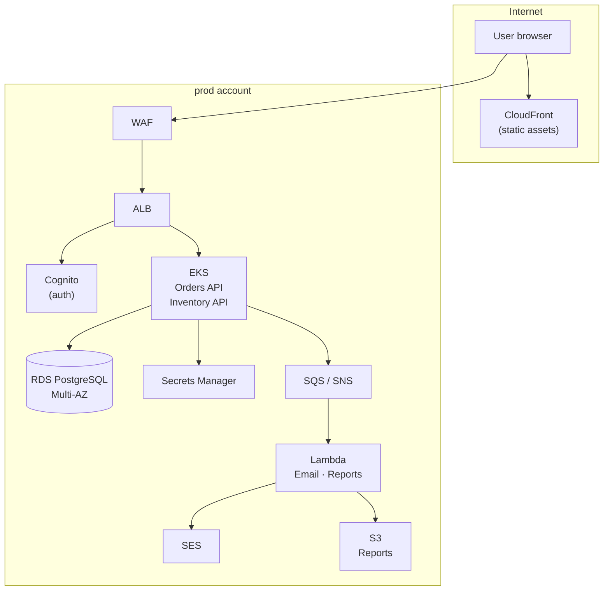

# Phase 12 — Multi-Environment and Capstone

> **AWS services introduced:** AWS Organizations, Control Tower, Terraform workspaces, GitOps promotion pipeline | **Daily cost:** ~$18–22/day (free-tier optimised)

---

## AWS services introduced

| Service | What it does | Why we need it |
|---|---|---|
| **AWS Organizations** | Multi-account management | Separate AWS accounts for dev/staging/prod with consolidated billing |
| **Control Tower** | Landing zone guardrails | Enforces account-level security baseline automatically |
| **Terraform workspaces** | Environment separation in IaC | Same Terraform code, different state per environment |
| **GitHub Actions environments** | Deployment gates | Require manual approval before promoting to prod |

## The problem

Running dev, staging, and prod in the same AWS account is a risk: a misconfigured IAM policy or accidental `terraform destroy` can affect all environments simultaneously. AWS Organizations solves this with separate accounts — separate IAM namespaces, separate billing, separate blast radius — unified under a single management account.

## Account structure

```
Management Account
├── Audit Account          — CloudTrail logs, Security Hub aggregation
├── Log Archive Account    — Centralized CloudWatch logs
└── Workloads OU
    ├── dev Account        — Shared by all developers; smaller instances, single-AZ
    ├── staging Account    — Production-like; used for pre-release validation
    └── prod Account       — Customer traffic only; tightest guardrails
```

## The capstone scenario

Six months have passed. Black Friday is in two weeks. You need to demonstrate:

1. A code change goes from `git push` → CI → dev → staging (manual approval) → prod — no manual AWS console clicks
2. GuardDuty and WAF are active in all three accounts. Security Hub aggregates findings into the audit account.
3. Simulated incident: RDS Multi-AZ failover. Orders continue with less than 60 seconds of elevated error rate.
4. Cost report: AWS Cost Explorer breakdown by account, service, and tag. Top three cost drivers identified.
5. A new engineer can `git clone`, `docker compose up`, and place an order without any AWS access.

---

## Challenge 1 — AWS Organizations and account structure

**Goal:** Create the Organizations structure with an OU for workloads. Understand how Control Tower sets up a landing zone with baseline guardrails.

### Step 1: Enable AWS Organizations

This step is done once from the management account and cannot be done via Terraform until Organizations is already enabled.

```bash
# Enable Organizations (management account only)
aws organizations create-organization --feature-set ALL

# Verify
aws organizations describe-organization \
  --query 'Organization.{Id:Id,MasterAccountId:MasterAccountId,FeatureSet:FeatureSet}' \
  --output table
```

Expected:

```
-----------------------------------------------
|          DescribeOrganization               |
+--------------------+------------------------+
|  FeatureSet        |  ALL                   |
|  Id                |  o-xxxxxxxxxxxx        |
|  MasterAccountId   |  123456789012          |
+--------------------+------------------------+
```

### Step 2: Create the Organizational Unit structure

```bash
ROOT_ID=$(aws organizations list-roots --query 'Roots[0].Id' --output text)

# Create the Workloads OU
WORKLOADS_OU=$(aws organizations create-organizational-unit \
  --parent-id "$ROOT_ID" \
  --name "Workloads" \
  --query 'OrganizationalUnit.Id' \
  --output text)

echo "Workloads OU: $WORKLOADS_OU"
```

### Step 3: Create member accounts

Creating accounts via Organizations takes 5–10 minutes each. In the management account:

```bash
# Create the dev account
aws organizations create-account \
  --email "orderflow-dev@yourcompany.com" \
  --account-name "orderflow-dev" \
  --iam-user-access-to-billing ALLOW

# Create the staging account
aws organizations create-account \
  --email "orderflow-staging@yourcompany.com" \
  --account-name "orderflow-staging" \
  --iam-user-access-to-billing ALLOW

# Create the prod account
aws organizations create-account \
  --email "orderflow-prod@yourcompany.com" \
  --account-name "orderflow-prod" \
  --iam-user-access-to-billing ALLOW
```

Poll until all accounts are `SUCCEEDED`:

```bash
watch -n 15 "aws organizations list-create-account-status \
  --states IN_PROGRESS SUCCEEDED FAILED \
  --query 'CreateAccountStatuses[*].{Name:AccountName,State:State}' \
  --output table"
```

Move accounts into the Workloads OU:

```bash
for ACCOUNT_ID in $(aws organizations list-accounts \
  --query "Accounts[?Name!='Management'].Id" \
  --output text); do

  aws organizations move-account \
    --account-id "$ACCOUNT_ID" \
    --source-parent-id "$ROOT_ID" \
    --destination-parent-id "$WORKLOADS_OU"
done
```

### Step 4: Enable Control Tower (optional — console only)

Control Tower cannot be configured via CLI or Terraform. Open the AWS Console → Control Tower → **Set up landing zone**. This creates:

- A baseline CloudTrail in every account
- Config recorder in every account
- An audit account with Security Hub aggregation
- A log archive account with centralized S3 buckets

> If you skip Control Tower, manually enable CloudTrail and Config in each account (the Terraform in Challenge 2 handles this).

---

## Challenge 2 — Terraform workspaces for multi-environment

**Goal:** Use a single Terraform codebase with workspaces to deploy different-sized infrastructure in dev, staging, and prod. Each workspace has its own state file.

### Step 1: Understand the workspace strategy

```
phase-12-capstone/terraform/
├── backend.tf          # Remote state in management account S3
├── main.tf             # Calls all modules
├── variables.tf        # Shared variable declarations
├── environments/
│   ├── dev.tfvars      # t2.micro, single-AZ, 1 NAT instance
│   ├── staging.tfvars  # t3.small, multi-AZ, 1 NAT instance
│   └── prod.tfvars     # t3.small, multi-AZ, 1 NAT instance, WAF
└── modules/
    ├── vpc/
    ├── rds/
    └── eks/
```

### Step 2: Create environment-specific variable files

Create `phase-12-capstone/terraform/environments/dev.tfvars`:

```hcl
environment        = "dev"
ec2_instance_type  = "t2.micro"
rds_instance_class = "db.t3.micro"
rds_multi_az       = false
eks_node_type      = "t3.small"
eks_node_min       = 1
eks_node_max       = 2
eks_node_desired   = 1
enable_waf         = false
nat_type           = "instance" # NAT instance — free tier
```

Create `phase-12-capstone/terraform/environments/staging.tfvars`:

```hcl
environment        = "staging"
ec2_instance_type  = "t3.small"
rds_instance_class = "db.t3.micro"
rds_multi_az       = false
eks_node_type      = "t3.small"
eks_node_min       = 1
eks_node_max       = 3
eks_node_desired   = 2
enable_waf         = true
nat_type           = "instance"
```

Create `phase-12-capstone/terraform/environments/prod.tfvars`:

```hcl
environment        = "prod"
ec2_instance_type  = "t3.small"
rds_instance_class = "db.t3.micro"
rds_multi_az       = true  # Multi-AZ only in prod for the failover challenge
eks_node_type      = "t3.small"
eks_node_min       = 2
eks_node_max       = 4
eks_node_desired   = 2
enable_waf         = true
nat_type           = "instance"
```

### Step 3: Use Terraform workspaces

Each workspace stores state in a separate S3 key automatically:

```bash
cd phase-12-capstone/terraform

# Create and deploy dev
terraform workspace new dev
terraform init
terraform plan -var-file="environments/dev.tfvars"
terraform apply -var-file="environments/dev.tfvars" -auto-approve

# Create and deploy staging
terraform workspace new staging
terraform apply -var-file="environments/staging.tfvars" -auto-approve

# Create and deploy prod
terraform workspace new prod
terraform apply -var-file="environments/prod.tfvars" -auto-approve

# List workspaces
terraform workspace list
```

Expected:

```
  default
  dev
* prod
  staging
```

### Step 4: Verify separate state files in S3

```bash
aws s3 ls "s3://orderflow-tfstate-${AWS_ACCOUNT_ID}/env:/" --recursive
```

Expected — one state file per workspace:

```
... env:/dev/phase-12/terraform.tfstate
... env:/staging/phase-12/terraform.tfstate
... env:/prod/phase-12/terraform.tfstate
```

---

## Challenge 3 — GitOps promotion pipeline

**Goal:** Build a GitHub Actions workflow that deploys to dev on every push to `main`, then promotes to staging automatically, then requires a manual approval gate before promoting to prod.

### Step 1: Create GitHub Actions environments

In your repository settings → **Environments**:

1. Create `dev` — no protection rules
2. Create `staging` — no protection rules
3. Create `prod` — add **Required reviewers**: yourself

This means any deployment to `prod` pauses and sends a review request before proceeding.

### Step 2: Create the workflow

Create `.github/workflows/deploy.yml`:

```yaml
name: Deploy OrderFlow

on:
  push:
    branches: [main]

env:
  AWS_REGION: us-east-1
  ECR_REPOSITORY: orderflow

jobs:
  build:
    name: Build and push image
    runs-on: ubuntu-latest
    outputs:
      image_tag: ${{ steps.meta.outputs.sha }}

    steps:
      - uses: actions/checkout@v4

      - name: Configure AWS credentials (management account)
        uses: aws-actions/configure-aws-credentials@v4
        with:
          role-to-assume: ${{ secrets.AWS_DEPLOY_ROLE_ARN }}
          aws-region: ${{ env.AWS_REGION }}

      - name: Log in to ECR
        id: login-ecr
        uses: aws-actions/amazon-ecr-login@v2

      - name: Set image tag
        id: meta
        run: echo "sha=$(git rev-parse --short HEAD)" >> $GITHUB_OUTPUT

      - name: Build and push
        env:
          ECR_REGISTRY: ${{ steps.login-ecr.outputs.registry }}
          IMAGE_TAG: ${{ steps.meta.outputs.sha }}
        run: |
          docker build --platform linux/amd64 \
            -t $ECR_REGISTRY/$ECR_REPOSITORY:$IMAGE_TAG \
            -t $ECR_REGISTRY/$ECR_REPOSITORY:latest \
            orderflow/
          docker push $ECR_REGISTRY/$ECR_REPOSITORY:$IMAGE_TAG
          docker push $ECR_REGISTRY/$ECR_REPOSITORY:latest

  deploy-dev:
    name: Deploy to dev
    needs: build
    runs-on: ubuntu-latest
    environment: dev

    steps:
      - uses: actions/checkout@v4

      - name: Configure AWS credentials (dev account)
        uses: aws-actions/configure-aws-credentials@v4
        with:
          role-to-assume: ${{ secrets.DEV_DEPLOY_ROLE_ARN }}
          aws-region: ${{ env.AWS_REGION }}

      - name: Update kubeconfig
        run: aws eks update-kubeconfig --name orderflow --region ${{ env.AWS_REGION }}

      - name: Helm upgrade
        run: |
          helm upgrade orderflow phase-9-eks/helm/orderflow \
            --namespace orderflow \
            --reuse-values \
            --set image.tag=${{ needs.build.outputs.image_tag }} \
            --wait --timeout 5m

      - name: Smoke test
        run: |
          ALB=$(kubectl get ingress orderflow -n orderflow \
            -o jsonpath='{.status.loadBalancer.ingress[0].hostname}')
          curl -sf "https://${ALB}/health" | jq .

  deploy-staging:
    name: Deploy to staging
    needs: deploy-dev
    runs-on: ubuntu-latest
    environment: staging

    steps:
      - uses: actions/checkout@v4

      - name: Configure AWS credentials (staging account)
        uses: aws-actions/configure-aws-credentials@v4
        with:
          role-to-assume: ${{ secrets.STAGING_DEPLOY_ROLE_ARN }}
          aws-region: ${{ env.AWS_REGION }}

      - name: Update kubeconfig
        run: aws eks update-kubeconfig --name orderflow --region ${{ env.AWS_REGION }}

      - name: Helm upgrade
        run: |
          helm upgrade orderflow phase-9-eks/helm/orderflow \
            --namespace orderflow \
            --reuse-values \
            --set image.tag=${{ needs.build.outputs.image_tag }} \
            --wait --timeout 5m

      - name: Integration tests
        run: |
          ALB=$(kubectl get ingress orderflow -n orderflow \
            -o jsonpath='{.status.loadBalancer.ingress[0].hostname}')
          # Run a basic order creation test
          curl -sf -X POST "https://${ALB}/orders" \
            -H "Content-Type: application/json" \
            -d '{"productId":1,"quantity":1}' | jq .status

  deploy-prod:
    name: Deploy to prod
    needs: deploy-staging
    runs-on: ubuntu-latest
    environment: prod   # ← manual approval gate

    steps:
      - uses: actions/checkout@v4

      - name: Configure AWS credentials (prod account)
        uses: aws-actions/configure-aws-credentials@v4
        with:
          role-to-assume: ${{ secrets.PROD_DEPLOY_ROLE_ARN }}
          aws-region: ${{ env.AWS_REGION }}

      - name: Update kubeconfig
        run: aws eks update-kubeconfig --name orderflow --region ${{ env.AWS_REGION }}

      - name: Helm upgrade (rolling deploy)
        run: |
          helm upgrade orderflow phase-9-eks/helm/orderflow \
            --namespace orderflow \
            --reuse-values \
            --set image.tag=${{ needs.build.outputs.image_tag }} \
            --wait --timeout 10m

      - name: Post-deploy health check
        run: |
          ALB=$(kubectl get ingress orderflow -n orderflow \
            -o jsonpath='{.status.loadBalancer.ingress[0].hostname}')
          for i in $(seq 1 5); do
            curl -sf "https://${ALB}/health" | jq .
            sleep 5
          done
```

### Step 3: Create cross-account IAM roles for GitHub Actions

In each account, create a role that GitHub Actions can assume via OIDC:

```hcl
# phase-12-capstone/terraform/github_oidc.tf

data "aws_iam_openid_connect_provider" "github" {
  count = var.create_github_oidc ? 1 : 0
  url   = "https://token.actions.githubusercontent.com"
}

resource "aws_iam_openid_connect_provider" "github" {
  count           = var.create_github_oidc ? 1 : 0
  url             = "https://token.actions.githubusercontent.com"
  client_id_list  = ["sts.amazonaws.com"]
  thumbprint_list = ["6938fd4d98bab03faadb97b34396831e3780aea1"]
}

resource "aws_iam_role" "github_deploy" {
  name = "${var.project}-github-deploy"

  assume_role_policy = jsonencode({
    Version = "2012-10-17"
    Statement = [{
      Effect = "Allow"
      Action = "sts:AssumeRoleWithWebIdentity"
      Principal = {
        Federated = try(
          aws_iam_openid_connect_provider.github[0].arn,
          data.aws_iam_openid_connect_provider.github[0].arn
        )
      }
      Condition = {
        StringLike = {
          # Scope to your specific repository
          "token.actions.githubusercontent.com:sub" = "repo:your-org/cloud-migration-lab-aws:*"
        }
        StringEquals = {
          "token.actions.githubusercontent.com:aud" = "sts.amazonaws.com"
        }
      }
    }]
  })
}

resource "aws_iam_role_policy" "github_deploy" {
  name = "deploy-permissions"
  role = aws_iam_role.github_deploy.id

  policy = jsonencode({
    Version = "2012-10-17"
    Statement = [
      {
        Effect   = "Allow"
        Action   = ["eks:DescribeCluster", "eks:ListClusters"]
        Resource = "*"
      },
      {
        Effect   = "Allow"
        Action   = ["ecr:GetAuthorizationToken"]
        Resource = "*"
      },
      {
        Effect = "Allow"
        Action = [
          "ecr:BatchGetImage", "ecr:BatchCheckLayerAvailability",
          "ecr:PutImage", "ecr:InitiateLayerUpload",
          "ecr:UploadLayerPart", "ecr:CompleteLayerUpload",
        ]
        Resource = "arn:aws:ecr:${var.aws_region}:*:repository/orderflow"
      }
    ]
  })
}
```

### Step 4: Test the pipeline

Push a trivial change to trigger the pipeline:

```bash
echo "# updated $(date)" >> orderflow/README.md
git add . && git commit -m "chore: trigger pipeline test"
git push origin main
```

Watch the workflow in GitHub Actions → **Actions** tab:

```
✓ Build and push image         (2m 15s)
✓ Deploy to dev                (1m 42s)
✓ Deploy to staging            (1m 38s)
⏳ Deploy to prod              (waiting for approval)
```

Approve the prod deployment from the GitHub Actions UI. Expected:

```
✓ Deploy to prod               (2m 01s)
```

---

## Challenge 4 — Cross-account Security Hub aggregation

**Goal:** Designate the audit account as the Security Hub administrator. Aggregate findings from dev, staging, and prod into a single view.

### Step 1: Designate Security Hub administrator

In the management account:

```bash
AUDIT_ACCOUNT_ID="<your audit account ID>"

aws securityhub enable-organization-admin-account \
  --admin-account-id "$AUDIT_ACCOUNT_ID"
```

### Step 2: Enable Security Hub in all member accounts

From the audit account, auto-enable new members:

```bash
aws securityhub update-organization-configuration \
  --auto-enable \
  --auto-enable-standards DEFAULT

# List member accounts
aws securityhub list-members \
  --query 'Members[*].{AccountId:AccountId,Status:MemberStatus}' \
  --output table
```

Expected:

```
---------------------------------------
|          ListMembers                |
+--------------------+----------------+
|  AccountId         |  MemberStatus  |
+--------------------+----------------+
|  111111111111      |  Enabled       |   ← dev
|  222222222222      |  Enabled       |   ← staging
|  333333333333      |  Enabled       |   ← prod
+--------------------+----------------+
```

### Step 3: View aggregated findings

```bash
# From the audit account — shows findings across all member accounts
aws securityhub get-findings \
  --filters '{
    "RecordState":[{"Value":"ACTIVE","Comparison":"EQUALS"}],
    "SeverityLabel":[{"Value":"CRITICAL","Comparison":"EQUALS"}]
  }' \
  --query 'Findings[:10].{Title:Title,Account:AwsAccountId,Severity:Severity.Label}' \
  --output table
```

---

## Challenge 5 — Capstone: RDS failover under load

**Goal:** Simulate a production database failure during peak load. Measure actual downtime. Verify it is under 60 seconds and the X-Ray trace captures the failure window.

### Step 1: Start a continuous load test

```bash
ALB_URL=$(kubectl get ingress orderflow -n orderflow \
  --context prod \
  -o jsonpath='{.status.loadBalancer.ingress[0].hostname}')

FAILURES=0
REQUESTS=0
START=$(date +%s)

while true; do
  HTTP_STATUS=$(curl -so /dev/null -w "%{http_code}" \
    -X POST "https://${ALB_URL}/orders" \
    -H "Content-Type: application/json" \
    -d '{"productId":1,"quantity":1}')

  REQUESTS=$((REQUESTS + 1))

  if [ "$HTTP_STATUS" != "200" ] && [ "$HTTP_STATUS" != "201" ]; then
    FAILURES=$((FAILURES + 1))
    echo "$(date +%H:%M:%S) FAIL (HTTP $HTTP_STATUS) — failure #$FAILURES"
  else
    echo "$(date +%H:%M:%S) OK"
  fi
  sleep 1
done
```

### Step 2: Trigger an RDS Multi-AZ failover

In a second terminal:

```bash
aws rds reboot-db-instance \
  --db-instance-identifier orderflow-postgres \
  --force-failover \
  --region us-east-1 \
  --profile prod
```

### Step 3: Observe and record the failure window

Watch the output from Step 1. You will see a window of failures as the standby is promoted:

```
10:01:00 OK
10:01:01 OK
10:01:02 FAIL (HTTP 503) — failure #1
10:01:03 FAIL (HTTP 503) — failure #2
...
10:01:37 FAIL (HTTP 503) — failure #35
10:01:38 OK
10:01:39 OK
```

Calculate total downtime:

```bash
echo "Downtime: $FAILURES seconds (~$FAILURES requests failed)"
echo "Availability: $(echo "scale=4; ($REQUESTS - $FAILURES) / $REQUESTS * 100" | bc)%"
```

### Step 4: Verify the failover in RDS

```bash
aws rds describe-db-instances \
  --db-instance-identifier orderflow-postgres \
  --profile prod \
  --query 'DBInstances[0].{Status:DBInstanceStatus,AZ:AvailabilityZone,SecondaryAZ:SecondaryAvailabilityZone}' \
  --output table
```

The `AZ` field will have changed from `us-east-1a` to `us-east-1b` (or vice versa) — the standby is now the primary.

### Step 5: Pull the X-Ray trace for the failure window

In the X-Ray console → **Traces** → set time range to cover the failover:

Filter: `responsetime > 1` to find slow or failing requests:

```
10:01:02  POST /orders  503  ERROR  postgres.query — connection refused
10:01:03  POST /orders  503  ERROR  postgres.query — connection refused
...
10:01:38  POST /orders  201  OK     postgres.query — 45ms
```

The trace shows exactly when the database connection dropped and when it recovered.

### Step 6: Record your findings

| Metric | Value |
|---|---|
| First failed request | |
| Last failed request | |
| Total downtime (seconds) | |
| AZ before failover | |
| AZ after failover | |
| AWS SLA target | < 60 seconds |
| Did you meet the SLA? | |

---

## Challenge 6 — Cost analysis and optimization

**Goal:** Use AWS Cost Explorer to break down costs by account, service, and tag. Identify the top three cost drivers and propose one concrete reduction.

### Step 1: Enable Cost Allocation Tags

Cost Explorer only breaks down by tag if tags are activated as cost allocation tags:

```bash
# Activate the Project and Environment tags for cost allocation
aws ce update-cost-allocation-tags-status \
  --cost-allocation-tags-status \
    TagKey=Project,Status=Active \
    TagKey=Environment,Status=Active
```

> Tags activated today take 24 hours to appear in Cost Explorer.

### Step 2: Query costs by service

```bash
START=$(date -u -d '7 days ago' +%Y-%m-%d 2>/dev/null || date -u -v-7d +%Y-%m-%d)
END=$(date -u +%Y-%m-%d)

aws ce get-cost-and-usage \
  --time-period Start="$START",End="$END" \
  --granularity DAILY \
  --metrics UnblendedCost \
  --group-by Type=DIMENSION,Key=SERVICE \
  --query 'ResultsByTime[-1].Groups | sort_by(@, &Metrics.UnblendedCost.Amount) | reverse(@) | [:5].{Service:Keys[0],Cost:Metrics.UnblendedCost.Amount}' \
  --output table
```

Expected:

```
-----------------------------------------------------
|              GetCostAndUsage                      |
+----------------------------+---------------------+
|  Service                   |  Cost               |
+----------------------------+---------------------+
|  Amazon Elastic Kubernetes  |  2.40              |
|  Amazon RDS                |  0.81               |
|  Amazon ElastiCache        |  0.41               |
|  Amazon EC2-Other          |  0.21               |
|  Elastic Load Balancing    |  0.20               |
+----------------------------+---------------------+
```

### Step 3: Query costs by environment tag

```bash
aws ce get-cost-and-usage \
  --time-period Start="$START",End="$END" \
  --granularity MONTHLY \
  --metrics UnblendedCost \
  --group-by Type=TAG,Key=Environment \
  --query 'ResultsByTime[-1].Groups[*].{Env:Keys[0],Cost:Metrics.UnblendedCost.Amount}' \
  --output table
```

### Step 4: Identify the top three cost drivers and propose reductions

Based on the Cost Explorer output, fill in this table:

| Rank | Service | $/day | Reduction option |
|---|---|---|---|
| 1 | EKS control plane | $2.40 | Accept — no way to reduce; complete phase in 2 days |
| 2 | RDS PostgreSQL | $0.81 | Stop the instance overnight with a snapshot; restore next session |
| 3 | ElastiCache | $0.41 | Destroy when not actively working; restore from config in ~5 min |

**Concrete reduction — RDS snapshot and restore workflow:**

```bash
# Before stopping work: take a snapshot
aws rds create-db-snapshot \
  --db-instance-identifier orderflow-postgres \
  --db-snapshot-identifier orderflow-postgres-$(date +%Y%m%d)

# Destroy RDS (saves $0.81/day)
terraform workspace select prod
terraform destroy -target=aws_db_instance.main -auto-approve

# Next session: restore from snapshot
terraform apply -var-file="environments/prod.tfvars" \
  -var="rds_snapshot_identifier=orderflow-postgres-$(date +%Y%m%d)" \
  -auto-approve
```

This saves $0.81/day × 12 hours off = $0.40/day for part-time lab use.

---

## AWS concept: why multi-account?

| Risk | Single account | Multi-account |
|---|---|---|
| Accidental `terraform destroy` | Destroys prod | Destroys only the target account |
| IAM misconfiguration | Can affect all environments | Blast radius limited to one account |
| Billing visibility | One bill, hard to attribute | Per-account bills with consolidated view |
| Compliance | Harder to enforce prod guardrails | Control Tower SCPs apply per-OU |

---

## Final architecture



## Outcome

OrderFlow runs in three isolated AWS accounts deployed via a GitOps promotion pipeline. A code change reaches prod in under 10 minutes with a manual approval gate. GuardDuty and WAF are active in all three accounts. Security Hub aggregates findings from all accounts into the audit account. RDS failover completes in under 60 seconds.

## Cost breakdown (free-tier optimised)

| Account | Key resources | $/day |
|---|---|---|
| **dev** | NAT instance, EKS, 1× t3.small, RDS db.t3.micro Single-AZ | ~$3.50 |
| **staging** | NAT instance, EKS, 2× t3.small, RDS db.t3.micro | ~$5.90 |
| **prod** | NAT instance, EKS, 2× t3.small, RDS db.t3.micro Multi-AZ, WAF | ~$7.00 |
| **shared** | GuardDuty, Config, Security Hub, CloudTrail | ~$1.50 |
| **Total** | | **~$18–22/day** |

> Run Phase 12 in sprint mode — provision all environments, complete the capstone scenario (all 6 challenges), destroy within 3–4 days. Total cost: ~$65–85.

```bash
# Destroy in reverse order: prod → staging → dev
for env in prod staging dev; do
  terraform workspace select $env
  terraform destroy -var-file="environments/${env}.tfvars" -auto-approve
done
```

---

[Back to main README](../README.md) | [Next: Phase 13 — Data Platform & AI](../phase-13-data-ai/README.md)
