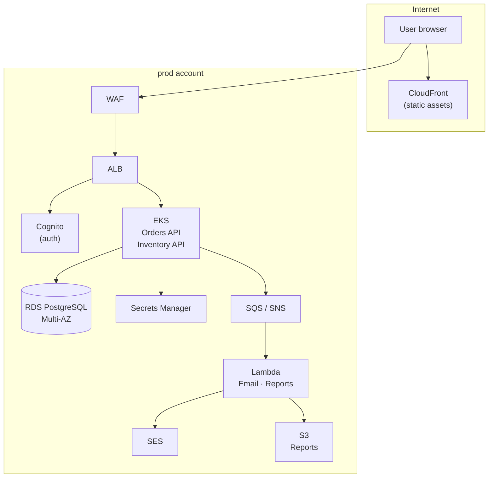

# Phase 12 — Multi-Environment and Capstone

> **AWS services introduced:** AWS Organizations, Control Tower, Service Catalog | **Daily cost:** ~$31–35/day

---

## AWS services introduced

| Service | What it does | Why we need it |
|---|---|---|
| **AWS Organizations** | Multi-account management | Separate AWS accounts for dev/staging/prod with consolidated billing |
| **Control Tower** | Landing zone guardrails | Enforces account-level security baseline automatically |
| **Service Catalog** | Self-service infrastructure | Teams provision standard resources without knowing Terraform |

## The problem

Running dev, staging, and prod in the same AWS account is a risk: a misconfigured IAM policy or accidental `terraform destroy` can affect all environments simultaneously. AWS Organizations solves this by providing separate accounts — with separate IAM namespaces, separate billing, and separate blast radius — unified under a single management account.

## Account structure

```
Management Account
├── Audit Account          — CloudTrail logs, Security Hub aggregation
├── Log Archive Account    — Centralized CloudWatch logs
└── Workloads OU
    ├── dev Account        — Shared by all developers for experimentation
    ├── staging Account    — Production-like, used for pre-release validation
    └── prod Account       — Customer traffic only, tightest guardrails
```

## The capstone scenario

Six months have passed. Black Friday is in two weeks. You need to demonstrate:

1. A code change that goes from `git push` → CI → dev EKS → staging (manual approval) → prod — fully automated, no manual AWS console clicks
2. GuardDuty and WAF are active in all three accounts. Security Hub aggregates findings into the audit account.
3. A simulated incident: the RDS Multi-AZ failover. Orders must continue with less than 60 seconds of elevated error rate. Show the X-Ray trace of the failing requests and the CloudWatch alarm that fired.
4. The cost report: show the AWS Cost Explorer breakdown by account, service, and environment. Identify the top three cost drivers. Propose one reduction (e.g., Savings Plan for ECS Fargate).
5. A new engineer joins. They can run `git clone`, `docker compose up`, and place an order — without any AWS access or tribal knowledge.

## Final architecture



## Outcome

A fully cloud-native OrderFlow running in three isolated AWS accounts, deployed via a GitOps promotion pipeline, with WAF/GuardDuty/Config active in all environments and a sub-60-second recovery from an RDS failover.

## Cost breakdown

| Account | Key resources | $/day |
|---|---|---|
| dev | 1 NAT GW, EKS, 1× t3.small, RDS Single-AZ | ~$5 |
| staging | 2 NAT GW, EKS, 2× t3.medium, RDS Multi-AZ, ElastiCache | ~$10 |
| prod | 2 NAT GW, EKS, 2× t3.medium, RDS Multi-AZ, ElastiCache, WAF | ~$11 |
| shared | GuardDuty, Config, Security Hub, CloudTrail (3 accounts) | ~$5 |
| **Total** | | **~$31–35/day** |

> Run Phase 12 in sprint mode — provision everything, complete the capstone scenario, destroy within 2–3 days. A full run costs ~$70–100.

```bash
cd terraform && terraform destroy -auto-approve
```

---

[Back to main README](../README.md) | [Next: Phase 13 — Data Platform & AI](../phase-13-data-ai/README.md)
