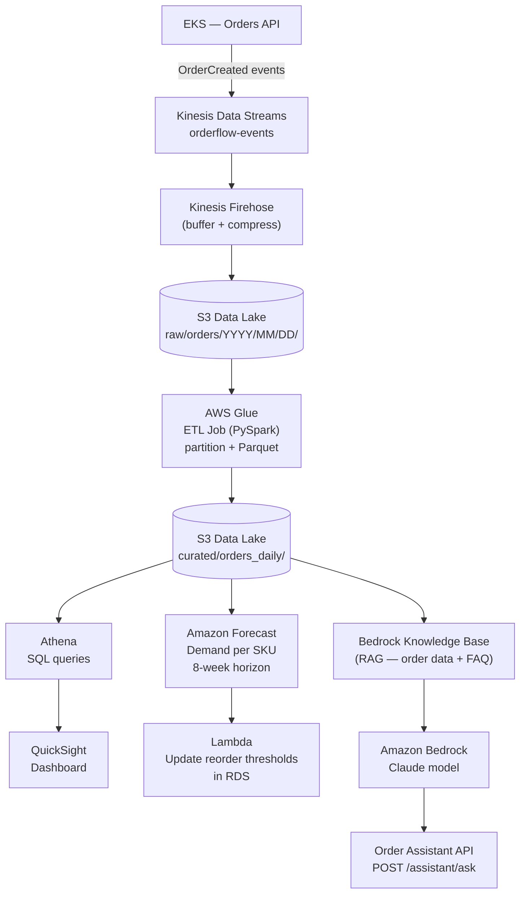
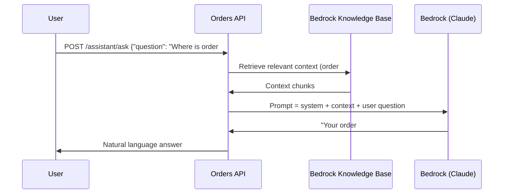

# Phase 13 — Data Platform & AI

> **AWS services introduced:** Kinesis, Glue, Athena, QuickSight, Amazon Forecast, Amazon Bedrock | **Daily cost:** ~$36/day (incremental ~$2.20 over Phase 12)

---

## AWS services introduced

| Service | What it does | Why we need it |
|---|---|---|
| **Kinesis Data Streams** | Real-time event ingestion | Capture every order event at scale without hitting the database |
| **AWS Glue** | Serverless ETL | Transform raw event data into analytics-ready tables |
| **S3 data lake** | Long-term analytics storage | Cheap, durable store for all historical order data |
| **Athena** | Serverless SQL on S3 | Query terabytes of order history without a warehouse |
| **QuickSight** | BI dashboards | Self-service dashboards for the finance and ops teams |
| **Amazon Forecast** | Time-series ML forecasting | Predict demand per product before stockouts happen |
| **Amazon Bedrock** | Managed foundation models (LLMs) | Build a GenAI order assistant without training your own model |
| **Bedrock Knowledge Bases** | Retrieval-augmented generation (RAG) | Ground LLM responses in OrderFlow's own product and order data |

## The problem

OrderFlow processes 400,000 orders per day. The board has three new requests:

1. **The CFO** wants a real-time sales dashboard — current revenue, top products, regional breakdown. Right now, every report is a manual SQL export from RDS.
2. **The warehouse team** keeps running out of stock at peak times. They want demand forecasts per product, not spreadsheet guesses.
3. **Customer support** spends 40% of time answering "where is my order?" questions. They want an AI assistant that can answer in natural language and reduce ticket volume.

These three problems share a common answer: build a data platform that unlocks the order data that already exists, and layer AI on top of it.

## Architecture after Phase 13



---

## Track A — Data Platform (analytics)

### The data lake pipeline

Raw order events flow from the Orders API into Kinesis Data Streams, buffered by Kinesis Firehose, and landed in S3 as compressed JSON partitioned by date. A nightly Glue ETL job converts raw JSON to Parquet, adds partition columns (`year`, `month`, `day`, `region`), and writes to the curated S3 prefix. Athena queries the Glue Data Catalog — no data movement, no warehouse to provision.

```
S3 raw prefix:     s3://orderflow-data-lake/raw/orders/2026/04/17/
S3 curated prefix: s3://orderflow-data-lake/curated/orders_daily/year=2026/month=04/day=17/
```

Partitioning is critical: Athena charges per byte scanned. A query for "April orders" without partitioning scans the entire history. With partitioning, Athena reads only the April partition — 100× cheaper on a year of data.

### QuickSight dashboard

Connect QuickSight to Athena. Create a SPICE dataset that refreshes every hour. Build three visuals:
- Revenue by day (line chart with 30-day rolling average)
- Top 20 products by units sold (bar chart)
- Order volume by region (filled map)

The CFO can access this in a browser — no SQL, no CSV exports.

---

## Track B — AI

### Demand forecasting with Amazon Forecast

Amazon Forecast trains a time-series model on your historical order data. You provide: a target time series (`product_id`, `date`, `units_sold`) and optionally related time series (`is_holiday`, `price`). Forecast handles model selection, hyperparameter tuning, and inference — you never write ML code.

```python
# Export curated order data to Forecast format
# product_id, timestamp, demand
"PROD-001", "2026-01-01", 142
"PROD-001", "2026-01-02", 98
...

# Forecast output: 8-week predictions with P10/P50/P90 bounds
# Lambda reads predictions and writes reorder_threshold to RDS inventory table
```

When P90 demand for a product exceeds current stock + lead time, the inventory Lambda triggers an SNS alert to the purchasing team.

### GenAI order assistant with Amazon Bedrock

The support team's top question: *"Where is my order?"* This requires real order data — a generic LLM cannot answer it. The solution is Retrieval-Augmented Generation (RAG) via Bedrock Knowledge Bases.



The Knowledge Base is backed by an S3 bucket containing:
- Order status exports (JSON, refreshed every 15 minutes by a Lambda)
- Product FAQ documents
- Shipping policy documentation

Bedrock chunks, embeds, and indexes this data into a vector store (Amazon OpenSearch Serverless). At query time, the user's question is embedded and the most relevant chunks are retrieved before being passed to Claude.

No fine-tuning. No training data. No GPU. The model is fully managed by AWS — you pay per input/output token.

---

## Challenges

1. **Kinesis pipeline**: Configure the Orders API to publish `OrderCreated` and `OrderShipped` events to Kinesis Data Streams. Set up Firehose to buffer for 60 seconds, compress to GZIP, and land in S3. Verify events arrive within 2 minutes of order placement.
2. **Glue ETL**: Write a PySpark Glue job that reads raw JSON from S3, infers the schema, converts to Parquet, and writes to the curated prefix with date partitions. Schedule it with Glue Triggers at midnight UTC.
3. **Athena + QuickSight**: Create the Glue Data Catalog table pointing at the curated prefix. Run a query that calculates daily revenue for the past 30 days. Connect QuickSight to Athena and build the CFO dashboard.
4. **Amazon Forecast**: Export 90 days of product order history in the Forecast CSV format. Create a Dataset Group, import the data, and train a predictor with a 56-day (8-week) forecast horizon. Export predictions and write a Lambda that reads them and updates the `reorder_threshold` column in RDS.
5. **Bedrock Knowledge Base**: Create a Knowledge Base backed by an S3 bucket. Write a Lambda that exports recent order statuses to S3 every 15 minutes. Enable the Knowledge Base and confirm it indexes the documents. Test retrieval with a specific order ID.
6. **Order assistant API**: Add `POST /assistant/ask` to the Orders API. The handler calls the Bedrock `RetrieveAndGenerate` API, passes the user question, and returns the LLM response. Add a Cognito authorizer so only authenticated users can call it.
7. **Cost guardrail**: Set a Bedrock token budget — add a Lambda authorizer that rejects requests if the daily Bedrock token count (tracked in DynamoDB) exceeds 500,000 tokens. Understand why this matters at scale.

## AWS concept: RAG vs fine-tuning

| Approach | When to use | Cost | Freshness |
|---|---|---|---|
| **Prompt engineering** | Generic tasks, no private data | Lowest | N/A |
| **RAG (Knowledge Bases)** | Private, frequently-changing data | Low | Near real-time |
| **Fine-tuning** | Specific tone/style/domain jargon | High (training run) | Snapshot in time |
| **Pre-training** | Building a foundation model | Extremely high | N/A |

For OrderFlow, RAG is the right answer: order data changes every second, fine-tuning would be stale within hours, and pre-training is not in the budget.

## Outcome

- The CFO has a live QuickSight dashboard with no SQL required
- The warehouse team receives weekly reorder threshold updates driven by ML predictions
- Customer support has an AI assistant that answers order-status questions in natural language, grounded in real order data
- All AI features use managed AWS services — no ML infrastructure to run, no models to train

## Cost breakdown

| Resource | Size / usage | $/day |
|---|---|---|
| Kinesis Data Streams | 2 shards | ~$0.72 |
| Kinesis Firehose | ~5 MB/day | ~$0.02 |
| S3 data lake | ~1 GB/month | ~$0.01 |
| Glue ETL | 2 DPU × 15 min/night | ~$0.07 |
| Athena | ~100 MB scanned/day | ~$0.01 |
| QuickSight | 1 author | ~$0.60 |
| Bedrock (Claude Haiku) | ~50K tokens/day | ~$0.04 |
| Bedrock Knowledge Base | OpenSearch Serverless 0.5 OCU | ~$0.72 |
| Amazon Forecast | predictor training (one-time) | ~$2–5 total |
| **Incremental over Phase 12** | | **~$2.20/day** |

> Train the Forecast predictor once, export predictions, then delete the predictor. You keep the CSVs in S3. Retraining is a deliberate action — not a continuous cost.

```bash
cd terraform && terraform destroy -auto-approve
```

---

[Back to main README](../README.md)
