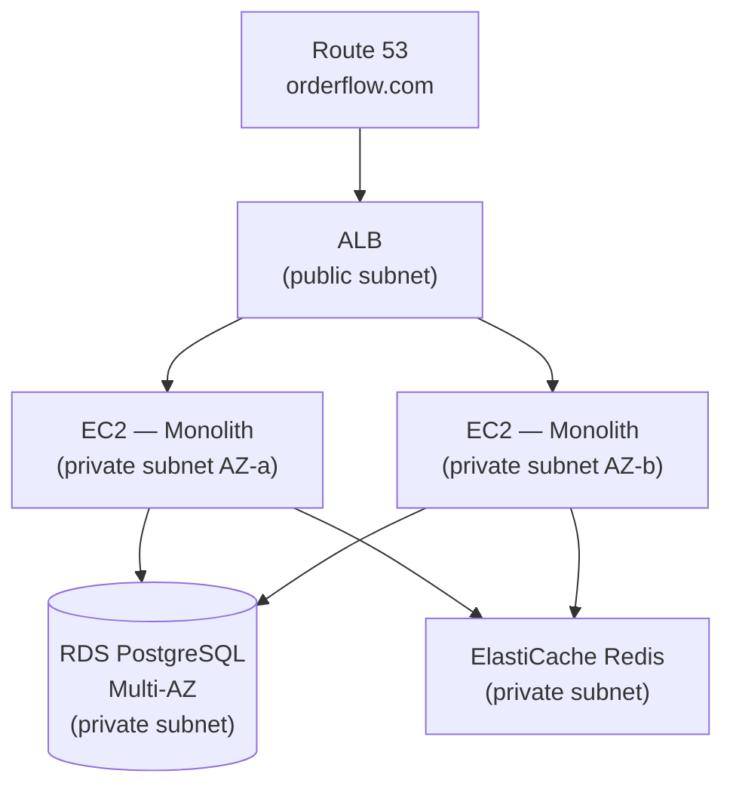

# Phase 2 — Lift and Shift

> **AWS services introduced:** EC2, RDS, ElastiCache, ALB, Route 53, ACM | **Daily cost:** ~$6.10/day

---

## AWS services introduced

| Service | What it does | Why we need it |
|---|---|---|
| **EC2** | Virtual machines | Runs the monolith — same as the VPS, but managed by AWS |
| **RDS PostgreSQL** | Managed relational database | Removes the ops burden of running PostgreSQL yourself |
| **ElastiCache (Redis)** | Managed in-memory cache | Solves the session problem observed in Phase 0 |
| **ALB** | Application Load Balancer | Distributes traffic across multiple app servers |
| **Route 53** | DNS | Maps your domain to the ALB |
| **ACM** | Certificate Manager | Free TLS certificates, auto-renewed |

## The problem

The OrderFlow VPS will be decommissioned. The shortest path to AWS is a "lift and shift" — move the monolith to EC2 with minimum code changes. This is not the end state. It is a stable platform from which to run every subsequent phase.

## Why RDS instead of PostgreSQL on EC2?

Running PostgreSQL on an EC2 instance means you are responsible for: backups, failover, patching, storage scaling, and replication. RDS handles all of this. It costs more than a raw EC2 instance running Postgres, but when your database fails at 2 AM, you want AWS to page their on-call, not yours.

RDS Multi-AZ runs a synchronous standby in a second AZ. If the primary fails, AWS promotes the standby in under 60 seconds — automatically, without you doing anything.

## Why ElastiCache instead of Redis on EC2?

The same argument applies. ElastiCache also solves the session problem from Phase 0: when the monolith runs on 2 EC2 instances behind an ALB, both instances read and write session data to the same ElastiCache cluster rather than storing it in process memory.

```
Before Phase 2:
  User → EC2-A (session stored in EC2-A memory) → next request goes to EC2-B → logged out

After Phase 2:
  User → ALB → EC2-A or EC2-B → ElastiCache (shared sessions) → always logged in
```

## Architecture after Phase 2



## Challenges

1. Provision an RDS PostgreSQL instance in the private subnets from Phase 1. Enable Multi-AZ. Store the password in AWS Secrets Manager (not in Terraform state).
2. Provision an ElastiCache Redis cluster. Update the monolith's session store to point at it.
3. Create a launch template for EC2 and an Auto Scaling Group (min: 1, max: 3) in the private subnets.
4. Create an ALB in the public subnets. Add a target group pointing at the Auto Scaling Group. Configure health checks on `GET /health`.
5. Request a certificate in ACM. Add an HTTPS listener on the ALB. Redirect HTTP to HTTPS.
6. Run the same session test from Phase 0 — log in on one instance, make a request through the ALB (which may route to the other) — confirm sessions persist.
7. Simulate an RDS failover (`aws rds reboot-db-instance --force-failover`) — measure how long orders are unavailable.

## Outcome

OrderFlow runs on AWS, survives a server failure, and the session bug from Phase 0 is resolved. The monolith code is unchanged — only its environment changed.

## Cost breakdown

| Resource | $/day |
|---|---|
| 2× NAT Gateway | $2.16 |
| 2× EC2 t3.small | $1.00 |
| RDS PostgreSQL db.t3.small Multi-AZ | $1.63 |
| ElastiCache cache.t3.micro | $0.41 |
| ALB | $0.25 |
| Route 53 + ACM | ~$0.05 |
| **Total** | **~$5.50** |

```bash
cd terraform && terraform destroy -auto-approve
```

---

[Back to main README](../README.md) | [Next: Phase 3 — Containerize and ECS](../phase-3-ecs/README.md)
