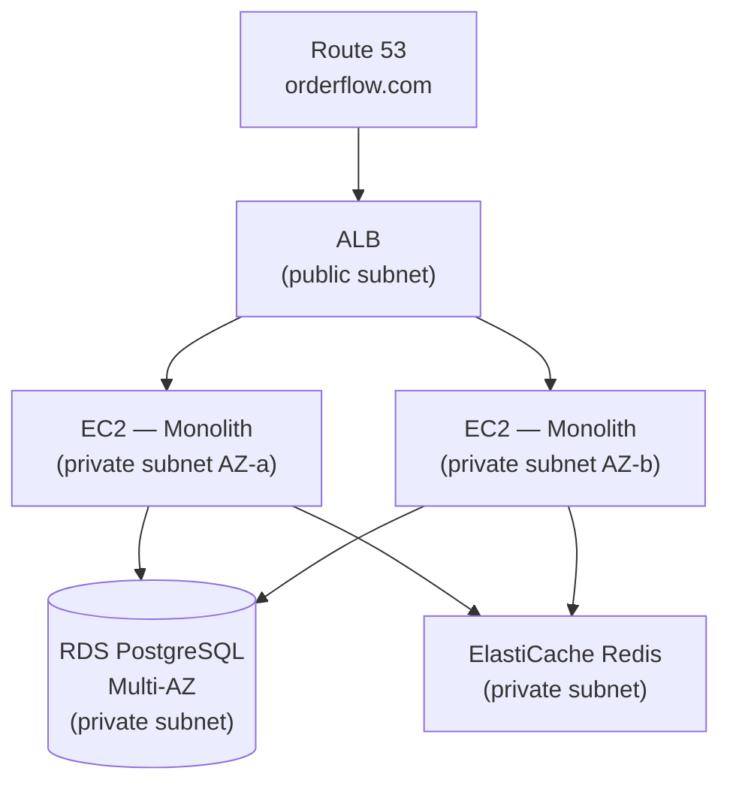

# Phase 2 — Lift and Shift

> **AWS services introduced:** EC2, RDS, ElastiCache, ALB, Route 53, ACM | **Daily cost:** ~$6.10/day

---

## AWS services introduced

| Service | What it does | Why we need it |
|---|---|---|
| **EC2** | Virtual machines | Runs the monolith — same as the VPS, but managed by AWS |
| **RDS PostgreSQL** | Managed relational database | Removes the ops burden of running PostgreSQL yourself |
| **ElastiCache (Redis)** | Managed in-memory cache | Solves the session problem observed in Phase 0 |
| **ALB** | Application Load Balancer | Distributes traffic across multiple app servers |
| **Route 53** | DNS | Maps your domain to the ALB |
| **ACM** | Certificate Manager | Free TLS certificates, auto-renewed |

## The problem

The OrderFlow VPS will be decommissioned. The shortest path to AWS is a "lift and shift" — move the monolith to EC2 with minimum code changes. This is not the end state. It is a stable platform from which to run every subsequent phase.

## Why RDS instead of PostgreSQL on EC2?

Running PostgreSQL on an EC2 instance means you are responsible for: backups, failover, patching, storage scaling, and replication. RDS handles all of this. When your database fails at 2 AM, you want AWS to page their on-call, not yours.

RDS Multi-AZ runs a synchronous standby in a second AZ. If the primary fails, AWS promotes the standby in under 60 seconds — automatically.

## Why ElastiCache instead of Redis on EC2?

ElastiCache solves the session problem from Phase 0: when the monolith runs on 2 EC2 instances behind an ALB, both read and write session data to the same ElastiCache cluster instead of storing it in process memory.

```
Before: User → EC2-A (session in memory) → next request hits EC2-B → logged out
After:  User → ALB → EC2-A or EC2-B → ElastiCache (shared sessions) → always logged in
```

## Architecture after Phase 2



---

## Challenge 1 — Provision RDS PostgreSQL with Multi-AZ and store the password in Secrets Manager

### Step 1: Create the Terraform directory

```bash
mkdir -p phase-2-lift-and-shift/terraform
cd phase-2-lift-and-shift/terraform
```

Copy `backend.tf` and `variables.tf` from Phase 1, updating the state key:

```hcl
# backend.tf (key only changes)
backend "s3" {
  key = "phase-2/terraform.tfstate"
}
```

### Step 2: Create security groups in `security_groups.tf`

```hcl
# security_groups.tf

# Security group for the ALB — allows inbound HTTP and HTTPS from the internet
resource "aws_security_group" "alb" {
  name        = "${var.project}-alb-sg"
  description = "Allow HTTP and HTTPS from the internet"
  vpc_id      = data.aws_vpc.main.id

  ingress {
    from_port   = 80
    to_port     = 80
    protocol    = "tcp"
    cidr_blocks = ["0.0.0.0/0"]
  }

  ingress {
    from_port   = 443
    to_port     = 443
    protocol    = "tcp"
    cidr_blocks = ["0.0.0.0/0"]
  }

  egress {
    from_port   = 0
    to_port     = 0
    protocol    = "-1"
    cidr_blocks = ["0.0.0.0/0"]
  }

  tags = { Name = "${var.project}-alb-sg" }
}

# Security group for EC2 — only accepts traffic from the ALB
resource "aws_security_group" "app" {
  name        = "${var.project}-app-sg"
  description = "Allow traffic from ALB only"
  vpc_id      = data.aws_vpc.main.id

  ingress {
    from_port       = 3000
    to_port         = 3000
    protocol        = "tcp"
    security_groups = [aws_security_group.alb.id]
  }

  egress {
    from_port   = 0
    to_port     = 0
    protocol    = "-1"
    cidr_blocks = ["0.0.0.0/0"]
  }

  tags = { Name = "${var.project}-app-sg" }
}

# Security group for RDS — only accepts traffic from EC2 instances
resource "aws_security_group" "rds" {
  name        = "${var.project}-rds-sg"
  description = "Allow PostgreSQL from app instances only"
  vpc_id      = data.aws_vpc.main.id

  ingress {
    from_port       = 5432
    to_port         = 5432
    protocol        = "tcp"
    security_groups = [aws_security_group.app.id]
  }

  tags = { Name = "${var.project}-rds-sg" }
}

# Security group for ElastiCache — only accepts traffic from EC2 instances
resource "aws_security_group" "redis" {
  name        = "${var.project}-redis-sg"
  description = "Allow Redis from app instances only"
  vpc_id      = data.aws_vpc.main.id

  ingress {
    from_port       = 6379
    to_port         = 6379
    protocol        = "tcp"
    security_groups = [aws_security_group.app.id]
  }

  tags = { Name = "${var.project}-redis-sg" }
}
```

### Step 3: Add data sources to reference the Phase 1 VPC in `data.tf`

```hcl
# data.tf
data "aws_vpc" "main" {
  tags = { Project = var.project }
}

data "aws_subnets" "private" {
  filter {
    name   = "vpc-id"
    values = [data.aws_vpc.main.id]
  }
  tags = { Tier = "private" }
}

data "aws_subnets" "public" {
  filter {
    name   = "vpc-id"
    values = [data.aws_vpc.main.id]
  }
  tags = { Tier = "public" }
}
```

### Step 4: Generate and store the database password in Secrets Manager

```hcl
# rds.tf

# Generate a random password — never written to Terraform state as plaintext
resource "random_password" "db" {
  length           = 32
  special          = true
  override_special = "!#$%&*()-_=+[]{}<>:?"
}

# Store the password in Secrets Manager
resource "aws_secretsmanager_secret" "db_password" {
  name                    = "${var.project}/db-password"
  recovery_window_in_days = 0  # Allow immediate deletion in dev

  tags = { Project = var.project }
}

resource "aws_secretsmanager_secret_version" "db_password" {
  secret_id     = aws_secretsmanager_secret.db_password.id
  secret_string = jsonencode({
    username = "orderflow"
    password = random_password.db.result
    dbname   = "orderflow"
  })
}
```

### Step 5: Provision the RDS subnet group and instance

Append to `rds.tf`:

```hcl
resource "aws_db_subnet_group" "main" {
  name       = "${var.project}-db-subnet-group"
  subnet_ids = data.aws_subnets.private.ids

  tags = { Name = "${var.project}-db-subnet-group" }
}

resource "aws_db_instance" "main" {
  identifier        = "${var.project}-postgres"
  engine            = "postgres"
  engine_version    = "15"
  instance_class    = "db.t3.small"
  allocated_storage = 20
  storage_encrypted = true

  db_name  = "orderflow"
  username = "orderflow"
  password = random_password.db.result

  db_subnet_group_name   = aws_db_subnet_group.main.name
  vpc_security_group_ids = [aws_security_group.rds.id]

  # Multi-AZ — synchronous standby in a second AZ
  multi_az = true

  # Backups
  backup_retention_period = 7
  backup_window           = "03:00-04:00"
  maintenance_window      = "Mon:04:00-Mon:05:00"

  # Prevent accidental deletion
  deletion_protection = false  # Set to true in production
  skip_final_snapshot = true   # Set to false in production

  tags = { Name = "${var.project}-postgres" }
}
```

### Step 6: Verify the secret was stored correctly

After `terraform apply`:

```bash
aws secretsmanager get-secret-value \
  --secret-id orderflow/db-password \
  --query SecretString \
  --output text | jq
```

Expected output:
```json
{
  "username": "orderflow",
  "password": "...",
  "dbname": "orderflow"
}
```

---

## Challenge 2 — Provision ElastiCache Redis and update the session store

### Step 1: Create `elasticache.tf`

```hcl
# elasticache.tf

resource "aws_elasticache_subnet_group" "main" {
  name       = "${var.project}-redis-subnet-group"
  subnet_ids = data.aws_subnets.private.ids

  tags = { Name = "${var.project}-redis-subnet-group" }
}

resource "aws_elasticache_cluster" "redis" {
  cluster_id           = "${var.project}-redis"
  engine               = "redis"
  node_type            = "cache.t3.micro"
  num_cache_nodes      = 1
  parameter_group_name = "default.redis7"
  port                 = 6379
  subnet_group_name    = aws_elasticache_subnet_group.main.name
  security_group_ids   = [aws_security_group.redis.id]

  tags = { Name = "${var.project}-redis" }
}

output "redis_endpoint" {
  value = aws_elasticache_cluster.redis.cache_nodes[0].address
}
```

### Step 2: Update the monolith to use ElastiCache for sessions

In `orderflow/src/app.js`, the session configuration reads from the `REDIS_URL` environment variable. The EC2 user-data script (set in Challenge 3) will inject this value at boot.

The key change is ensuring `connect-redis` is configured:

```js
// src/app.js — session configuration (already in the app)
const session = require('express-session');
const RedisStore = require('connect-redis').default;
const { createClient } = require('redis');

const redisClient = createClient({ url: process.env.REDIS_URL });
redisClient.connect();

app.use(session({
  store: new RedisStore({ client: redisClient }),
  secret: process.env.SESSION_SECRET,
  resave: false,
  saveUninitialized: false,
  cookie: { secure: process.env.NODE_ENV === 'production' }
}));
```

The `REDIS_URL` value will be `redis://<elasticache-endpoint>:6379`, injected via the EC2 user-data script.

---

## Challenge 3 — Create a launch template and Auto Scaling Group

### Step 1: Find the latest Amazon Linux 2023 AMI

```hcl
# ec2.tf

data "aws_ami" "amazon_linux_2023" {
  most_recent = true
  owners      = ["amazon"]

  filter {
    name   = "name"
    values = ["al2023-ami-*-x86_64"]
  }
}
```

### Step 2: Create the user-data script

The user-data script runs once when the instance boots. It installs Node.js, pulls the app from S3 (or ECR in later phases), and starts it.

```hcl
locals {
  user_data = base64encode(templatefile("${path.module}/user_data.sh", {
    db_secret_arn  = aws_secretsmanager_secret.db_password.arn
    redis_endpoint = aws_elasticache_cluster.redis.cache_nodes[0].address
    aws_region     = var.aws_region
    project        = var.project
  }))
}
```

Create `user_data.sh`:

```bash
#!/bin/bash
set -e

# Install Node.js 20
curl -fsSL https://rpm.nodesource.com/setup_20.x | bash -
yum install -y nodejs git jq

# Read database credentials from Secrets Manager
SECRET=$(aws secretsmanager get-secret-value \
  --secret-id "${db_secret_arn}" \
  --region "${aws_region}" \
  --query SecretString \
  --output text)

DB_USER=$(echo "$SECRET" | jq -r '.username')
# URL-encode the password to handle special characters in the connection string
DB_PASS=$(echo "$SECRET" | jq -r '.password' | python3 -c "import sys, urllib.parse; print(urllib.parse.quote(sys.stdin.read().strip(), safe=''))")
DB_NAME=$(echo "$SECRET" | jq -r '.dbname')

# Get RDS endpoint
RDS_ENDPOINT=$(aws rds describe-db-instances \
  --db-instance-identifier "${project}-postgres" \
  --region "${aws_region}" \
  --query "DBInstances[0].Endpoint.Address" \
  --output text)

# Clone the application
git clone https://github.com/wb-platform-engineering-lab/cloud-migration-lab-aws.git /app
cd /app/phase-2-lift-and-shift/orderflow
npm install --production

# Write environment file
cat > /app/phase-2-lift-and-shift/orderflow/.env <<EOF
NODE_ENV=production
PORT=3000
DATABASE_URL=postgres://$DB_USER:$DB_PASS@$RDS_ENDPOINT:5432/$DB_NAME?sslmode=no-verify
REDIS_URL=redis://${redis_endpoint}:6379
SESSION_SECRET=$(openssl rand -hex 32)
EOF

# Run database migrations and seed
npm run migrate
npm run seed

# Start with systemd
cat > /etc/systemd/system/orderflow.service <<EOF
[Unit]
Description=OrderFlow
After=network.target

[Service]
WorkingDirectory=/app/phase-2-lift-and-shift/orderflow
EnvironmentFile=/app/phase-2-lift-and-shift/orderflow/.env
ExecStart=/usr/bin/node src/app.js
Restart=always
RestartSec=5
User=ec2-user

[Install]
WantedBy=multi-user.target
EOF

systemctl daemon-reload
systemctl enable orderflow
systemctl start orderflow
```

### Step 3: Create the launch template and ASG

Append to `ec2.tf`:

```hcl
resource "aws_launch_template" "app" {
  name_prefix   = "${var.project}-"
  image_id      = data.aws_ami.amazon_linux_2023.id
  instance_type = "t3.small"

  user_data = local.user_data

  iam_instance_profile {
    name = "${var.project}-ec2-instance-profile"  # Created in Phase 1
  }

  network_interfaces {
    associate_public_ip_address = false
    security_groups             = [aws_security_group.app.id]
  }

  tag_specifications {
    resource_type = "instance"
    tags = {
      Name    = "${var.project}-app"
      Project = var.project
    }
  }
}

resource "aws_autoscaling_group" "app" {
  name                = "${var.project}-asg"
  min_size            = 1
  max_size            = 3
  desired_capacity    = 2
  vpc_zone_identifier = data.aws_subnets.private.ids

  launch_template {
    id      = aws_launch_template.app.id
    version = "$Latest"
  }

  target_group_arns = [aws_lb_target_group.app.arn]

  health_check_type         = "ELB"
  health_check_grace_period = 120

  tag {
    key                 = "Project"
    value               = var.project
    propagate_at_launch = true
  }
}
```

---

## Challenge 4 — Create the ALB, target group, and health checks

### Step 1: Create `alb.tf`

```hcl
# alb.tf

resource "aws_lb" "main" {
  name               = "${var.project}-alb"
  internal           = false
  load_balancer_type = "application"
  security_groups    = [aws_security_group.alb.id]
  subnets            = data.aws_subnets.public.ids

  tags = { Name = "${var.project}-alb" }
}

resource "aws_lb_target_group" "app" {
  name        = "${var.project}-tg"
  port        = 3000
  protocol    = "HTTP"
  vpc_id      = data.aws_vpc.main.id
  target_type = "instance"

  health_check {
    path                = "/health"
    protocol            = "HTTP"
    matcher             = "200"
    interval            = 30
    timeout             = 5
    healthy_threshold   = 2
    unhealthy_threshold = 3
  }

  tags = { Name = "${var.project}-tg" }
}

# HTTP listener — redirects to HTTPS (added after ACM cert in Challenge 5)
resource "aws_lb_listener" "http" {
  load_balancer_arn = aws_lb.main.arn
  port              = 80
  protocol          = "HTTP"

  default_action {
    type = "redirect"
    redirect {
      port        = "443"
      protocol    = "HTTPS"
      status_code = "HTTP_301"
    }
  }
}

output "alb_dns_name" {
  value = aws_lb.main.dns_name
}
```

### Step 2: Verify health checks pass after apply

```bash
ALB_DNS=$(terraform output -raw alb_dns_name)

# Wait for instances to pass health checks (~2 minutes after apply)
watch -n 10 "aws elbv2 describe-target-health \
  --target-group-arn $(terraform output -raw target_group_arn) \
  --query 'TargetHealthDescriptions[*].{ID:Target.Id,State:TargetHealth.State}' \
  --output table"
```

Expected output when healthy:
```
-----------------------------------------
|      DescribeTargetHealth             |
+-----------------------+---------------+
|           ID          |    State      |
+-----------------------+---------------+
|  i-0abc123            |  healthy      |
|  i-0def456            |  healthy      |
+-----------------------+---------------+
```

---

## Challenge 5 — Request an ACM certificate and add an HTTPS listener

### Step 1: Request the certificate in `acm.tf`

```hcl
# acm.tf

resource "aws_acm_certificate" "main" {
  domain_name       = "orderflow.${var.domain}"
  validation_method = "DNS"

  lifecycle {
    create_before_destroy = true
  }

  tags = { Name = "${var.project}-cert" }
}

# Output the DNS validation records — you will add these to Route 53
output "acm_validation_records" {
  value = aws_acm_certificate.main.domain_validation_options
}
```

### Step 2: Validate the certificate via DNS

ACM needs to verify you own the domain. Add the validation CNAME record to your DNS:

```bash
# Get the validation record details
terraform output acm_validation_records
```

If you are using Route 53, Terraform can automate the validation:

```hcl
resource "aws_route53_record" "cert_validation" {
  for_each = {
    for dvo in aws_acm_certificate.main.domain_validation_options : dvo.domain_name => {
      name   = dvo.resource_record_name
      record = dvo.resource_record_value
      type   = dvo.resource_record_type
    }
  }

  zone_id = data.aws_route53_zone.main.zone_id
  name    = each.value.name
  type    = each.value.type
  ttl     = 60
  records = [each.value.record]
}

resource "aws_acm_certificate_validation" "main" {
  certificate_arn         = aws_acm_certificate.main.arn
  validation_record_fqdns = [for record in aws_route53_record.cert_validation : record.fqdn]
}
```

### Step 3: Add the HTTPS listener to the ALB

Add to `alb.tf`:

```hcl
resource "aws_lb_listener" "https" {
  load_balancer_arn = aws_lb.main.arn
  port              = 443
  protocol          = "HTTPS"
  ssl_policy        = "ELBSecurityPolicy-TLS13-1-2-2021-06"
  certificate_arn   = aws_acm_certificate_validation.main.certificate_arn

  default_action {
    type             = "forward"
    target_group_arn = aws_lb_target_group.app.arn
  }
}
```

### Step 4: Create the Route 53 A record pointing to the ALB

```hcl
# route53.tf

data "aws_route53_zone" "main" {
  name = var.domain
}

resource "aws_route53_record" "app" {
  zone_id = data.aws_route53_zone.main.zone_id
  name    = "orderflow.${var.domain}"
  type    = "A"

  alias {
    name                   = aws_lb.main.dns_name
    zone_id                = aws_lb.main.zone_id
    evaluate_target_health = true
  }
}
```

### Step 5: Verify HTTPS is working

```bash
curl -I https://orderflow.yourdomain.com/health
```

Expected response headers:
```
HTTP/2 200
content-type: application/json
```

---

## Challenge 6 — Confirm sessions persist across instances

### Step 1: Log in through the ALB

```bash
curl -s -c cookies_alb.txt -X POST https://orderflow.yourdomain.com/auth/login \
  -H "Content-Type: application/json" \
  -d '{"email": "test@orderflow.com", "password": "password123"}' | jq
```

### Step 2: Place an order 10 times

The ALB will round-robin between EC2 instances. Sessions must persist regardless of which instance handles each request:

```bash
for i in $(seq 1 10); do
  RESPONSE=$(curl -s -b cookies_alb.txt -X POST https://orderflow.yourdomain.com/orders \
    -H "Content-Type: application/json" \
    -d '{"productId": 1, "quantity": 1}')
  echo "Request $i: $(echo $RESPONSE | jq -r '.status // .error')"
done
```

Expected output — all 10 requests authenticated, regardless of which EC2 instance handled them:
```
Request 1: confirmed
Request 2: confirmed
Request 3: confirmed
...
Request 10: confirmed
```

### Step 3: Confirm ElastiCache is being used

Check the ElastiCache metrics to confirm cache hits:

```bash
aws cloudwatch get-metric-statistics \
  --namespace AWS/ElastiCache \
  --metric-name CacheHits \
  --dimensions Name=CacheClusterId,Value=orderflow-redis \
  --start-time $(date -u -d '5 minutes ago' +%Y-%m-%dT%H:%M:%SZ) \
  --end-time $(date -u +%Y-%m-%dT%H:%M:%SZ) \
  --period 60 \
  --statistics Sum \
  --output table
```

---

## Challenge 7 — Simulate an RDS failover and measure downtime

### Step 1: Start a continuous order loop to measure availability

```bash
START=$(date +%s)
FAILURES=0
REQUESTS=0

while true; do
  STATUS=$(curl -s -o /dev/null -w "%{http_code}" \
    -b cookies_alb.txt \
    https://orderflow.yourdomain.com/health)
  REQUESTS=$((REQUESTS + 1))

  if [ "$STATUS" != "200" ]; then
    FAILURES=$((FAILURES + 1))
    echo "$(date): FAILED (HTTP $STATUS) — failure #$FAILURES"
  else
    echo "$(date): OK"
  fi
  sleep 2
done
```

### Step 2: In a second terminal, trigger the RDS failover

```bash
aws rds reboot-db-instance \
  --db-instance-identifier orderflow-postgres \
  --force-failover
```

### Step 3: Watch the output from Step 1

You will see a window of failures as RDS promotes the standby. Measure how many seconds of failures occur:

```
2026-04-17 10:01:00: OK
2026-04-17 10:01:02: OK
2026-04-17 10:01:04: FAILED (HTTP 503) — failure #1
2026-04-17 10:01:06: FAILED (HTTP 503) — failure #2
...
2026-04-17 10:01:42: FAILED (HTTP 503) — failure #19
2026-04-17 10:01:44: OK
2026-04-17 10:01:46: OK
```

### Step 4: Confirm the failover completed

```bash
aws rds describe-db-instances \
  --db-instance-identifier orderflow-postgres \
  --query "DBInstances[0].{Status:DBInstanceStatus,AZ:AvailabilityZone,SecondaryAZ:SecondaryAvailabilityZone}" \
  --output table
```

The `AZ` field will have changed to the standby's AZ — the old primary is now the standby.

### Step 5: Record your findings

| Metric | Value |
|---|---|
| Time to detect failover (first failed request) | |
| Total downtime (seconds of failures) | |
| AZ before failover | |
| AZ after failover | |

AWS's SLA for RDS Multi-AZ failover is typically under 60 seconds. Compare your measured downtime against this target.

---

## Outcome

OrderFlow runs on AWS behind an ALB, survives server and database failures, and the session bug from Phase 0 is resolved. The monolith code is unchanged — only its environment changed.

## Cost breakdown

| Resource | $/day |
|---|---|
| 2× NAT Gateway | $2.16 |
| 2× EC2 t3.small | $1.00 |
| RDS PostgreSQL db.t3.small Multi-AZ | $1.63 |
| ElastiCache cache.t3.micro | $0.41 |
| ALB | $0.25 |
| Route 53 + ACM | ~$0.05 |
| **Total** | **~$5.50** |

```bash
cd terraform && terraform destroy -auto-approve
```

---

[Back to main README](../README.md) | [Next: Phase 3 — Containerize and ECS](../phase-3-ecs/README.md)
