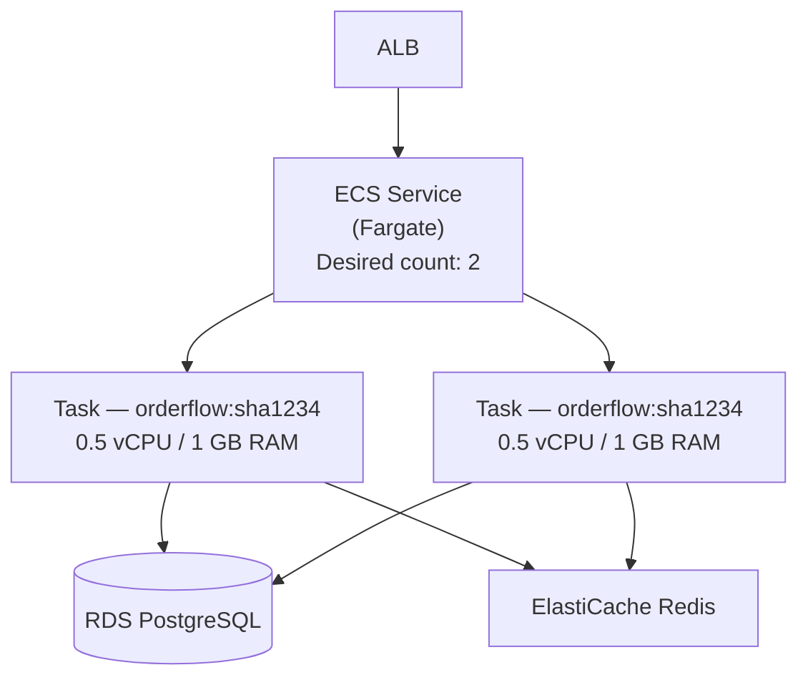

# Phase 3 — Containerize and ECS

> **AWS services introduced:** ECS Fargate, ECR | **Daily cost:** ~$6.30/day

---

## AWS services introduced

| Service | What it does | Why we need it |
|---|---|---|
| **ECR** | Elastic Container Registry | Stores Docker images in AWS, integrated with IAM |
| **ECS Fargate** | Serverless containers | Runs containers without managing EC2 instances |
| **ECS Service** | Long-running container manager | Handles desired count, health checks, rolling deploys |
| **ECS Task Definition** | Container specification | Defines the image, CPU, memory, environment variables |

## The problem

EC2 Auto Scaling Groups require you to manage AMIs, instance types, patching, and bootstrapping scripts. Every deploy is: build image, push to registry, update the launch template, refresh the Auto Scaling Group, wait for instances to drain. It is slow and error-prone.

ECS Fargate removes the EC2 layer entirely. You define a task (a container with CPU, memory, and environment), a service (how many copies to run), and AWS handles the rest. Deploys become: push a new image, update the task definition, ECS does a rolling replacement.

## Why not just use Kubernetes?

ECS Fargate is the right choice at this stage because:
- No control plane to manage
- Simpler operational model — a team of 5 can run it without a dedicated platform engineer
- Native integration with IAM (task roles), ALB (target groups), CloudWatch (logs)
- Lower cost at small scale than EKS

When the team grows and needs multi-team service isolation, progressive delivery, and a self-service developer platform, the answer is EKS — that is Phase 9.

## Architecture after Phase 3



## Challenges

1. Create an ECR repository for `orderflow`. Push the image from Phase 0.
2. Write an ECS Task Definition for the monolith. Grant it an IAM task role with permission to read from Secrets Manager.
3. Update the app to read `DB_PASSWORD` from Secrets Manager at startup (replace the hardcoded env var).
4. Create an ECS Service with desired count 2 in the private subnets. Wire it to the ALB target group.
5. Deploy a new image version — observe the rolling replace: ECS starts new tasks, waits for health checks to pass, then drains and stops old tasks. No downtime.
6. Scale down to 0 tasks after hours using an ECS scheduled scaling action (cost control).

## AWS concept: IAM task roles

Unlike EC2 instance profiles (where all processes on the instance share one role), ECS task roles are per-container. The OrderFlow container can read from Secrets Manager. A future reporting container can write to S3. Neither can do what the other can do. Least privilege at the container level.

## Outcome

OrderFlow runs on ECS Fargate with zero EC2 instances to manage. Deploys take 2–3 minutes and require zero downtime. The EC2 Auto Scaling Group from Phase 2 is decommissioned.

## Cost breakdown

| Resource | $/day |
|---|---|
| 2× NAT Gateway | $2.16 |
| ECS Fargate (2× 0.5 vCPU / 1 GB) | $1.19 |
| RDS + ElastiCache + ALB | $2.29 |
| ECR storage | ~$0.05 |
| **Total** | **~$5.69** |

```bash
cd terraform && terraform destroy -auto-approve
```

---

[Back to main README](../README.md) | [Next: Phase 4 — CI/CD Pipeline](../phase-4-cicd/README.md)
