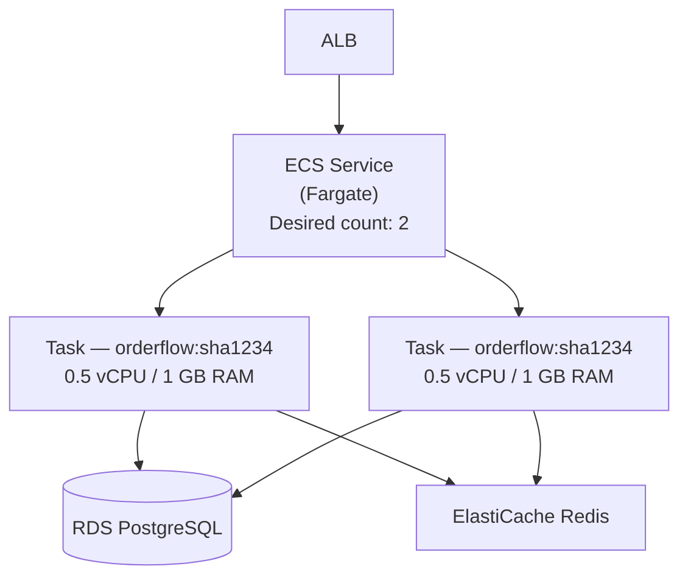

# Phase 3 — Containerize and ECS

> **AWS services introduced:** ECS Fargate, ECR | **Daily cost:** ~$6.30/day

---

## AWS services introduced

| Service | What it does | Why we need it |
|---|---|---|
| **ECR** | Elastic Container Registry | Stores Docker images in AWS, integrated with IAM |
| **ECS Fargate** | Serverless containers | Runs containers without managing EC2 instances |
| **ECS Service** | Long-running container manager | Handles desired count, health checks, rolling deploys |
| **ECS Task Definition** | Container specification | Defines the image, CPU, memory, environment variables |

## The problem

EC2 Auto Scaling Groups require you to manage AMIs, instance types, patching, and bootstrapping scripts. Every deploy is: build image, push to registry, update the launch template, refresh the Auto Scaling Group, wait for instances to drain. It is slow and error-prone.

ECS Fargate removes the EC2 layer entirely. You define a task (a container with CPU, memory, and environment), a service (how many copies to run), and AWS handles the rest. Deploys become: push a new image, update the task definition, ECS does a rolling replacement.

## Why not just use Kubernetes?

ECS Fargate is the right choice at this stage because:
- No control plane to manage
- Simpler operational model — a team of 5 can run it without a dedicated platform engineer
- Native integration with IAM (task roles), ALB (target groups), CloudWatch (logs)
- Lower cost at small scale than EKS

When the team grows and needs multi-team service isolation, progressive delivery, and a self-service developer platform, the answer is EKS — that is Phase 9.

## Architecture after Phase 3



---

## Challenge 1 — Create an ECR repository and push the image

### Step 1: Set environment variables

```bash
export AWS_ACCOUNT_ID=$(aws sts get-caller-identity --query Account --output text)
export AWS_REGION="us-east-1"
export ECR_REPO="orderflow"
export ECR_URI="${AWS_ACCOUNT_ID}.dkr.ecr.${AWS_REGION}.amazonaws.com/${ECR_REPO}"
```

### Step 2: Create the ECR repository via Terraform

Create `phase-3-ecs/terraform/ecr.tf`:

```hcl
# ecr.tf
resource "aws_ecr_repository" "orderflow" {
  name                 = "orderflow"
  image_tag_mutability = "MUTABLE"

  image_scanning_configuration {
    scan_on_push = true
  }

  tags = { Name = "orderflow" }
}

# Lifecycle policy — keep only the 10 most recent images to control storage cost
resource "aws_ecr_lifecycle_policy" "orderflow" {
  repository = aws_ecr_repository.orderflow.name

  policy = jsonencode({
    rules = [{
      rulePriority = 1
      description  = "Keep last 10 images"
      selection = {
        tagStatus   = "any"
        countType   = "imageCountMoreThan"
        countNumber = 10
      }
      action = { type = "expire" }
    }]
  })
}

output "ecr_repository_url" {
  value = aws_ecr_repository.orderflow.repository_url
}
```

Apply:

```bash
cd phase-3-ecs/terraform
terraform init && terraform apply -auto-approve
```

### Step 3: Authenticate Docker to ECR

```bash
aws ecr get-login-password --region $AWS_REGION \
  | docker login --username AWS --password-stdin \
    "${AWS_ACCOUNT_ID}.dkr.ecr.${AWS_REGION}.amazonaws.com"
```

Expected output:
```
Login Succeeded
```

### Step 4: Build the image and push it

```bash
cd orderflow

# Build for linux/amd64 — required for ECS Fargate (even on Apple Silicon)
docker build --platform linux/amd64 -t orderflow .

# Tag with the ECR URI and a short git SHA
GIT_SHA=$(git rev-parse --short HEAD)
docker tag orderflow:latest "${ECR_URI}:${GIT_SHA}"
docker tag orderflow:latest "${ECR_URI}:latest"

# Push both tags
docker push "${ECR_URI}:${GIT_SHA}"
docker push "${ECR_URI}:latest"

echo "Pushed: ${ECR_URI}:${GIT_SHA}"
```

### Step 5: Verify the image is in ECR

```bash
aws ecr describe-images \
  --repository-name orderflow \
  --query "imageDetails[*].{Tags:imageTags,PushedAt:imagePushedAt,SizeMB:imageSizeInBytes}" \
  --output table
```

---

## Challenge 2 — Write the ECS Task Definition with an IAM task role

### Step 1: Create the IAM task role in `iam.tf`

```hcl
# iam.tf

# Task execution role — used by ECS to pull the image and write logs
data "aws_iam_policy_document" "ecs_assume_role" {
  statement {
    effect  = "Allow"
    actions = ["sts:AssumeRole"]
    principals {
      type        = "Service"
      identifiers = ["ecs-tasks.amazonaws.com"]
    }
  }
}

resource "aws_iam_role" "ecs_task_execution" {
  name               = "orderflow-ecs-task-execution"
  assume_role_policy = data.aws_iam_policy_document.ecs_assume_role.json
}

resource "aws_iam_role_policy_attachment" "ecs_task_execution" {
  role       = aws_iam_role.ecs_task_execution.name
  policy_arn = "arn:aws:iam::aws:policy/service-role/AmazonECSTaskExecutionRolePolicy"
}

# Task role — the identity of the running container
# This is what the app uses when it calls AWS APIs (e.g. Secrets Manager)
resource "aws_iam_role" "ecs_task" {
  name               = "orderflow-ecs-task"
  assume_role_policy = data.aws_iam_policy_document.ecs_assume_role.json
}

# Allow the container to read its own secret — and nothing else
resource "aws_iam_role_policy" "ecs_task_secrets" {
  name = "read-db-secret"
  role = aws_iam_role.ecs_task.id

  policy = jsonencode({
    Version = "2012-10-17"
    Statement = [{
      Effect   = "Allow"
      Action   = ["secretsmanager:GetSecretValue"]
      Resource = "arn:aws:secretsmanager:${var.aws_region}:${data.aws_caller_identity.current.account_id}:secret:orderflow/*"
    }]
  })
}

data "aws_caller_identity" "current" {}
```

### Step 2: Create a CloudWatch log group

```hcl
# cloudwatch.tf
resource "aws_cloudwatch_log_group" "orderflow" {
  name              = "/ecs/orderflow"
  retention_in_days = 7

  tags = { Project = var.project }
}
```

### Step 3: Create the ECS cluster and task definition in `ecs.tf`

```hcl
# ecs.tf

resource "aws_ecs_cluster" "main" {
  name = var.project

  setting {
    name  = "containerInsights"
    value = "enabled"
  }

  tags = { Name = var.project }
}

resource "aws_ecs_task_definition" "orderflow" {
  family                   = "orderflow"
  requires_compatibilities = ["FARGATE"]
  network_mode             = "awsvpc"
  cpu                      = 512   # 0.5 vCPU
  memory                   = 1024  # 1 GB

  execution_role_arn = aws_iam_role.ecs_task_execution.arn
  task_role_arn      = aws_iam_role.ecs_task.arn

  container_definitions = jsonencode([{
    name      = "orderflow"
    image     = "${aws_ecr_repository.orderflow.repository_url}:latest"
    essential = true

    portMappings = [{
      containerPort = 3000
      protocol      = "tcp"
    }]

    environment = [
      { name = "NODE_ENV", value = "production" },
      { name = "PORT",     value = "3000" },
    ]

    # Read secrets from Secrets Manager at task launch
    # The value is injected as an environment variable — the app reads DATABASE_URL normally
    secrets = [
      {
        name      = "DATABASE_URL"
        valueFrom = "arn:aws:secretsmanager:${var.aws_region}:${data.aws_caller_identity.current.account_id}:secret:orderflow/database-url"
      },
      {
        name      = "REDIS_URL"
        valueFrom = "arn:aws:secretsmanager:${var.aws_region}:${data.aws_caller_identity.current.account_id}:secret:orderflow/redis-url"
      },
      {
        name      = "SESSION_SECRET"
        valueFrom = "arn:aws:secretsmanager:${var.aws_region}:${data.aws_caller_identity.current.account_id}:secret:orderflow/session-secret"
      }
    ]

    logConfiguration = {
      logDriver = "awslogs"
      options = {
        "awslogs-group"         = "/ecs/orderflow"
        "awslogs-region"        = var.aws_region
        "awslogs-stream-prefix" = "ecs"
      }
    }

    healthCheck = {
      command     = ["CMD-SHELL", "wget -qO- http://localhost:3000/health | grep -q '\"status\":\"ok\"' || exit 1"]
      interval    = 30
      timeout     = 5
      retries     = 3
      startPeriod = 10
    }
  }])

  tags = { Project = var.project }
}
```

---

## Challenge 3 — Update the app to read DB_PASSWORD from Secrets Manager

The ECS task definition in Challenge 2 injects secrets as environment variables at container launch. The app already reads `DATABASE_URL` from `process.env.DATABASE_URL` — no code change is needed for the connection string approach.

However, to demonstrate reading directly from Secrets Manager at startup (the pattern used before ECS secrets injection existed), add this to `src/app.js`:

### Step 1: Store the connection details as a secret

```bash
# Store DATABASE_URL as a secret
aws secretsmanager create-secret \
  --name "orderflow/database-url" \
  --secret-string "postgres://orderflow:<PASSWORD>@<RDS_ENDPOINT>:5432/orderflow"

# Store REDIS_URL
aws secretsmanager create-secret \
  --name "orderflow/redis-url" \
  --secret-string "redis://<ELASTICACHE_ENDPOINT>:6379"

# Store SESSION_SECRET
aws secretsmanager create-secret \
  --name "orderflow/session-secret" \
  --secret-string "$(openssl rand -hex 32)"
```

### Step 2: Verify the task execution role can read the secrets

```bash
# Simulate what ECS does — assume the task execution role and read the secret
aws secretsmanager get-secret-value \
  --secret-id "orderflow/database-url" \
  --query SecretString \
  --output text
```

The secret value is injected into the container as `DATABASE_URL` at launch. The app reads it with `process.env.DATABASE_URL` — no SDK calls needed in application code.

---

## Challenge 4 — Create the ECS Service and wire it to the ALB target group

### Step 1: Add the ECS service security group to `security_groups.tf`

```hcl
# Reuse the app security group from Phase 2 — ECS tasks use the same rules
# (accept traffic from ALB on port 3000, egress unrestricted)
```

The Phase 2 `app` security group already covers ECS tasks — no change needed.

### Step 2: Create the ECS service in `ecs.tf`

Append to `ecs.tf`:

```hcl
resource "aws_ecs_service" "orderflow" {
  name            = "orderflow"
  cluster         = aws_ecs_cluster.main.id
  task_definition = aws_ecs_task_definition.orderflow.arn
  desired_count   = 2
  launch_type     = "FARGATE"

  # Rolling deployment — ECS starts new tasks before stopping old ones
  deployment_minimum_healthy_percent = 50
  deployment_maximum_percent         = 200

  network_configuration {
    subnets          = data.aws_subnets.private.ids
    security_groups  = [data.aws_security_group.app.id]
    assign_public_ip = false
  }

  load_balancer {
    target_group_arn = data.aws_lb_target_group.app.arn
    container_name   = "orderflow"
    container_port   = 3000
  }

  # Ensure the ALB listener exists before creating the service
  depends_on = [data.aws_lb_target_group.app]

  tags = { Project = var.project }
}
```

### Step 3: Apply and watch the service reach steady state

```bash
terraform apply -auto-approve

# Watch ECS bring up the tasks
watch -n 5 "aws ecs describe-services \
  --cluster orderflow \
  --services orderflow \
  --query 'services[0].{Running:runningCount,Pending:pendingCount,Desired:desiredCount,Status:status}' \
  --output table"
```

Expected output when stable:
```
---------------------------------------------
|           DescribeServices                |
+---------+---------+---------+-------------+
| Desired | Pending | Running |   Status    |
+---------+---------+---------+-------------+
|    2    |    0    |    2    |   ACTIVE    |
+---------+---------+---------+-------------+
```

### Step 4: Verify the ALB is routing traffic to ECS tasks

```bash
ALB_DNS=$(aws elbv2 describe-load-balancers \
  --query "LoadBalancers[?contains(LoadBalancerName,'orderflow')].DNSName" \
  --output text)

curl -s "http://${ALB_DNS}/health" | jq
```

Expected:
```json
{ "status": "ok", "db": "connected", "uptime": 12.4 }
```

### Step 5: Decommission the Phase 2 EC2 Auto Scaling Group

```bash
# Set the ASG desired count to 0 to drain instances gracefully
aws autoscaling update-auto-scaling-group \
  --auto-scaling-group-name orderflow-asg \
  --min-size 0 \
  --max-size 0 \
  --desired-capacity 0

echo "Waiting for instances to terminate..."
aws autoscaling wait group-in-service \
  --auto-scaling-group-name orderflow-asg
```

Then remove the ASG and launch template from Phase 2 Terraform state:

```bash
cd ../phase-2-lift-and-shift/terraform
terraform destroy -target=aws_autoscaling_group.app -target=aws_launch_template.app -auto-approve
```

---

## Challenge 5 — Deploy a new image version and observe the rolling replacement

### Step 1: Make a visible change to the app

Add a version header to the health endpoint in `src/app.js`:

```js
app.get('/health', async (req, res) => {
  // ...existing health check code...
  health.version = '1.1.0';  // ← add this line
  return res.status(statusCode).json(health);
});
```

### Step 2: Build, tag, and push the new image

```bash
cd orderflow

GIT_SHA=$(git rev-parse --short HEAD)

docker build --platform linux/amd64 -t orderflow .
docker tag orderflow:latest "${ECR_URI}:${GIT_SHA}"
docker tag orderflow:latest "${ECR_URI}:latest"

docker push "${ECR_URI}:${GIT_SHA}"
docker push "${ECR_URI}:latest"
```

### Step 3: Register a new task definition revision

```bash
# Get the current task definition
TASK_DEF=$(aws ecs describe-task-definition \
  --task-definition orderflow \
  --query taskDefinition)

# Update the image tag to the new SHA
NEW_TASK_DEF=$(echo $TASK_DEF | jq \
  --arg IMAGE "${ECR_URI}:${GIT_SHA}" \
  '.containerDefinitions[0].image = $IMAGE |
   del(.taskDefinitionArn, .revision, .status, .requiresAttributes, .compatibilities, .registeredAt, .registeredBy)')

# Register the new revision
aws ecs register-task-definition \
  --cli-input-json "$NEW_TASK_DEF" \
  --query "taskDefinition.{Revision:revision,Image:containerDefinitions[0].image}" \
  --output table
```

### Step 4: Force a new deployment and watch the rolling replace

```bash
aws ecs update-service \
  --cluster orderflow \
  --service orderflow \
  --task-definition orderflow \
  --force-new-deployment

# Watch the rolling replacement in real time
watch -n 3 "aws ecs describe-services \
  --cluster orderflow \
  --services orderflow \
  --query 'services[0].deployments[*].{Status:status,Running:runningCount,Pending:pendingCount,Desired:desiredCount}' \
  --output table"
```

You will see two deployments — `PRIMARY` (new) and `ACTIVE` (old):

```
----------------------------------------------------------
|               DescribeServices                         |
+---------+---------+---------+----------+              |
| Desired | Pending | Running |  Status  |              |
+---------+---------+---------+----------+              |
|    2    |    1    |    1    | PRIMARY  |  ← new tasks |
|    2    |    0    |    1    |  ACTIVE  |  ← old tasks |
+---------+---------+---------+----------+              |
```

ECS starts the new task, waits for health checks to pass, then stops the old task. No downtime.

### Step 5: Confirm the new version is live

```bash
curl -s "http://${ALB_DNS}/health" | jq .version
# Expected: "1.1.0"
```

---

## Challenge 6 — Scale to 0 tasks after hours using scheduled scaling

### Step 1: Create the Application Auto Scaling target

```hcl
# autoscaling.tf

resource "aws_appautoscaling_target" "ecs" {
  max_capacity       = 4
  min_capacity       = 0
  resource_id        = "service/${aws_ecs_cluster.main.name}/${aws_ecs_service.orderflow.name}"
  scalable_dimension = "ecs:service:DesiredCount"
  service_namespace  = "ecs"
}
```

### Step 2: Add scheduled scale-down and scale-up actions

```hcl
# Scale down to 0 at 8 PM UTC (after business hours)
resource "aws_appautoscaling_scheduled_action" "scale_down" {
  name               = "orderflow-scale-down"
  service_namespace  = aws_appautoscaling_target.ecs.service_namespace
  resource_id        = aws_appautoscaling_target.ecs.resource_id
  scalable_dimension = aws_appautoscaling_target.ecs.scalable_dimension
  schedule           = "cron(0 20 * * ? *)"

  scalable_target_action {
    min_capacity = 0
    max_capacity = 0
  }
}

# Scale back up to 2 at 7 AM UTC (start of business)
resource "aws_appautoscaling_scheduled_action" "scale_up" {
  name               = "orderflow-scale-up"
  service_namespace  = aws_appautoscaling_target.ecs.service_namespace
  resource_id        = aws_appautoscaling_target.ecs.resource_id
  scalable_dimension = aws_appautoscaling_target.ecs.scalable_dimension
  schedule           = "cron(0 7 * * ? *)"

  scalable_target_action {
    min_capacity = 2
    max_capacity = 4
  }
}
```

### Step 3: Trigger an immediate scale-to-0 manually (for cost control during the lab)

```bash
aws ecs update-service \
  --cluster orderflow \
  --service orderflow \
  --desired-count 0

# Verify tasks are stopping
aws ecs describe-services \
  --cluster orderflow \
  --services orderflow \
  --query "services[0].{Running:runningCount,Desired:desiredCount}" \
  --output table
```

### Step 4: Scale back up when ready

```bash
aws ecs update-service \
  --cluster orderflow \
  --service orderflow \
  --desired-count 2

aws ecs wait services-stable \
  --cluster orderflow \
  --services orderflow

echo "Service is stable"
```

---

## AWS concept: IAM task roles

Unlike EC2 instance profiles (where all processes on the instance share one role), ECS task roles are per-container. The OrderFlow container can read from Secrets Manager. A future reporting container can write to S3. Neither can do what the other can do — least privilege at the container level.

## Outcome

OrderFlow runs on ECS Fargate with zero EC2 instances to manage. Deploys take 2–3 minutes and require zero downtime. The EC2 Auto Scaling Group from Phase 2 is decommissioned.

## Cost breakdown

| Resource | $/day |
|---|---|
| 2× NAT Gateway | $2.16 |
| ECS Fargate (2× 0.5 vCPU / 1 GB) | $1.19 |
| RDS + ElastiCache + ALB | $2.29 |
| ECR storage | ~$0.05 |
| **Total** | **~$5.69** |

```bash
cd terraform && terraform destroy -auto-approve
```

---

[Back to main README](../README.md) | [Next: Phase 4 — CI/CD Pipeline](../phase-4-cicd/README.md)
