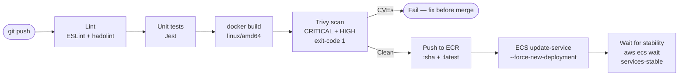
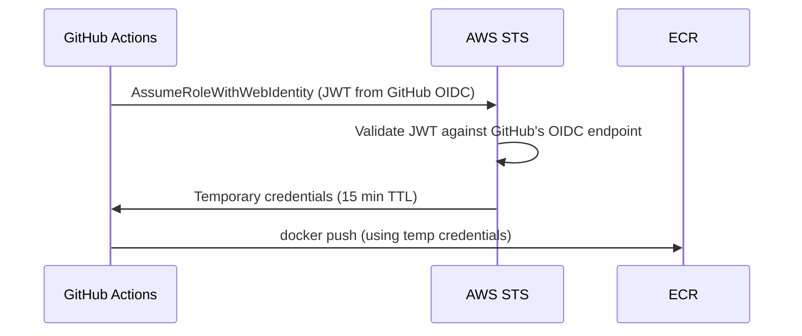

# Phase 4 — CI/CD Pipeline

> **AWS services introduced:** ECR image scanning | **Daily cost:** ~$5.74/day

---

## AWS services introduced

| Service | What it does | Why we need it |
|---|---|---|
| **ECR image scanning** | Trivy-compatible vulnerability scanning | Catch CVEs before images reach production |
| **IAM OIDC Provider** | Trust GitHub Actions JWTs without static keys | No credentials to leak or rotate |

*(This phase uses GitHub Actions rather than AWS CodePipeline — same reason as the GKE lab: GitHub Actions is more widely used and teaches transferable skills.)*

## The problem

Right now, deploying a change requires running commands manually: `docker build`, `docker push`, `aws ecs update-service`. This is fine for one engineer. It breaks down at three.

The pipeline automates the path from commit to production with quality gates: lint, test, build, scan, push, deploy.

## Pipeline design



## AWS concept: OIDC federation (no static keys)



Never store AWS access keys as GitHub secrets. OIDC federation issues temporary credentials that expire — there is nothing to leak and nothing to rotate.

---

## Challenges

### Challenge 1 — GitHub Actions OIDC trust with AWS

**Goal:** Allow GitHub Actions to assume an IAM role without any stored access keys.

#### Step 1 — Create the Terraform file for OIDC

Create `phase-4-cicd/terraform/oidc.tf`:

```hcl
# ── Data: GitHub OIDC thumbprint ──────────────────────────────────────────────
# AWS needs the TLS thumbprint of GitHub's OIDC endpoint to validate JWTs.
data "tls_certificate" "github" {
  url = "https://token.actions.githubusercontent.com/.well-known/openid-configuration"
}

# ── IAM OIDC provider ─────────────────────────────────────────────────────────
resource "aws_iam_openid_connect_provider" "github" {
  url = "https://token.actions.githubusercontent.com"

  client_id_list = ["sts.amazonaws.com"]

  thumbprint_list = [
    data.tls_certificate.github.certificates[0].sha1_fingerprint
  ]

  tags = { Name = "github-actions-oidc" }
}
```

> **Note:** Only one OIDC provider per URL per account is allowed. If your account already has this provider (e.g., from the GKE lab), import it:
> ```
> terraform import aws_iam_openid_connect_provider.github \
>   arn:aws:iam::123456789012:oidc-provider/token.actions.githubusercontent.com
> ```

#### Step 2 — Create the deploy IAM role

Create `phase-4-cicd/terraform/iam_cicd.tf`:

```hcl
locals {
  # Replace with your actual GitHub org and repo name
  github_repo = "your-github-org/cloud-migration-lab-aws"
}

# ── Trust policy: only allow the main branch to assume this role ──────────────
data "aws_iam_policy_document" "github_actions_trust" {
  statement {
    effect  = "Allow"
    actions = ["sts:AssumeRoleWithWebIdentity"]

    principals {
      type        = "Federated"
      identifiers = [aws_iam_openid_connect_provider.github.arn]
    }

    condition {
      test     = "StringEquals"
      variable = "token.actions.githubusercontent.com:aud"
      values   = ["sts.amazonaws.com"]
    }

    # Restrict to pushes on main branch only
    condition {
      test     = "StringLike"
      variable = "token.actions.githubusercontent.com:sub"
      values   = ["repo:${local.github_repo}:ref:refs/heads/main"]
    }
  }
}

resource "aws_iam_role" "github_actions_deploy" {
  name               = "github-actions-deploy"
  assume_role_policy = data.aws_iam_policy_document.github_actions_trust.json

  tags = { Name = "github-actions-deploy" }
}

# ── Permissions: ECR push + ECS deploy ───────────────────────────────────────
data "aws_iam_policy_document" "github_actions_deploy" {
  # ECR authentication
  statement {
    effect    = "Allow"
    actions   = ["ecr:GetAuthorizationToken"]
    resources = ["*"]
  }

  # ECR image push (scoped to orderflow repo only)
  statement {
    effect = "Allow"
    actions = [
      "ecr:BatchCheckLayerAvailability",
      "ecr:CompleteLayerUpload",
      "ecr:InitiateLayerUpload",
      "ecr:PutImage",
      "ecr:UploadLayerPart",
      "ecr:DescribeImages",
      "ecr:ListImages",
    ]
    resources = [
      "arn:aws:ecr:${var.aws_region}:${data.aws_caller_identity.current.account_id}:repository/orderflow"
    ]
  }

  # ECS deploy
  statement {
    effect = "Allow"
    actions = [
      "ecs:DescribeServices",
      "ecs:DescribeTaskDefinition",
      "ecs:DescribeTasks",
      "ecs:RegisterTaskDefinition",
      "ecs:UpdateService",
      "ecs:ListTasks",
    ]
    resources = ["*"]
  }

  # Allow ECS to pass the task execution role (needed for RegisterTaskDefinition)
  statement {
    effect    = "Allow"
    actions   = ["iam:PassRole"]
    resources = [
      aws_iam_role.ecs_task_execution.arn,
      aws_iam_role.ecs_task.arn,
    ]
  }
}

resource "aws_iam_policy" "github_actions_deploy" {
  name   = "github-actions-deploy"
  policy = data.aws_iam_policy_document.github_actions_deploy.json
}

resource "aws_iam_role_policy_attachment" "github_actions_deploy" {
  role       = aws_iam_role.github_actions_deploy.name
  policy_arn = aws_iam_policy.github_actions_deploy.arn
}

# ── Output the role ARN — you'll need this in GitHub secrets ─────────────────
output "github_actions_role_arn" {
  value = aws_iam_role.github_actions_deploy.arn
}
```

Add `data.tf` entry if not already present:

```hcl
data "aws_caller_identity" "current" {}
```

#### Step 3 — Apply

```bash
cd phase-4-cicd/terraform
terraform init
terraform apply -auto-approve
```

Expected output (excerpt):

```
aws_iam_openid_connect_provider.github: Creating...
aws_iam_openid_connect_provider.github: Creation complete after 1s
aws_iam_role.github_actions_deploy: Creating...
aws_iam_role.github_actions_deploy: Creation complete after 1s

Outputs:
github_actions_role_arn = "arn:aws:iam::123456789012:role/github-actions-deploy"
```

#### Step 4 — Add the role ARN as a GitHub Actions variable

```bash
# Store it — you'll reference this in the workflow
export DEPLOY_ROLE_ARN=$(terraform output -raw github_actions_role_arn)
echo "DEPLOY_ROLE_ARN=$DEPLOY_ROLE_ARN"
```

In GitHub: **Settings → Secrets and variables → Actions → Variables (not Secrets)**.  
Create a variable named `AWS_DEPLOY_ROLE_ARN` with the role ARN value.

> Variables (not secrets) are fine for role ARNs — they're not sensitive. Secrets are for tokens and passwords.

#### Step 5 — Verify the trust policy

```bash
aws iam get-role --role-name github-actions-deploy \
  --query 'Role.AssumeRolePolicyDocument' \
  --output json
```

Expected output:

```json
{
  "Version": "2012-10-17",
  "Statement": [
    {
      "Effect": "Allow",
      "Principal": {
        "Federated": "arn:aws:iam::123456789012:oidc-provider/token.actions.githubusercontent.com"
      },
      "Action": "sts:AssumeRoleWithWebIdentity",
      "Condition": {
        "StringEquals": {
          "token.actions.githubusercontent.com:aud": "sts.amazonaws.com"
        },
        "StringLike": {
          "token.actions.githubusercontent.com:sub": "repo:your-github-org/cloud-migration-lab-aws:ref:refs/heads/main"
        }
      }
    }
  ]
}
```

---

### Challenge 2 — CI workflow: lint → test → build → Trivy scan → push

**Goal:** Every push to `main` runs quality gates and pushes a verified image to ECR.

#### Step 1 — Add ESLint to the project

```bash
cd orderflow
npm install --save-dev eslint@8
```

Create `orderflow/.eslintrc.json`:

```json
{
  "env": {
    "node": true,
    "es2022": true
  },
  "extends": "eslint:recommended",
  "parserOptions": {
    "ecmaVersion": 2022
  },
  "rules": {
    "no-unused-vars": ["warn", { "argsIgnorePattern": "^_" }],
    "no-console": "off"
  }
}
```

Add a lint script to `orderflow/package.json`:

```json
"scripts": {
  "start": "node src/app.js",
  "lint": "eslint src/",
  "test": "jest --forceExit"
}
```

Verify lint runs locally:

```bash
npm run lint
```

Expected output:

```
> eslint src/

(no output = no errors)
```

#### Step 2 — Add a minimal Jest test

```bash
npm install --save-dev jest
```

Create `orderflow/src/__tests__/health.test.js`:

```js
// Smoke test — verifies the app module loads without crashing.
// Real integration tests require a running database; those live in phase-4-cicd/tests/.
describe('app module', () => {
  it('exports an Express app', () => {
    // We only test the module loads — DB connection is not available in CI.
    // The actual health endpoint is tested in Challenge 7 integration tests.
    expect(true).toBe(true);
  });
});
```

Create `orderflow/src/__tests__/reports.test.js`:

```js
const { burnCpu } = require('../services/reports');

describe('burnCpu', () => {
  it('returns a number', () => {
    const result = burnCpu(1);
    expect(typeof result).toBe('number');
  });

  it('takes measurably longer with more iterations', () => {
    const start1 = Date.now();
    burnCpu(10);
    const t1 = Date.now() - start1;

    const start2 = Date.now();
    burnCpu(100);
    const t2 = Date.now() - start2;

    expect(t2).toBeGreaterThan(t1);
  });
});
```

Update `orderflow/src/services/reports.js` to export `burnCpu` for testability (add at the bottom):

```js
module.exports = { generateDailyReport, burnCpu };
```

Run tests:

```bash
npm test
```

Expected output:

```
PASS src/__tests__/reports.test.js
PASS src/__tests__/health.test.js

Test Suites: 2 passed, 2 total
Tests:       3 passed, 3 total
```

#### Step 3 — Create the CI workflow

Create `.github/workflows/ci.yml` at the **repo root**:

```yaml
name: CI

on:
  push:
    branches: [main]
  pull_request:
    branches: [main]

permissions:
  id-token: write   # Required for OIDC
  contents: read

env:
  AWS_REGION: us-east-1
  ECR_REPO: orderflow
  ECS_CLUSTER: orderflow
  ECS_SERVICE: orderflow

jobs:
  # ── Job 1: Lint ──────────────────────────────────────────────────────────────
  lint:
    name: Lint
    runs-on: ubuntu-latest
    defaults:
      run:
        working-directory: orderflow

    steps:
      - uses: actions/checkout@v4

      - uses: actions/setup-node@v4
        with:
          node-version: '20'
          cache: 'npm'
          cache-dependency-path: orderflow/package-lock.json

      - name: Install dependencies
        run: npm ci

      - name: ESLint
        run: npm run lint

      - name: Lint Dockerfile
        uses: hadolint/hadolint-action@v3.1.0
        with:
          dockerfile: orderflow/Dockerfile
          failure-threshold: warning

  # ── Job 2: Test ──────────────────────────────────────────────────────────────
  test:
    name: Unit tests
    runs-on: ubuntu-latest
    defaults:
      run:
        working-directory: orderflow

    steps:
      - uses: actions/checkout@v4

      - uses: actions/setup-node@v4
        with:
          node-version: '20'
          cache: 'npm'
          cache-dependency-path: orderflow/package-lock.json

      - name: Install dependencies
        run: npm ci

      - name: Run tests
        run: npm test

  # ── Job 3: Build + Scan + Push ───────────────────────────────────────────────
  build-scan-push:
    name: Build → Scan → Push
    runs-on: ubuntu-latest
    needs: [lint, test]
    # Only push on main branch pushes, not PRs
    if: github.ref == 'refs/heads/main' && github.event_name == 'push'

    outputs:
      image-uri: ${{ steps.meta.outputs.image-uri }}
      image-sha: ${{ steps.meta.outputs.sha }}

    steps:
      - uses: actions/checkout@v4

      - name: Configure AWS credentials (OIDC)
        uses: aws-actions/configure-aws-credentials@v4
        with:
          role-to-assume: ${{ vars.AWS_DEPLOY_ROLE_ARN }}
          aws-region: ${{ env.AWS_REGION }}

      - name: Log in to ECR
        id: ecr-login
        uses: aws-actions/amazon-ecr-login@v2

      - name: Set image metadata
        id: meta
        run: |
          REGISTRY=${{ steps.ecr-login.outputs.registry }}
          SHA=${GITHUB_SHA::8}
          echo "image-uri=${REGISTRY}/${{ env.ECR_REPO }}:${SHA}" >> "$GITHUB_OUTPUT"
          echo "sha=${SHA}" >> "$GITHUB_OUTPUT"

      - name: Set up Docker Buildx
        uses: docker/setup-buildx-action@v3

      - name: Build image (linux/amd64)
        uses: docker/build-push-action@v5
        with:
          context: orderflow
          platforms: linux/amd64
          push: false          # Don't push yet — scan first
          tags: |
            ${{ steps.meta.outputs.image-uri }}
          load: true           # Load into local Docker daemon for Trivy
          cache-from: type=gha
          cache-to: type=gha,mode=max

      - name: Scan with Trivy
        uses: aquasecurity/trivy-action@master
        with:
          image-ref: ${{ steps.meta.outputs.image-uri }}
          format: table
          exit-code: '1'
          severity: 'CRITICAL,HIGH'
          ignore-unfixed: true

      - name: Push to ECR
        run: |
          REGISTRY=${{ steps.ecr-login.outputs.registry }}
          SHA=${{ steps.meta.outputs.sha }}
          docker push ${REGISTRY}/${{ env.ECR_REPO }}:${SHA}
          docker tag  ${REGISTRY}/${{ env.ECR_REPO }}:${SHA} \
                      ${REGISTRY}/${{ env.ECR_REPO }}:latest
          docker push ${REGISTRY}/${{ env.ECR_REPO }}:latest
          echo "Pushed: ${REGISTRY}/${{ env.ECR_REPO }}:${SHA}"
```

#### Step 4 — Verify the workflow file

```bash
# Confirm the file is valid YAML
python3 -c "import yaml, sys; yaml.safe_load(open('.github/workflows/ci.yml'))" && echo "Valid YAML"
```

---

### Challenge 3 — CD step: update task definition and deploy

**Goal:** After a clean image is in ECR, update the ECS task definition to the new image SHA and trigger a rolling deployment.

#### Step 1 — Add the deploy job to the workflow

Append a `deploy` job to `.github/workflows/ci.yml`:

```yaml
  # ── Job 4: Deploy to ECS ─────────────────────────────────────────────────────
  deploy:
    name: Deploy to ECS
    runs-on: ubuntu-latest
    needs: build-scan-push
    if: github.ref == 'refs/heads/main' && github.event_name == 'push'

    steps:
      - name: Configure AWS credentials (OIDC)
        uses: aws-actions/configure-aws-credentials@v4
        with:
          role-to-assume: ${{ vars.AWS_DEPLOY_ROLE_ARN }}
          aws-region: ${{ env.AWS_REGION }}

      - name: Log in to ECR
        id: ecr-login
        uses: aws-actions/amazon-ecr-login@v2

      - name: Resolve full image URI
        id: image
        run: |
          REGISTRY=${{ steps.ecr-login.outputs.registry }}
          SHA=${{ needs.build-scan-push.outputs.image-sha }}
          echo "uri=${REGISTRY}/${{ env.ECR_REPO }}:${SHA}" >> "$GITHUB_OUTPUT"

      - name: Get current task definition
        id: current-task-def
        run: |
          aws ecs describe-task-definition \
            --task-definition ${{ env.ECS_SERVICE }} \
            --query taskDefinition \
            > task-def.json
          echo "Task definition retrieved"

      - name: Update image in task definition
        id: new-task-def
        run: |
          # Strip read-only fields that cannot be passed to register-task-definition
          jq 'del(.taskDefinitionArn, .revision, .status, .requiresAttributes,
                  .placementConstraints, .compatibilities, .registeredAt,
                  .registeredBy, .deregisteredAt)
             | .containerDefinitions[0].image = "${{ steps.image.outputs.uri }}"' \
            task-def.json > new-task-def.json

          cat new-task-def.json | jq '.containerDefinitions[0].image'

      - name: Register new task definition revision
        id: register
        run: |
          NEW_ARN=$(aws ecs register-task-definition \
            --cli-input-json file://new-task-def.json \
            --query 'taskDefinition.taskDefinitionArn' \
            --output text)
          echo "Registered: $NEW_ARN"
          echo "arn=$NEW_ARN" >> "$GITHUB_OUTPUT"

      - name: Update ECS service
        run: |
          aws ecs update-service \
            --cluster ${{ env.ECS_CLUSTER }} \
            --service  ${{ env.ECS_SERVICE }} \
            --task-definition ${{ steps.register.outputs.arn }} \
            --force-new-deployment

      - name: Wait for service stability
        run: |
          echo "Waiting for service to stabilize (up to 10 minutes)..."
          aws ecs wait services-stable \
            --cluster ${{ env.ECS_CLUSTER }} \
            --services ${{ env.ECS_SERVICE }}
          echo "Deployment stable!"

      - name: Verify deployment
        run: |
          aws ecs describe-services \
            --cluster ${{ env.ECS_CLUSTER }} \
            --services ${{ env.ECS_SERVICE }} \
            --query 'services[0].{running:runningCount,desired:desiredCount,status:status,image:taskDefinition}' \
            --output table
```

#### Step 2 — Understanding the task definition update pattern

The key pattern here is the "jq strip + re-register" approach:

```
describe-task-definition → strip read-only fields → update image SHA → register (new revision) → update-service
```

Why not use `--image` flag directly on `update-service`? ECS doesn't have one. You always register a new task definition revision then point the service at it.

The `jq` pipeline does four things:
1. Removes read-only fields (`taskDefinitionArn`, `revision`, `status`, etc.) that AWS rejects if present in `register-task-definition`
2. Updates `.containerDefinitions[0].image` to the new `registry/repo:sha` URI
3. Leaves all other config (CPU, memory, secrets, log config) untouched
4. Outputs the clean JSON to `new-task-def.json` for the register call

#### Step 3 — Commit and push to trigger the pipeline

```bash
git add .github/workflows/ci.yml orderflow/.eslintrc.json orderflow/src/__tests__/
git commit -m "feat: add CI/CD pipeline with OIDC, Trivy scan, ECS deploy"
git push origin main
```

Watch the pipeline in GitHub → Actions tab. You should see four jobs appear sequentially:
1. `Lint` — ~30 seconds
2. `Unit tests` — ~20 seconds
3. `Build → Scan → Push` — ~2–3 minutes (first run; subsequent runs use layer cache)
4. `Deploy to ECS` — ~3–5 minutes (waiting for `services-stable`)

#### Step 4 — Verify the deployment from the CLI

```bash
# Confirm the running task is using the new image SHA
aws ecs describe-tasks \
  --cluster orderflow \
  --tasks $(aws ecs list-tasks --cluster orderflow --service-name orderflow --query 'taskArns[0]' --output text) \
  --query 'tasks[0].containers[0].image' \
  --output text
```

Expected output:

```
123456789012.dkr.ecr.us-east-1.amazonaws.com/orderflow:a1b2c3d4
```

The SHA should match the first 8 characters of the commit that triggered the pipeline.

---

### Challenge 4 — `workflow_dispatch`: promote a specific SHA to staging

**Goal:** Add a manual trigger that lets any engineer promote a specific image SHA to a staging environment without a new commit.

#### Step 1 — Add the `workflow_dispatch` trigger

Add a new workflow file `.github/workflows/promote.yml`:

```yaml
name: Promote to Staging

on:
  workflow_dispatch:
    inputs:
      image_sha:
        description: 'Image SHA to promote (8-char short SHA, e.g. a1b2c3d4)'
        required: true
        type: string
      confirm:
        description: 'Type "yes" to confirm promotion'
        required: true
        default: 'no'
        type: string

permissions:
  id-token: write
  contents: read

env:
  AWS_REGION: us-east-1
  ECR_REPO: orderflow
  # For this lab, "staging" is a separate ECS service in the same cluster.
  # In production you'd point at a different cluster or account.
  ECS_CLUSTER: orderflow
  ECS_SERVICE: orderflow-staging   # Must exist — created in the lab extension

jobs:
  gate:
    name: Safety gate
    runs-on: ubuntu-latest
    steps:
      - name: Require confirmation
        if: inputs.confirm != 'yes'
        run: |
          echo "::error::You must type 'yes' in the confirm field to proceed."
          exit 1

  promote:
    name: Promote ${{ inputs.image_sha }} to staging
    runs-on: ubuntu-latest
    needs: gate

    steps:
      - name: Configure AWS credentials (OIDC)
        uses: aws-actions/configure-aws-credentials@v4
        with:
          role-to-assume: ${{ vars.AWS_DEPLOY_ROLE_ARN }}
          aws-region: ${{ env.AWS_REGION }}

      - name: Log in to ECR
        id: ecr-login
        uses: aws-actions/amazon-ecr-login@v2

      - name: Verify the image exists in ECR
        run: |
          REGISTRY=${{ steps.ecr-login.outputs.registry }}
          IMAGE="${REGISTRY}/${{ env.ECR_REPO }}:${{ inputs.image_sha }}"
          echo "Verifying image: $IMAGE"
          aws ecr describe-images \
            --repository-name ${{ env.ECR_REPO }} \
            --image-ids imageTag=${{ inputs.image_sha }} \
            --query 'imageDetails[0].{tag:imageTags[0],pushed:imagePushedAt,size:imageSizeInBytes}' \
            --output table

      - name: Get current task definition
        run: |
          aws ecs describe-task-definition \
            --task-definition ${{ env.ECS_SERVICE }} \
            --query taskDefinition \
            > task-def.json

      - name: Update image SHA in task definition
        run: |
          REGISTRY=${{ steps.ecr-login.outputs.registry }}
          IMAGE="${REGISTRY}/${{ env.ECR_REPO }}:${{ inputs.image_sha }}"
          jq --arg img "$IMAGE" \
            'del(.taskDefinitionArn, .revision, .status, .requiresAttributes,
                 .placementConstraints, .compatibilities, .registeredAt,
                 .registeredBy, .deregisteredAt)
            | .containerDefinitions[0].image = $img' \
            task-def.json > new-task-def.json
          echo "Promoting image: $IMAGE"

      - name: Register and deploy
        run: |
          NEW_ARN=$(aws ecs register-task-definition \
            --cli-input-json file://new-task-def.json \
            --query 'taskDefinition.taskDefinitionArn' \
            --output text)

          aws ecs update-service \
            --cluster ${{ env.ECS_CLUSTER }} \
            --service  ${{ env.ECS_SERVICE }} \
            --task-definition $NEW_ARN \
            --force-new-deployment

          echo "Waiting for stability..."
          aws ecs wait services-stable \
            --cluster ${{ env.ECS_CLUSTER }} \
            --services ${{ env.ECS_SERVICE }}

          echo "Promoted ${{ inputs.image_sha }} to staging!"
```

#### Step 2 — Trigger the workflow manually

```bash
# Using the GitHub CLI
gh workflow run promote.yml \
  -f image_sha=a1b2c3d4 \
  -f confirm=yes
```

Or via the GitHub UI: **Actions → Promote to Staging → Run workflow**.

Watch the run:

```bash
# Get the latest run ID and tail the logs
gh run list --workflow=promote.yml --limit=1
gh run watch <run-id>
```

#### Step 3 — Understand the safety gate pattern

The `gate` job runs first. If `confirm != 'yes'` it fails immediately, blocking the `promote` job. This prevents accidental promotions from the UI where someone clicks "Run workflow" without reading the inputs.

```
gate (fails fast) ──→ promote (only runs if gate passes)
```

The `verify image exists` step prevents promoting a SHA that was never built — e.g., a typo in the SHA. You get a clear error from the `aws ecr describe-images` call rather than a cryptic ECS error later.

---

### Challenge 5 — Protect the `main` branch

**Goal:** Require the CI pipeline to pass before any PR can be merged into `main`.

#### Step 1 — Enable branch protection via GitHub CLI

```bash
# Require status checks (lint, test, build-scan-push) before merge
gh api repos/:owner/:repo/branches/main/protection \
  --method PUT \
  --input - <<'EOF'
{
  "required_status_checks": {
    "strict": true,
    "contexts": [
      "Lint",
      "Unit tests",
      "Build → Scan → Push"
    ]
  },
  "enforce_admins": false,
  "required_pull_request_reviews": {
    "required_approving_review_count": 1,
    "dismiss_stale_reviews": true
  },
  "restrictions": null,
  "allow_force_pushes": false,
  "allow_deletions": false,
  "required_conversation_resolution": true
}
EOF
```

Expected output:

```json
{
  "url": "https://api.github.com/repos/your-org/cloud-migration-lab-aws/branches/main/protection",
  "required_status_checks": {
    "strict": true,
    "contexts": ["Lint", "Unit tests", "Build → Scan → Push"]
  },
  ...
}
```

#### Step 2 — Verify the protection is in place

```bash
gh api repos/:owner/:repo/branches/main/protection \
  --jq '{
    required_checks: .required_status_checks.contexts,
    dismiss_stale: .required_pull_request_reviews.dismiss_stale_reviews,
    required_approvals: .required_pull_request_reviews.required_approving_review_count,
    force_push_allowed: .allow_force_pushes.enabled
  }'
```

Expected output:

```json
{
  "required_checks": ["Lint", "Unit tests", "Build → Scan → Push"],
  "dismiss_stale": true,
  "required_approvals": 1,
  "force_push_allowed": false
}
```

#### Step 3 — Test the protection

Create a branch with a syntax error:

```bash
git checkout -b test/branch-protection
# Introduce a deliberate syntax error
echo "const x = {" >> orderflow/src/app.js
git add orderflow/src/app.js
git commit -m "test: deliberate syntax error"
git push origin test/branch-protection
```

Open a PR:

```bash
gh pr create \
  --title "test: deliberate syntax error (should be blocked)" \
  --body "Testing branch protection. This PR should fail CI and be unmergeable." \
  --base main \
  --head test/branch-protection
```

Watch the CI run fail on `Lint`. In GitHub, the PR will show a red ✗ next to the merge button with the message **"Required status checks have not passed"**.

Clean up:

```bash
gh pr close <pr-number>
git checkout main
git branch -D test/branch-protection
git push origin --delete test/branch-protection
# Revert the syntax error
git checkout -- orderflow/src/app.js
```

#### Step 4 — What "strict" means

`"strict": true` means the branch must be **up to date with `main`** before the status checks run. Without this, a PR that was green yesterday could merge even if a concurrent merge to `main` broke something. With `strict: true`, GitHub forces a rebase/merge before the checks run.

---

### Challenge 6 — Simulate a CVE: vulnerable package blocks the deploy

**Goal:** Add a package with a known critical CVE, push to a branch, and confirm Trivy blocks the image push.

#### Step 1 — Add a vulnerable package

```bash
git checkout -b test/cve-simulation
cd orderflow

# lodash 4.17.20 has a prototype pollution CVE (CVE-2021-23337, HIGH/CRITICAL)
npm install lodash@4.17.20
```

Import it somewhere in the code so it's not tree-shaken (add to `orderflow/src/app.js`):

```bash
# Add a line that imports lodash so it's in the bundle
sed -i '' '1s/^/const _ = require("lodash"); \/\/ CVE simulation — remove after test\n/' orderflow/src/app.js
```

Commit and push:

```bash
git add package.json package-lock.json orderflow/src/app.js
git commit -m "test: add lodash 4.17.20 (CVE simulation)"
git push origin test/cve-simulation
```

Open a draft PR so CI runs without triggering a merge:

```bash
gh pr create \
  --title "test: CVE simulation (expected to fail)" \
  --body "Trivy should detect lodash CVE-2021-23337 and block the push." \
  --base main \
  --head test/cve-simulation \
  --draft
```

#### Step 2 — Observe the Trivy failure

In GitHub Actions, the `Build → Scan → Push` job will fail at the **Scan with Trivy** step with output like:

```
2024-01-15T10:23:45.123Z	INFO	Detected OS: alpine 3.18
2024-01-15T10:23:45.456Z	INFO	Detecting Alpine vulnerabilities...

orderflow:a1b2c3d4 (alpine 3.18.0)
=================================
Total: 0 (CRITICAL: 0, HIGH: 0)

Node.js (node-pkg)
==================
Total: 3 (CRITICAL: 1, HIGH: 2)

┌─────────────────────┬────────────────┬──────────┬────────┬─────────────────────┬───────────────┐
│       Library       │ Vulnerability  │ Severity │ Status │   Installed Version │ Fixed Version │
├─────────────────────┼────────────────┼──────────┼────────┼─────────────────────┼───────────────┤
│ lodash              │ CVE-2021-23337 │ CRITICAL │ fixed  │ 4.17.20             │ 4.17.21       │
│ lodash              │ CVE-2020-28500 │ HIGH     │ fixed  │ 4.17.20             │ 4.17.21       │
└─────────────────────┴────────────────┴──────────┴────────┴─────────────────────┴───────────────┘

2024-01-15T10:23:47.891Z	ERROR	exit status 1
```

The `Push to ECR` step is **skipped** because Trivy returned exit code 1. The PR shows ✗ and cannot be merged.

#### Step 3 — Fix the CVE and confirm the pipeline goes green

```bash
# Upgrade lodash to the patched version
npm install lodash@4.17.21

# Remove the import we added
sed -i '' '/CVE simulation/d' orderflow/src/app.js

git add package.json package-lock.json orderflow/src/app.js
git commit -m "fix: upgrade lodash to 4.17.21 (resolves CVE-2021-23337)"
git push origin test/cve-simulation
```

The pipeline re-runs. Trivy exits 0. The image is pushed to ECR. The PR is now mergeable.

#### Step 4 — Clean up

```bash
gh pr close <pr-number>
git checkout main
git branch -D test/cve-simulation
git push origin --delete test/cve-simulation

# Remove lodash entirely — we don't actually need it
cd orderflow
npm uninstall lodash
git add package.json package-lock.json
git commit -m "chore: remove lodash (CVE simulation cleanup)"
git push origin main
```

#### What this proves

| Without pipeline | With pipeline |
|---|---|
| CVE ships to production | CVE blocked at build |
| Discovered in prod incident | Discovered in PR review |
| Requires emergency patch + redeploy | Fixed before merge |
| Downtime risk | Zero user impact |

The `exit-code: 1` in the Trivy step is what makes this gate hard. Without it, Trivy only reports CVEs but still exits 0 — the pipeline continues and the vulnerable image ships.

---

## Outcome

Every push to `main` automatically:

1. Lints source code (ESLint) and the Dockerfile (hadolint)
2. Runs unit tests
3. Builds a `linux/amd64` image with layer caching
4. Scans for CRITICAL/HIGH CVEs — exits on findings
5. Pushes a SHA-tagged image to ECR
6. Registers a new task definition revision with the new image
7. Triggers a rolling deployment on ECS
8. Waits for `services-stable` before marking the pipeline green

No engineer runs deployment commands manually. CVEs in the image block the deploy. Branch protection ensures no code merges without passing CI.

## Cost breakdown

| Resource | $/day |
|---|---|
| Phase 3 baseline | ~$5.69 |
| ECR image storage (~5 images) | ~$0.05 |
| **Total** | **~$5.74** |

> GitHub Actions minutes are free for public repos. Private repos get 2,000 free minutes/month on the free plan.

---

[Back to main README](../README.md) | [Next: Phase 5 — Static Assets](../phase-5-static-assets/README.md)
