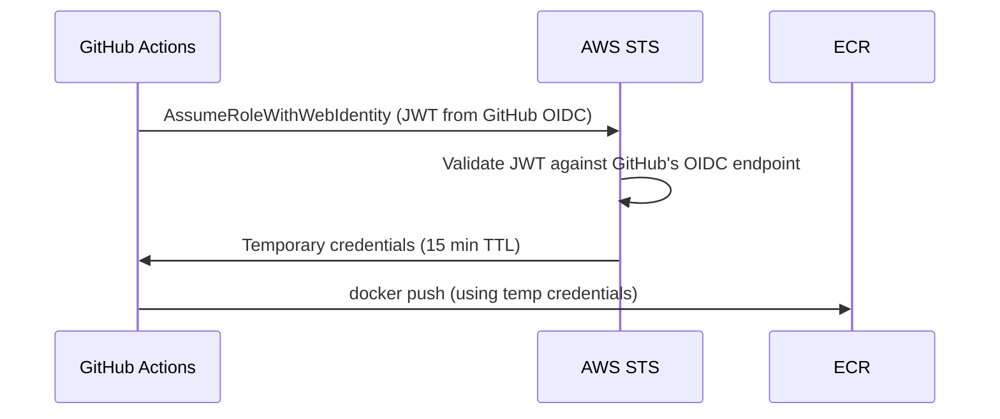

# Phase 4 — CI/CD Pipeline

> **AWS services introduced:** ECR image scanning | **Daily cost:** ~$6.35/day

---

## AWS services introduced

| Service | What it does | Why we need it |
|---|---|---|
| **ECR image scanning** | Trivy-compatible vulnerability scanning | Catch CVEs before images reach production |

*(This phase uses GitHub Actions rather than AWS CodePipeline — same reason as the GKE lab: GitHub Actions is more widely used and teaches transferable skills.)*

## The problem

Right now, deploying a change requires running commands manually: `docker build`, `docker push`, `aws ecs update-service`. This is fine for one engineer. It breaks down at three.

The pipeline automates the path from commit to production with quality gates: lint, test, build, scan, push, deploy.

## Pipeline design

## Challenges

1. Set up GitHub Actions OIDC trust with AWS (no long-lived access keys — same principle as GKE Workload Identity)
2. Write the CI workflow: lint → test → build → Trivy scan → push to ECR
3. Write the CD step: update ECS task definition with new image SHA, force new deployment, wait for stability
4. Add a `workflow_dispatch` input for promoting a specific SHA to staging
5. Protect the `main` branch: require status checks to pass before merge
6. Simulate a CVE: add a vulnerable npm package, confirm the pipeline fails and prevents the push

## AWS concept: OIDC federation (no static keys)

Never store AWS access keys as GitHub secrets. OIDC federation issues temporary credentials that expire — there is nothing to leak and nothing to rotate.

## Outcome

Every push to `main` automatically builds, scans, and deploys to dev. No engineer runs deployment commands manually. CVEs in the image block the deploy.

## Cost breakdown

| Resource | $/day |
|---|---|
| Phase 3 baseline | ~$5.69 |
| ECR image storage (~5 images) | ~$0.05 |
| **Total** | **~$5.74** |

> GitHub Actions minutes are free for public repos. Private repos get 2,000 free minutes/month on the free plan.

---

[Back to main README](../README.md) | [Next: Phase 5 — Static Assets](../phase-5-static-assets/README.md)
