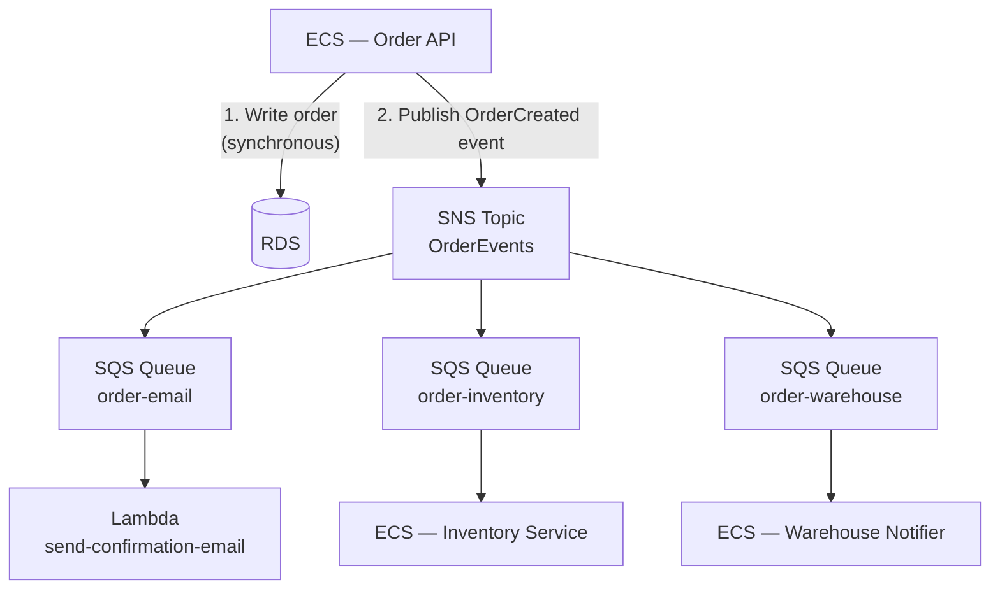

# Phase 6 — Decouple with SQS and SNS

> **AWS services introduced:** SQS, SNS, EventBridge | **Daily cost:** ~$5.80/day (SQS/SNS within free tier)

---

## AWS services introduced

| Service | What it does | Why we need it |
|---|---|---|
| **SQS** | Message queue | Decouples the order creation response from downstream processing |
| **SNS** | Pub/sub notifications | Fan out a single event to multiple consumers |
| **EventBridge** | Event bus with routing rules | Routes events from AWS services and custom apps to targets |

## The problem

When a customer places an order, the OrderFlow monolith currently does all of this synchronously in the same HTTP request:
1. Write the order to PostgreSQL
2. Deduct inventory
3. Send a confirmation email
4. Notify the warehouse system
5. Update the daily sales report

If the email service is slow, the customer waits. If the warehouse API is down, the order fails even though the customer's payment went through. If any step throws, the entire transaction rolls back.

The customer only needs to know the order was received. Everything else can happen asynchronously.

## Architecture after Phase 6



The HTTP response returns as soon as the order is written to the database and the event is published. Everything downstream is best-effort and retried automatically if it fails.

## AWS concept: at-least-once delivery

SQS guarantees that every message is delivered **at least once** but not necessarily exactly once. Your consumers must be **idempotent**: processing the same message twice should produce the same result as processing it once. For order confirmation emails: check if the email was already sent before sending it. For inventory deduction: use a database transaction with a unique order ID constraint.

---

## Challenges

### Challenge 1 — Create the SNS topic

**Goal:** Create a single SNS topic that acts as the event bus for all order events.

#### Step 1 — Create the Terraform file

Create `phase-6-async/terraform/sns.tf`:

```hcl
# ── SNS topic for order events ────────────────────────────────────────────────
resource "aws_sns_topic" "order_events" {
  name = "orderflow-order-events"

  # KMS encryption at rest — use the AWS-managed key for SNS
  kms_master_key_id = "alias/aws/sns"

  tags = { Name = "orderflow-order-events" }
}

output "order_events_topic_arn" {
  value = aws_sns_topic.order_events.arn
}
```

#### Step 2 — Apply and verify

```bash
cd phase-6-async/terraform
terraform init
terraform apply -auto-approve
```

Expected output:

```
aws_sns_topic.order_events: Creating...
aws_sns_topic.order_events: Creation complete after 1s

Outputs:
order_events_topic_arn = "arn:aws:sns:us-east-1:123456789012:orderflow-order-events"
```

Verify the topic exists:

```bash
TOPIC_ARN=$(terraform output -raw order_events_topic_arn)

aws sns get-topic-attributes \
  --topic-arn "$TOPIC_ARN" \
  --query 'Attributes.{name:DisplayName,kms:KmsMasterKeyId,subscriptions:SubscriptionsConfirmed}' \
  --output table
```

Publish a test message to confirm the topic accepts messages:

```bash
aws sns publish \
  --topic-arn "$TOPIC_ARN" \
  --message '{"eventType":"OrderCreated","orderId":"test-123"}' \
  --subject "OrderCreated"
```

Expected:

```json
{
  "MessageId": "a1b2c3d4-1234-5678-abcd-ef0123456789"
}
```

---

### Challenge 2 — SQS queues with dead-letter queues

**Goal:** Create three SQS queues subscribed to the SNS topic. Each queue has a DLQ — messages that fail 3 times land there for inspection without being lost.

#### Step 1 — Create the Terraform file

Create `phase-6-async/terraform/sqs.tf`:

```hcl
locals {
  queues = ["order-email", "order-inventory", "order-warehouse"]
}

# ── Dead-letter queues (one per consumer) ─────────────────────────────────────
resource "aws_sqs_queue" "dlq" {
  for_each = toset(local.queues)

  name                      = "orderflow-${each.key}-dlq"
  message_retention_seconds = 1209600 # 14 days — gives time to investigate
  kms_master_key_id         = "alias/aws/sqs"

  tags = { Name = "orderflow-${each.key}-dlq" }
}

# ── Main queues ───────────────────────────────────────────────────────────────
resource "aws_sqs_queue" "queues" {
  for_each = toset(local.queues)

  name                       = "orderflow-${each.key}"
  visibility_timeout_seconds = 60    # Must be >= consumer processing time
  message_retention_seconds  = 86400 # 1 day
  kms_master_key_id          = "alias/aws/sqs"

  redrive_policy = jsonencode({
    deadLetterTargetArn = aws_sqs_queue.dlq[each.key].arn
    maxReceiveCount     = 3  # After 3 failures, move to DLQ
  })

  tags = { Name = "orderflow-${each.key}" }
}

# ── SQS access policy: allow SNS to send messages ─────────────────────────────
data "aws_iam_policy_document" "sqs_sns_policy" {
  for_each = toset(local.queues)

  statement {
    sid    = "AllowSNSPublish"
    effect = "Allow"

    principals {
      type        = "Service"
      identifiers = ["sns.amazonaws.com"]
    }

    actions   = ["sqs:SendMessage"]
    resources = [aws_sqs_queue.queues[each.key].arn]

    condition {
      test     = "ArnEquals"
      variable = "aws:SourceArn"
      values   = [aws_sns_topic.order_events.arn]
    }
  }
}

resource "aws_sqs_queue_policy" "queues" {
  for_each  = toset(local.queues)
  queue_url = aws_sqs_queue.queues[each.key].url
  policy    = data.aws_iam_policy_document.sqs_sns_policy[each.key].json
}

# ── SNS subscriptions ─────────────────────────────────────────────────────────
resource "aws_sns_topic_subscription" "queues" {
  for_each = toset(local.queues)

  topic_arn = aws_sns_topic.order_events.arn
  protocol  = "sqs"
  endpoint  = aws_sqs_queue.queues[each.key].arn

  # Raw message delivery: SQS receives the JSON body directly,
  # not wrapped in the SNS envelope. Makes consumer code simpler.
  raw_message_delivery = true
}

output "queue_urls" {
  value = { for k, q in aws_sqs_queue.queues : k => q.url }
}

output "dlq_urls" {
  value = { for k, q in aws_sqs_queue.dlq : k => q.url }
}
```

#### Step 2 — Apply

```bash
terraform apply -auto-approve
```

Expected output (excerpt):

```
aws_sqs_queue.dlq["order-email"]: Creating...
aws_sqs_queue.dlq["order-inventory"]: Creating...
aws_sqs_queue.dlq["order-warehouse"]: Creating...
aws_sqs_queue.queues["order-email"]: Creating...
...
aws_sns_topic_subscription.queues["order-email"]: Creation complete after 0s
aws_sns_topic_subscription.queues["order-inventory"]: Creation complete after 0s
aws_sns_topic_subscription.queues["order-warehouse"]: Creation complete after 0s

Outputs:
queue_urls = {
  "order-email"     = "https://sqs.us-east-1.amazonaws.com/123456789012/orderflow-order-email"
  "order-inventory" = "https://sqs.us-east-1.amazonaws.com/123456789012/orderflow-order-inventory"
  "order-warehouse" = "https://sqs.us-east-1.amazonaws.com/123456789012/orderflow-order-warehouse"
}
```

#### Step 3 — Verify fan-out end to end

Publish to SNS and confirm all three queues receive the message:

```bash
TOPIC_ARN=$(terraform output -raw order_events_topic_arn)

aws sns publish \
  --topic-arn "$TOPIC_ARN" \
  --message '{"eventType":"OrderCreated","orderId":"fan-out-test","customerId":"1"}' \
  --subject "OrderCreated"

# Wait 2 seconds for propagation, then check each queue
sleep 2

for QUEUE in order-email order-inventory order-warehouse; do
  URL=$(terraform output -json queue_urls | jq -r ".\"${QUEUE}\"")
  COUNT=$(aws sqs get-queue-attributes \
    --queue-url "$URL" \
    --attribute-names ApproximateNumberOfMessages \
    --query 'Attributes.ApproximateNumberOfMessages' \
    --output text)
  echo "${QUEUE}: ${COUNT} message(s)"
done
```

Expected:

```
order-email: 1 message(s)
order-inventory: 1 message(s)
order-warehouse: 1 message(s)
```

One SNS publish → three SQS queues each received an independent copy.

---

### Challenge 3 — Refactor the order creation endpoint

**Goal:** The order route writes to DB, publishes to SNS, and returns 201. All synchronous downstream work (email, inventory, warehouse) is removed from the request path.

#### Step 1 — Add the AWS SDK SNS client to the app

```bash
cd orderflow
npm install @aws-sdk/client-sns
```

#### Step 2 — Create an event publisher helper

Create `orderflow/src/services/events.js`:

```js
const { SNSClient, PublishCommand } = require('@aws-sdk/client-sns');

const sns = new SNSClient({ region: process.env.AWS_REGION || 'us-east-1' });
const TOPIC_ARN = process.env.ORDER_EVENTS_TOPIC_ARN;

/**
 * Publishes an OrderCreated event to SNS.
 * All downstream consumers (email, inventory, warehouse) receive a copy.
 *
 * @param {object} order - The Sequelize order instance (after DB save)
 */
async function publishOrderCreated(order) {
  if (!TOPIC_ARN) {
    // Local dev without SNS — log and continue
    console.log('[events] ORDER_EVENTS_TOPIC_ARN not set, skipping SNS publish');
    return;
  }

  const event = {
    eventType: 'OrderCreated',
    orderId: order.id,
    customerId: order.CustomerId,
    productId: order.ProductId,
    quantity: order.quantity,
    totalPrice: order.totalPrice,
    createdAt: order.createdAt,
  };

  await sns.send(new PublishCommand({
    TopicArn: TOPIC_ARN,
    Message: JSON.stringify(event),
    Subject: 'OrderCreated',
    MessageAttributes: {
      eventType: {
        DataType: 'String',
        StringValue: 'OrderCreated',
      },
    },
  }));

  console.log(`[events] Published OrderCreated for order ${order.id}`);
}

module.exports = { publishOrderCreated };
```

#### Step 3 — Refactor `orderflow/src/routes/orders.js`

Replace the synchronous `POST /orders` handler with the async version:

```js
const { publishOrderCreated } = require('../services/events');

// POST /orders — create a new order
router.post('/', requireAuth, async (req, res) => {
  const { productId, quantity } = req.body;

  if (!productId || !quantity) {
    return res.status(400).json({ error: 'productId and quantity are required' });
  }

  const product = await Product.findByPk(productId);
  if (!product) {
    return res.status(404).json({ error: 'Product not found' });
  }

  if (product.stock < quantity) {
    return res.status(409).json({ error: 'Insufficient stock' });
  }

  // ── Synchronous: write the order to the database ───────────────────────────
  const order = await Order.create({
    CustomerId: req.session.customerId,
    ProductId: productId,
    quantity,
    totalPrice: product.price * quantity,
    status: 'pending',
  });

  // ── Async: publish event — consumers handle everything else ───────────────
  // If SNS publish fails, the order is still created. The event can be
  // replayed from the DB later. Do NOT block the response on this.
  publishOrderCreated(order).catch(err => {
    console.error('[events] Failed to publish OrderCreated:', err.message);
  });

  // Return immediately — the customer's work is done
  return res.status(201).json({
    id: order.id,
    status: order.status,
    totalPrice: order.totalPrice,
    message: 'Order received. Confirmation email will arrive shortly.',
  });
});
```

Notice what is **gone** from the handler:
- `sendConfirmationEmail(...)` — now handled by Lambda via `order-email` queue
- `deductInventory(...)` — now handled by inventory service via `order-inventory` queue
- `notifyWarehouse(...)` — now handled by warehouse notifier via `order-warehouse` queue

#### Step 4 — Add the topic ARN to ECS secrets

```bash
TOPIC_ARN=$(terraform output -raw order_events_topic_arn)

aws secretsmanager create-secret \
  --name orderflow/order-events-topic-arn \
  --secret-string "$TOPIC_ARN"
```

Add to the ECS task definition secrets array:

```hcl
{ name = "ORDER_EVENTS_TOPIC_ARN", valueFrom = "arn:aws:secretsmanager:...:secret:orderflow/order-events-topic-arn" }
```

Grant the ECS task role SNS publish permission:

```hcl
# In phase-3-ecs/terraform/iam.tf, add to the task role policy:
statement {
  effect    = "Allow"
  actions   = ["sns:Publish"]
  resources = [aws_sns_topic.order_events.arn]
}
```

#### Step 5 — Test the refactored endpoint

```bash
# Place an order — should return immediately
time curl -s -X POST http://localhost:3000/orders \
  -H "Content-Type: application/json" \
  -b cookies.txt \
  -d '{"productId":1,"quantity":2}' | jq .
```

Expected (fast response, no email/inventory blocking):

```json
{
  "id": 15,
  "status": "pending",
  "totalPrice": "49.98",
  "message": "Order received. Confirmation email will arrive shortly."
}

real    0m0.042s    ← was 1-3s in Phase 0 (synchronous email + warehouse)
```

Confirm the event landed in all three queues:

```bash
for QUEUE in order-email order-inventory order-warehouse; do
  URL=$(terraform -chdir=phase-6-async/terraform output -json queue_urls | jq -r ".\"${QUEUE}\"")
  MSG=$(aws sqs receive-message --queue-url "$URL" --query 'Messages[0].Body' --output text)
  echo "=== $QUEUE ==="
  echo "$MSG" | jq .
done
```

---

### Challenge 4 — Lambda function for confirmation email

**Goal:** Write a Lambda function triggered by the `order-email` SQS queue. It reads the event and sends a confirmation email via SES.

#### Step 1 — Verify your SES sending identity

Before Lambda can send email, SES must have a verified sender:

```bash
# Verify your email address as a sender (sandbox mode)
aws ses verify-email-identity --email-address orders@yourdomain.com

# Check verification status
aws ses get-identity-verification-attributes \
  --identities orders@yourdomain.com \
  --query 'VerificationAttributes'
```

Check your inbox for the AWS verification email and click the link.

#### Step 2 — Write the Lambda function

Create `phase-6-async/lambda/send-confirmation-email/index.js`:

```js
const { SESClient, SendEmailCommand } = require('@aws-sdk/client-ses');
const { DynamoDBClient, PutItemCommand, GetItemCommand } = require('@aws-sdk/client-dynamodb');

const ses = new SESClient({ region: process.env.AWS_REGION });
const dynamo = new DynamoDBClient({ region: process.env.AWS_REGION });

const FROM_ADDRESS = process.env.SES_FROM_ADDRESS;
const IDEMPOTENCY_TABLE = process.env.IDEMPOTENCY_TABLE; // DynamoDB table for dedup

/**
 * Checks if we already sent an email for this orderId.
 * SQS delivers at-least-once — without this check, customers could receive
 * duplicate emails if the Lambda retries.
 */
async function alreadySent(orderId) {
  const result = await dynamo.send(new GetItemCommand({
    TableName: IDEMPOTENCY_TABLE,
    Key: { orderId: { S: String(orderId) } },
  }));
  return !!result.Item;
}

async function markSent(orderId) {
  await dynamo.send(new PutItemCommand({
    TableName: IDEMPOTENCY_TABLE,
    Item: {
      orderId:   { S: String(orderId) },
      sentAt:    { S: new Date().toISOString() },
      ttl:       { N: String(Math.floor(Date.now() / 1000) + 7 * 86400) }, // 7-day TTL
    },
    // Fail if a record already exists — race-condition safety
    ConditionExpression: 'attribute_not_exists(orderId)',
  }));
}

exports.handler = async (event) => {
  const results = [];

  for (const record of event.Records) {
    let body;
    try {
      body = JSON.parse(record.body);
    } catch {
      console.error('Failed to parse SQS message body:', record.body);
      // Don't throw — bad messages should go to DLQ after maxReceiveCount
      results.push({ messageId: record.messageId, status: 'parse-error' });
      continue;
    }

    const { orderId, customerId, totalPrice, productId } = body;

    // ── Idempotency check ────────────────────────────────────────────────────
    if (await alreadySent(orderId)) {
      console.log(`[email] Already sent confirmation for order ${orderId} — skipping`);
      results.push({ orderId, status: 'skipped-duplicate' });
      continue;
    }

    // ── Send email ───────────────────────────────────────────────────────────
    // In production: look up the customer's email from RDS.
    // For this lab, we use a placeholder to keep the Lambda self-contained.
    const customerEmail = `customer+${customerId}@example.com`;

    await ses.send(new SendEmailCommand({
      Source: FROM_ADDRESS,
      Destination: { ToAddresses: [customerEmail] },
      Message: {
        Subject: { Data: `OrderFlow — Order #${orderId} Confirmed` },
        Body: {
          Text: {
            Data: [
              `Hi there,`,
              ``,
              `Your order #${orderId} has been confirmed.`,
              `Total: $${Number(totalPrice).toFixed(2)}`,
              ``,
              `We'll notify you when it ships.`,
              ``,
              `— The OrderFlow team`,
            ].join('\n'),
          },
        },
      },
    }));

    // ── Record that we sent it ────────────────────────────────────────────────
    try {
      await markSent(orderId);
    } catch (err) {
      if (err.name === 'ConditionalCheckFailedException') {
        // Another Lambda invocation won the race — that's fine
        console.log(`[email] Race condition on order ${orderId} — other invocation won`);
      } else {
        throw err;
      }
    }

    console.log(`[email] Confirmation sent for order ${orderId} to ${customerEmail}`);
    results.push({ orderId, status: 'sent' });
  }

  return { results };
};
```

#### Step 3 — Terraform for Lambda and DynamoDB idempotency table

Create `phase-6-async/terraform/lambda_email.tf`:

```hcl
# ── DynamoDB table for email idempotency ─────────────────────────────────────
resource "aws_dynamodb_table" "email_idempotency" {
  name         = "orderflow-email-sent"
  billing_mode = "PAY_PER_REQUEST"
  hash_key     = "orderId"

  attribute {
    name = "orderId"
    type = "S"
  }

  ttl {
    attribute_name = "ttl"
    enabled        = true
  }

  tags = { Name = "orderflow-email-idempotency" }
}

# ── Lambda IAM role ───────────────────────────────────────────────────────────
data "aws_iam_policy_document" "lambda_email_trust" {
  statement {
    effect  = "Allow"
    actions = ["sts:AssumeRole"]
    principals {
      type        = "Service"
      identifiers = ["lambda.amazonaws.com"]
    }
  }
}

resource "aws_iam_role" "lambda_email" {
  name               = "orderflow-lambda-email"
  assume_role_policy = data.aws_iam_policy_document.lambda_email_trust.json
}

resource "aws_iam_role_policy_attachment" "lambda_email_basic" {
  role       = aws_iam_role.lambda_email.name
  policy_arn = "arn:aws:iam::aws:policy/service-role/AWSLambdaBasicExecutionRole"
}

resource "aws_iam_role_policy_attachment" "lambda_email_sqs" {
  role       = aws_iam_role.lambda_email.name
  policy_arn = "arn:aws:iam::aws:policy/service-role/AWSLambdaSQSQueueExecutionRole"
}

data "aws_iam_policy_document" "lambda_email_app" {
  statement {
    effect    = "Allow"
    actions   = ["ses:SendEmail", "ses:SendRawEmail"]
    resources = ["*"]
  }

  statement {
    effect  = "Allow"
    actions = ["dynamodb:GetItem", "dynamodb:PutItem"]
    resources = [aws_dynamodb_table.email_idempotency.arn]
  }
}

resource "aws_iam_role_policy" "lambda_email_app" {
  name   = "lambda-email-app"
  role   = aws_iam_role.lambda_email.id
  policy = data.aws_iam_policy_document.lambda_email_app.json
}

# ── Package and deploy the Lambda ─────────────────────────────────────────────
data "archive_file" "lambda_email" {
  type        = "zip"
  source_dir  = "${path.module}/../../lambda/send-confirmation-email"
  output_path = "${path.module}/lambda-email.zip"
}

resource "aws_lambda_function" "send_confirmation_email" {
  filename         = data.archive_file.lambda_email.output_path
  source_code_hash = data.archive_file.lambda_email.output_base64sha256
  function_name    = "orderflow-send-confirmation-email"
  role             = aws_iam_role.lambda_email.arn
  handler          = "index.handler"
  runtime          = "nodejs20.x"
  timeout          = 30

  environment {
    variables = {
      SES_FROM_ADDRESS  = var.ses_from_address
      IDEMPOTENCY_TABLE = aws_dynamodb_table.email_idempotency.name
    }
  }

  tags = { Name = "orderflow-send-confirmation-email" }
}

# ── SQS event source mapping ──────────────────────────────────────────────────
resource "aws_lambda_event_source_mapping" "order_email" {
  event_source_arn = aws_sqs_queue.queues["order-email"].arn
  function_name    = aws_lambda_function.send_confirmation_email.arn
  batch_size       = 10

  # If any message in the batch fails, only retry failed messages (not the whole batch)
  function_response_types = ["ReportBatchItemFailures"]
}
```

Add to `variables.tf`:

```hcl
variable "ses_from_address" {
  description = "Verified SES sender email address"
  type        = string
}
```

#### Step 4 — Install Lambda dependencies and deploy

```bash
cd phase-6-async/lambda/send-confirmation-email
npm init -y
npm install @aws-sdk/client-ses @aws-sdk/client-dynamodb

cd ../../terraform
terraform apply -auto-approve \
  -var="ses_from_address=orders@yourdomain.com"
```

#### Step 5 — Test the full flow

```bash
# Place an order
curl -s -X POST http://your-alb-hostname/orders \
  -H "Content-Type: application/json" \
  -b cookies.txt \
  -d '{"productId":1,"quantity":1}' | jq .

# Check Lambda CloudWatch logs
aws logs tail /aws/lambda/orderflow-send-confirmation-email \
  --follow \
  --since 2m
```

Expected log output:

```
[email] Confirmation sent for order 16 to customer+7@example.com
```

---

### Challenge 5 — Simulate consumer failure

**Goal:** Stop the inventory consumer while placing orders. Confirm orders still succeed and messages accumulate in the queue. Restart and watch the queue drain.

#### Step 1 — Place orders with the inventory consumer "down"

In this lab, the inventory consumer is simulated — we'll observe queue depth rather than stopping a real service:

```bash
INVENTORY_URL=$(terraform output -json queue_urls | jq -r '."order-inventory"')

# Place 10 orders rapidly
for i in $(seq 1 10); do
  curl -s -X POST http://your-alb-hostname/orders \
    -H "Content-Type: application/json" \
    -b cookies.txt \
    -d "{\"productId\":1,\"quantity\":1}" > /dev/null
  echo "Order $i placed"
done
```

#### Step 2 — Observe queue depth

```bash
# Check messages waiting in the inventory queue
aws sqs get-queue-attributes \
  --queue-url "$INVENTORY_URL" \
  --attribute-names \
    ApproximateNumberOfMessages \
    ApproximateNumberOfMessagesNotVisible \
  --query 'Attributes' \
  --output table
```

Expected:

```
---------------------------------------
|       GetQueueAttributes            |
+--------------------------------------+--+
| ApproximateNumberOfMessages          | 10|
| ApproximateNumberOfMessagesNotVisible|  0|
+--------------------------------------+--+
```

10 messages are sitting in the queue, not yet consumed. Crucially, **all 10 orders succeeded** — the customer got their confirmation. The inventory deduction will happen when the consumer comes back.

#### Step 3 — Drain the queue (simulate consumer restart)

```bash
# Receive and delete messages — simulates consumer processing
for i in $(seq 1 10); do
  MSG=$(aws sqs receive-message \
    --queue-url "$INVENTORY_URL" \
    --query 'Messages[0]' \
    --output json)

  if [ "$MSG" == "null" ] || [ -z "$MSG" ]; then
    echo "Queue empty"
    break
  fi

  ORDER_ID=$(echo "$MSG" | jq -r '.Body | fromjson | .orderId')
  RECEIPT=$(echo "$MSG" | jq -r '.ReceiptHandle')

  echo "Processing inventory deduction for order $ORDER_ID"

  # Acknowledge the message (delete it)
  aws sqs delete-message \
    --queue-url "$INVENTORY_URL" \
    --receipt-handle "$RECEIPT"
done
```

#### Step 4 — Verify the queue is empty

```bash
aws sqs get-queue-attributes \
  --queue-url "$INVENTORY_URL" \
  --attribute-names ApproximateNumberOfMessages \
  --query 'Attributes.ApproximateNumberOfMessages' \
  --output text
```

Expected: `0`

#### Step 5 — Check the DLQ is empty

Messages only land in the DLQ if they fail `maxReceiveCount` (3) times. Since we processed them successfully, the DLQ should be empty:

```bash
DLQ_URL=$(terraform output -json dlq_urls | jq -r '."order-inventory"')

aws sqs get-queue-attributes \
  --queue-url "$DLQ_URL" \
  --attribute-names ApproximateNumberOfMessages \
  --query 'Attributes.ApproximateNumberOfMessages' \
  --output text
```

Expected: `0`

---

### Challenge 6 — SQS visibility timeout

**Goal:** Understand what happens when the visibility timeout is shorter than your consumer's processing time — and why it causes duplicate processing.

#### Step 1 — What is visibility timeout?

When a consumer receives a message, SQS makes it **invisible** to other consumers for `VisibilityTimeout` seconds. This prevents two consumers from processing the same message simultaneously.

```
t=0s   Consumer A receives message → message becomes invisible (60s timeout)
t=30s  Consumer A finishes → deletes message → message is gone ✓

vs.

t=0s   Consumer A receives message → message becomes invisible (10s timeout)
t=10s  Timeout expires → message becomes visible again
t=10s  Consumer B receives the same message (Consumer A still working!)
t=20s  Consumer A finishes → tries to delete → ReceiptHandle stale → error
t=25s  Consumer B finishes → deletes message
       Result: message processed TWICE
```

#### Step 2 — Reproduce duplicate processing

Lower the timeout to 5 seconds temporarily:

```bash
INVENTORY_URL=$(terraform output -json queue_urls | jq -r '."order-inventory"')

aws sqs set-queue-attributes \
  --queue-url "$INVENTORY_URL" \
  --attributes VisibilityTimeout=5
```

Send a message and receive it — then wait longer than 5 seconds before deleting:

```bash
# Send
aws sqs send-message \
  --queue-url "$INVENTORY_URL" \
  --message-body '{"eventType":"OrderCreated","orderId":"vt-test","customerId":"1"}'

# Receive (message is now invisible for 5 seconds)
MSG=$(aws sqs receive-message --queue-url "$INVENTORY_URL" --output json)
RECEIPT=$(echo "$MSG" | jq -r '.Messages[0].ReceiptHandle')
echo "Received. Waiting 7 seconds (longer than 5s timeout)..."

sleep 7

# Try to receive again — the message is visible again
MSG2=$(aws sqs receive-message --queue-url "$INVENTORY_URL" --output json)
echo "Second receive: $(echo "$MSG2" | jq -r '.Messages[0].Body')"
```

Expected: you receive the **same message twice**. Without idempotency guards, this would deduct inventory twice for the same order.

#### Step 3 — Set the correct timeout

The rule: **visibility timeout must be greater than your longest expected consumer processing time**, including retries.

For a consumer that:
- Queries the database: ~50ms
- Makes an external API call: ~500ms
- Retries on failure: up to 3× = ~1.5s total
- Add 10× safety margin: 15s

Set it to 60 seconds (generous for this lab):

```bash
aws sqs set-queue-attributes \
  --queue-url "$INVENTORY_URL" \
  --attributes VisibilityTimeout=60
```

Verify:

```bash
aws sqs get-queue-attributes \
  --queue-url "$INVENTORY_URL" \
  --attribute-names VisibilityTimeout \
  --query 'Attributes.VisibilityTimeout' \
  --output text
```

Expected: `60`

#### Step 4 — The DLQ relationship

If a consumer crashes midway through processing (instance terminated, Lambda timeout), the message becomes visible again after the timeout expires. SQS retries delivery. After `maxReceiveCount` (3) retries, the message moves to the DLQ.

```
Message received → processed → deleted              ✓ happy path
Message received → consumer crashes → timeout       ↩ retry 1
Message received → consumer crashes → timeout       ↩ retry 2
Message received → consumer crashes → timeout       ↩ retry 3
Message received → maxReceiveCount reached           → DLQ
```

Check DLQ depth as a health signal:

```bash
DLQ_URL=$(terraform output -json dlq_urls | jq -r '."order-inventory"')

aws sqs get-queue-attributes \
  --queue-url "$DLQ_URL" \
  --attribute-names ApproximateNumberOfMessages \
  --query 'Attributes.ApproximateNumberOfMessages' \
  --output text
```

Any non-zero DLQ depth means messages failed 3 times and need manual investigation. In production, set a CloudWatch alarm on `ApproximateNumberOfMessagesVisible` for each DLQ.

---

## Outcome

Order placement response time drops by the time previously spent on email + inventory + warehouse calls. Downstream failures no longer cause order failures. The dead-letter queues give you visibility into what failed and why.

**Before Phase 6:**
```
POST /orders → write DB → send email (500ms) → deduct inventory (200ms) → notify warehouse (300ms) → 201
Total: ~1100ms
```

**After Phase 6:**
```
POST /orders → write DB → publish SNS (30ms) → 201
Total: ~80ms
Email, inventory, warehouse: async, retried on failure, isolated from each other
```

## Cost breakdown

| Resource | $/day |
|---|---|
| Phase 5 baseline | ~$5.80 |
| SQS + SNS | ~$0 (within free tier) |
| Lambda invocations | ~$0 (within free tier) |
| DynamoDB (idempotency) | ~$0 (on-demand, low volume) |
| **Total** | **~$5.80** |

---

[Back to main README](../README.md) | [Next: Phase 7 — Serverless](../phase-7-serverless/README.md)
