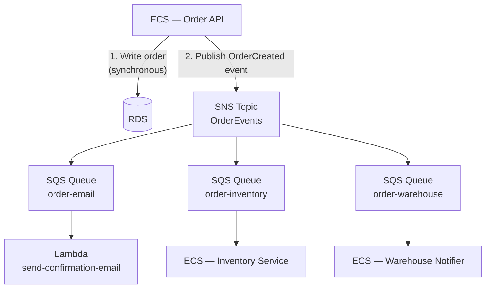

# Phase 6 — Decouple with SQS and SNS

> **AWS services introduced:** SQS, SNS, EventBridge | **Daily cost:** ~$6.40/day (SQS/SNS within free tier)

---

## AWS services introduced

| Service | What it does | Why we need it |
|---|---|---|
| **SQS** | Message queue | Decouples the order creation response from downstream processing |
| **SNS** | Pub/sub notifications | Fan out a single event to multiple consumers |
| **EventBridge** | Event bus with routing rules | Routes events from AWS services and custom apps to targets |

## The problem

When a customer places an order, the OrderFlow monolith currently does all of this synchronously in the same HTTP request:
1. Write the order to PostgreSQL
2. Deduct inventory
3. Send a confirmation email
4. Notify the warehouse system
5. Update the daily sales report

If the email service is slow, the customer waits. If the warehouse API is down, the order fails even though the customer's payment went through. If any step throws, the entire transaction rolls back.

The customer only needs to know the order was received. Everything else can happen asynchronously.

## Architecture after Phase 6



The HTTP response returns as soon as the order is written to the database and the event is published. Everything downstream is best-effort and retried automatically if it fails.

## AWS concept: at-least-once delivery

SQS guarantees that every message is delivered **at least once** but not necessarily exactly once. Your consumers must be **idempotent**: processing the same message twice should produce the same result as processing it once. For order confirmation emails: check if the email was already sent before sending it. For inventory deduction: use a database transaction with a unique order ID constraint.

## Challenges

1. Create an SNS topic `orderflow-order-events`
2. Create three SQS queues subscribing to the SNS topic. Add a dead-letter queue (DLQ) to each — messages that fail 3 times land in the DLQ for manual inspection
3. Refactor the order creation endpoint: write to DB, publish to SNS, return 201. Remove all synchronous downstream calls.
4. Write a Lambda function triggered by the `order-email` SQS queue. Use AWS SES to send the confirmation email.
5. Simulate a consumer failure: stop the inventory service while placing orders. Confirm orders still succeed and the inventory messages accumulate in the queue. Restart the service and watch it drain.
6. Set a SQS message visibility timeout larger than your consumer's processing time. Understand what happens if it is too short (duplicate processing).

## Outcome

Order placement response time drops by the time previously spent on email + inventory + warehouse calls. Downstream failures no longer cause order failures. The dead-letter queues give you visibility into what failed and why.

## Cost breakdown

| Resource | $/day |
|---|---|
| Phase 5 baseline | ~$5.80 |
| SQS + SNS | ~$0 (within free tier) |
| **Total** | **~$5.80** |

```bash
cd terraform && terraform destroy -auto-approve
```

---

[Back to main README](../README.md) | [Next: Phase 7 — Serverless](../phase-7-serverless/README.md)
