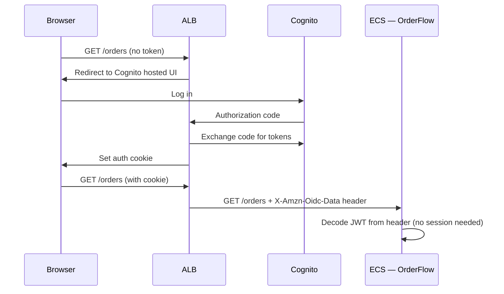

# Phase 8 — Extract Auth to Cognito

> **AWS services introduced:** Cognito User Pools, Cognito Identity Pools, ALB authentication | **Daily cost:** ~$6.40/day (<50K MAU free)

---

## AWS services introduced

| Service | What it does | Why we need it |
|---|---|---|
| **Cognito User Pools** | Managed user directory | Handles sign-up, sign-in, MFA, password reset — without writing auth code |
| **Cognito Identity Pools** | Federated identities | Maps authenticated users to AWS credentials for direct-to-S3 uploads |
| **ALB authentication** | OIDC integration on the load balancer | Enforces authentication before requests reach your containers |

## The problem

OrderFlow's auth is a custom session-based system: the user logs in, the server writes a session to Redis, every request reads the session to determine who the user is. This works but:
- Password reset, MFA, account lockout, social login — all custom code
- Sessions in Redis require ElastiCache to be available for every request
- No token-based API access for mobile or third-party integrations

Cognito provides all of this as a managed service. You define user pool configuration. Cognito handles the implementation.

## How ALB authentication works



The ALB handles the entire OAuth flow. Your application receives a signed JWT in a request header. No auth middleware. No session store. No Redis dependency for authentication.

## Challenges

1. Create a Cognito User Pool with email sign-in, MFA optional, and a hosted UI
2. Configure the ALB listener to use Cognito for authentication (`authenticate-cognito` action)
3. Migrate existing users: export from PostgreSQL, import to Cognito via the `AdminCreateUser` API (with a temporary password and `FORCE_CHANGE_PASSWORD` status)
4. Update OrderFlow to read the user identity from the `X-Amzn-Oidc-Data` JWT header instead of the Redis session
5. Remove the custom auth routes (`/login`, `/logout`, `/register`) from the monolith — Cognito's hosted UI replaces them
6. Remove the ElastiCache session store dependency from the app (ElastiCache is still used for query caching, but no longer for sessions)

## Outcome

Auth is fully managed by Cognito. The monolith has no auth code. Session infrastructure complexity is eliminated. MFA is available to all users with zero additional code.

## Cost breakdown

| Resource | $/day |
|---|---|
| Phase 7 baseline | ~$5.80 |
| Cognito | ~$0 (<50,000 MAU free) |
| **Total** | **~$5.80** |

```bash
cd terraform && terraform destroy -auto-approve
```

---

[Back to main README](../README.md) | [Next: Phase 9 — EKS](../phase-9-eks/README.md)
