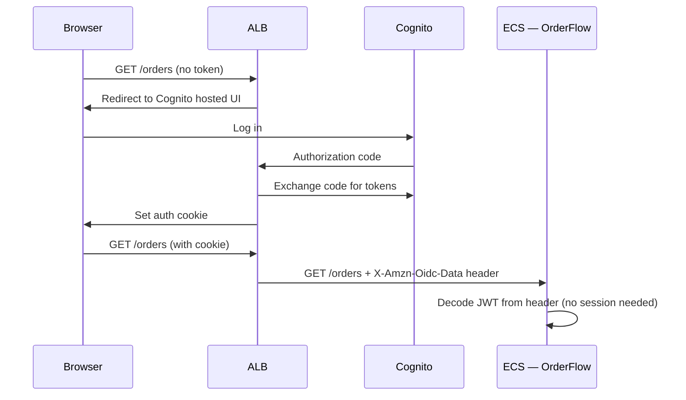

# Phase 8 — Extract Auth to Cognito

> **AWS services introduced:** Cognito User Pools, Cognito Identity Pools, ALB authentication | **Daily cost:** ~$5.80/day (<50K MAU free)

---

## AWS services introduced

| Service | What it does | Why we need it |
|---|---|---|
| **Cognito User Pools** | Managed user directory | Handles sign-up, sign-in, MFA, password reset — without writing auth code |
| **Cognito Identity Pools** | Federated identities | Maps authenticated users to AWS credentials for direct-to-S3 uploads |
| **ALB authentication** | OIDC integration on the load balancer | Enforces authentication before requests reach your containers |

## The problem

OrderFlow's auth is a custom session-based system: the user logs in, the server writes a session to Redis, every request reads the session to determine who the user is. This works but:
- Password reset, MFA, account lockout, social login — all custom code
- Sessions in Redis require ElastiCache to be available for every request
- No token-based API access for mobile or third-party integrations

Cognito provides all of this as a managed service. You define user pool configuration. Cognito handles the implementation.

## How ALB authentication works



The ALB handles the entire OAuth flow. Your application receives a signed JWT in a request header. No auth middleware. No session store. No Redis dependency for authentication.

---

## Challenges

### Challenge 1 — Create the Cognito User Pool

**Goal:** Create a Cognito User Pool with email sign-in, password policy, optional MFA, and a hosted UI.

#### Step 1 — Terraform for the User Pool

Create `phase-8-cognito/terraform/cognito.tf`:

```hcl
# ── User Pool ─────────────────────────────────────────────────────────────────
resource "aws_cognito_user_pool" "orderflow" {
  name = "orderflow"

  # Email is the username
  username_attributes      = ["email"]
  auto_verified_attributes = ["email"]

  # Password policy
  password_policy {
    minimum_length                   = 8
    require_lowercase                = true
    require_numbers                  = true
    require_symbols                  = false
    require_uppercase                = true
    temporary_password_validity_days = 7
  }

  # MFA: optional (user can enable TOTP in their account settings)
  mfa_configuration = "OPTIONAL"

  software_token_mfa_configuration {
    enabled = true
  }

  # Self-service account recovery via email
  account_recovery_setting {
    recovery_mechanism {
      name     = "verified_email"
      priority = 1
    }
  }

  # Email verification message
  verification_message_template {
    default_email_option = "CONFIRM_WITH_LINK"
    email_subject_by_link = "OrderFlow — Verify your email"
    email_message_by_link = "Click the link to verify your OrderFlow account: {##Verify Email##}"
  }

  # Standard attributes (required at sign-up)
  schema {
    attribute_data_type = "String"
    name                = "email"
    required            = true
    mutable             = true

    string_attribute_constraints {
      min_length = 5
      max_length = 254
    }
  }

  # Custom attribute: legacy DB customer ID (for migration)
  schema {
    attribute_data_type      = "Number"
    name                     = "legacy_customer_id"
    required                 = false
    mutable                  = true
    developer_only_attribute = false

    number_attribute_constraints {
      min_value = 1
    }
  }

  tags = { Name = "orderflow" }
}

# ── User Pool Client (for the ALB) ────────────────────────────────────────────
resource "aws_cognito_user_pool_client" "alb" {
  name         = "orderflow-alb"
  user_pool_id = aws_cognito_user_pool.orderflow.id

  generate_secret = true  # ALB requires a client secret

  allowed_oauth_flows                  = ["code"]  # Authorization code flow only
  allowed_oauth_scopes                 = ["openid", "email", "profile"]
  allowed_oauth_flows_user_pool_client = true

  # ALB callback URL — must match exactly
  callback_urls = ["https://${var.app_domain}/oauth2/idpresponse"]
  logout_urls   = ["https://${var.app_domain}/logout"]

  supported_identity_providers = ["COGNITO"]

  # Token validity
  access_token_validity  = 1    # hours
  id_token_validity      = 1    # hours
  refresh_token_validity = 30   # days

  token_validity_units {
    access_token  = "hours"
    id_token      = "hours"
    refresh_token = "days"
  }

  # Prevent user existence errors (don't tell attackers which emails are registered)
  prevent_user_existence_errors = "ENABLED"
}

# ── Hosted UI domain ──────────────────────────────────────────────────────────
# Uses a Cognito-managed subdomain: auth.orderflow.auth.us-east-1.amazoncognito.com
resource "aws_cognito_user_pool_domain" "orderflow" {
  domain       = "orderflow-${data.aws_caller_identity.current.account_id}"
  user_pool_id = aws_cognito_user_pool.orderflow.id
}

output "user_pool_id" {
  value = aws_cognito_user_pool.orderflow.id
}

output "user_pool_client_id" {
  value = aws_cognito_user_pool_client.alb.id
}

output "user_pool_client_secret" {
  value     = aws_cognito_user_pool_client.alb.client_secret
  sensitive = true
}

output "cognito_domain" {
  value = "https://${aws_cognito_user_pool_domain.orderflow.domain}.auth.${var.aws_region}.amazoncognito.com"
}
```

#### Step 2 — Apply and verify

```bash
cd phase-8-cognito/terraform
terraform init
terraform apply -auto-approve
```

Expected output:

```
aws_cognito_user_pool.orderflow: Creating...
aws_cognito_user_pool.orderflow: Creation complete after 3s [id=us-east-1_ABC123456]
aws_cognito_user_pool_client.alb: Creation complete after 1s
aws_cognito_user_pool_domain.orderflow: Creation complete after 2s

Outputs:
cognito_domain   = "https://orderflow-123456789012.auth.us-east-1.amazoncognito.com"
user_pool_id     = "us-east-1_ABC123456"
```

Verify the hosted UI is reachable:

```bash
COGNITO_DOMAIN=$(terraform output -raw cognito_domain)
CLIENT_ID=$(terraform output -raw user_pool_client_id)
APP_DOMAIN="your-alb-hostname.us-east-1.elb.amazonaws.com"

# Open this URL in a browser to see the Cognito hosted login UI
echo "${COGNITO_DOMAIN}/login?client_id=${CLIENT_ID}&response_type=code&redirect_uri=https://${APP_DOMAIN}/oauth2/idpresponse"
```

Create a test user via CLI:

```bash
POOL_ID=$(terraform output -raw user_pool_id)

aws cognito-idp admin-create-user \
  --user-pool-id "$POOL_ID" \
  --username "testuser@example.com" \
  --user-attributes Name=email,Value=testuser@example.com Name=email_verified,Value=true \
  --temporary-password "Temp1234!" \
  --message-action SUPPRESS
```

Expected:

```json
{
  "User": {
    "Username": "testuser@example.com",
    "UserStatus": "FORCE_CHANGE_PASSWORD",
    ...
  }
}
```

Set a permanent password:

```bash
aws cognito-idp admin-set-user-password \
  --user-pool-id "$POOL_ID" \
  --username "testuser@example.com" \
  --password "Secure1234!" \
  --permanent
```

---

### Challenge 2 — Configure ALB authentication

**Goal:** Add an `authenticate-cognito` action to the ALB HTTPS listener. Unauthenticated requests are redirected to Cognito login before reaching ECS.

#### Step 1 — Update the ALB listener rule

Create `phase-8-cognito/terraform/alb_auth.tf`:

```hcl
# Retrieve the existing HTTPS listener created in Phase 2
data "aws_lb_listener" "https" {
  load_balancer_arn = var.alb_arn
  port              = 443
}

# ── Modify the default action: authenticate first, then forward ───────────────
resource "aws_lb_listener_rule" "authenticated" {
  listener_arn = data.aws_lb_listener.https.arn
  priority     = 10

  action {
    type = "authenticate-cognito"

    authenticate_cognito {
      user_pool_arn              = aws_cognito_user_pool.orderflow.arn
      user_pool_client_id        = aws_cognito_user_pool_client.alb.id
      user_pool_domain           = aws_cognito_user_pool_domain.orderflow.domain
      on_unauthenticated_request = "authenticate"  # redirect to Cognito login
      scope                      = "openid email profile"
      session_cookie_name        = "AWSELBAuthSessionCookie"
      session_timeout            = 3600  # 1 hour
    }
  }

  action {
    type             = "forward"
    target_group_arn = var.ecs_target_group_arn
  }

  condition {
    path_pattern {
      values = ["/*"]
    }
  }
}

# ── Health check path must bypass auth ───────────────────────────────────────
# /health is called by the ALB itself — it has no auth cookie
resource "aws_lb_listener_rule" "health_bypass" {
  listener_arn = data.aws_lb_listener.https.arn
  priority     = 1  # Higher priority than the authenticated rule

  action {
    type             = "forward"
    target_group_arn = var.ecs_target_group_arn
  }

  condition {
    path_pattern {
      values = ["/health"]
    }
  }
}
```

Apply:

```bash
terraform apply -auto-approve
```

#### Step 2 — Verify the redirect

Test that an unauthenticated request to any protected path is redirected:

```bash
ALB_URL="https://your-alb-hostname.us-east-1.elb.amazonaws.com"

# Should redirect (302) to Cognito login, not return 200
curl -si "${ALB_URL}/orders" | head -5
```

Expected:

```
HTTP/2 302
location: https://orderflow-123456789012.auth.us-east-1.amazoncognito.com/login?...
```

Health check must still pass without auth:

```bash
curl -si "${ALB_URL}/health" | head -3
```

Expected:

```
HTTP/2 200
```

#### Step 3 — Verify the `X-Amzn-Oidc-Data` header

After authenticating via the hosted UI, the ALB sets a session cookie and forwards requests with a JWT header. Inspect what the app receives:

Add a temporary debug endpoint in `orderflow/src/app.js` (remove after testing):

```js
app.get('/debug/headers', (req, res) => {
  const oidcData = req.headers['x-amzn-oidc-data'];
  if (!oidcData) return res.json({ error: 'no OIDC header' });

  // The header is a JWT — decode the payload (middle segment)
  const payload = JSON.parse(Buffer.from(oidcData.split('.')[1], 'base64').toString());
  res.json({ payload });
});
```

After logging in via the hosted UI, visit `/debug/headers`. Expected response:

```json
{
  "payload": {
    "sub": "abc123-...",
    "email": "testuser@example.com",
    "username": "testuser@example.com",
    "custom:legacy_customer_id": "7",
    "exp": 1714000000,
    "iss": "https://cognito-idp.us-east-1.amazonaws.com/us-east-1_ABC123456"
  }
}
```

---

### Challenge 3 — Migrate existing users

**Goal:** Export customers from PostgreSQL, import them into Cognito via `AdminCreateUser`. Preserve the mapping between Cognito `sub` and the legacy database `customer_id`.

#### Step 1 — Export users from PostgreSQL

```bash
# Connect to RDS and export customers
psql "$DATABASE_URL" -c "\COPY (SELECT id, email FROM customers ORDER BY id) TO '/tmp/customers.csv' CSV HEADER"

cat /tmp/customers.csv
```

Expected:

```
id,email
1,alice@example.com
2,bob@example.com
7,testuser@example.com
```

#### Step 2 — Write the migration script

Create `phase-8-cognito/scripts/migrate-users.sh`:

```bash
#!/usr/bin/env bash
# Usage: ./migrate-users.sh <user-pool-id> <customers-csv>
set -euo pipefail

POOL_ID="$1"
CSV_FILE="$2"
IMPORTED=0
SKIPPED=0
FAILED=0

while IFS=, read -r id email; do
  # Skip header row
  [[ "$id" == "id" ]] && continue

  echo "Importing customer $id ($email)..."

  # Create user with a temporary password — they must change it on first login
  if aws cognito-idp admin-create-user \
    --user-pool-id "$POOL_ID" \
    --username "$email" \
    --user-attributes \
      Name=email,Value="$email" \
      Name=email_verified,Value=true \
      "Name=custom:legacy_customer_id,Value=$id" \
    --temporary-password "OrderFlow1!" \
    --message-action SUPPRESS \
    --output text > /dev/null 2>&1; then

    IMPORTED=$((IMPORTED + 1))
    echo "  ✓ Created: $email (legacy_id=$id)"
  else
    # User likely already exists
    SKIPPED=$((SKIPPED + 1))
    echo "  ↷ Skipped (already exists): $email"
  fi

done < "$CSV_FILE"

echo ""
echo "Migration complete: $IMPORTED imported, $SKIPPED skipped, $FAILED failed"
```

Run the migration:

```bash
POOL_ID=$(terraform output -raw user_pool_id)

chmod +x phase-8-cognito/scripts/migrate-users.sh
./phase-8-cognito/scripts/migrate-users.sh "$POOL_ID" /tmp/customers.csv
```

Expected:

```
Importing customer 1 (alice@example.com)...
  ✓ Created: alice@example.com (legacy_id=1)
Importing customer 2 (bob@example.com)...
  ✓ Created: bob@example.com (legacy_id=2)
Importing customer 7 (testuser@example.com)...
  ↷ Skipped (already exists): testuser@example.com

Migration complete: 2 imported, 1 skipped, 0 failed
```

#### Step 3 — Verify the custom attribute is set

```bash
POOL_ID=$(terraform output -raw user_pool_id)

aws cognito-idp admin-get-user \
  --user-pool-id "$POOL_ID" \
  --username "alice@example.com" \
  --query 'UserAttributes[?Name==`custom:legacy_customer_id`]'
```

Expected:

```json
[
  {
    "Name": "custom:legacy_customer_id",
    "Value": "1"
  }
]
```

#### Step 4 — Notify users about the migration

Migrated users have `FORCE_CHANGE_PASSWORD` status. They must reset their password on first login. Send a bulk notification:

```bash
# List all users in FORCE_CHANGE_PASSWORD status
aws cognito-idp list-users \
  --user-pool-id "$POOL_ID" \
  --filter "cognito:user_status = \"FORCE_CHANGE_PASSWORD\"" \
  --query 'Users[*].Username' \
  --output text
```

In production, you'd send a "Reset your password" email via SES to each of these users.

---

### Challenge 4 — Read identity from `X-Amzn-Oidc-Data` JWT header

**Goal:** Replace the Redis session lookup with a JWT decode from the ALB header. No session store needed for authentication.

#### Step 1 — Add JWT verification middleware

Install the Cognito JWT verifier:

```bash
cd orderflow
npm install aws-jwt-verify
```

Create `orderflow/src/middleware/cognito-auth.js`:

```js
const { CognitoJwtVerifier } = require('aws-jwt-verify');

// Verifier validates the JWT signature against Cognito's JWKS endpoint.
// It caches the public keys — no network call on each request after warmup.
const verifier = process.env.COGNITO_USER_POOL_ID
  ? CognitoJwtVerifier.create({
      userPoolId: process.env.COGNITO_USER_POOL_ID,
      tokenUse: 'id',
      clientId: process.env.COGNITO_CLIENT_ID,
    })
  : null;

/**
 * Reads the identity from the X-Amzn-Oidc-Data header injected by the ALB.
 * Falls back to the legacy Redis session when COGNITO_USER_POOL_ID is not set
 * (local dev or canary rollout period).
 */
async function requireAuth(req, res, next) {
  // ── Cognito path (production) ────────────────────────────────────────────
  const oidcHeader = req.headers['x-amzn-oidc-data'];

  if (oidcHeader && verifier) {
    try {
      const payload = await verifier.verify(oidcHeader);

      // Attach identity to request — same shape as the old session object
      req.user = {
        customerId: payload['custom:legacy_customer_id']
          ? parseInt(payload['custom:legacy_customer_id'], 10)
          : null,
        email:  payload.email,
        sub:    payload.sub,
        source: 'cognito',
      };

      return next();
    } catch (err) {
      console.warn('[auth] Invalid OIDC JWT:', err.message);
      return res.status(401).json({ error: 'Invalid token' });
    }
  }

  // ── Legacy session path (local dev / migration period) ───────────────────
  if (req.session && req.session.customerId) {
    req.user = {
      customerId: req.session.customerId,
      source: 'session',
    };
    return next();
  }

  return res.status(401).json({ error: 'Authentication required' });
}

module.exports = { requireAuth };
```

#### Step 2 — Replace session references in routes

Update `orderflow/src/routes/orders.js` — replace `req.session.customerId` with `req.user.customerId`:

```js
const { requireAuth } = require('../middleware/cognito-auth');

// POST /orders
router.post('/', requireAuth, async (req, res) => {
  const customerId = req.user.customerId;  // ← was req.session.customerId
  // ... rest of handler unchanged
});

// GET /orders
router.get('/', requireAuth, async (req, res) => {
  const customerId = req.user.customerId;
  // ...
});
```

Apply the same replacement across `customers.js` and any other routes that read from the session.

#### Step 3 — Add Cognito env vars to ECS task definition

```bash
POOL_ID=$(terraform output -raw user_pool_id)
CLIENT_ID=$(terraform output -raw user_pool_client_id)

aws secretsmanager create-secret \
  --name orderflow/cognito-user-pool-id \
  --secret-string "$POOL_ID"

aws secretsmanager create-secret \
  --name orderflow/cognito-client-id \
  --secret-string "$CLIENT_ID"
```

Add to the ECS task definition secrets:

```hcl
{ name = "COGNITO_USER_POOL_ID", valueFrom = "arn:aws:secretsmanager:...:secret:orderflow/cognito-user-pool-id" },
{ name = "COGNITO_CLIENT_ID",    valueFrom = "arn:aws:secretsmanager:...:secret:orderflow/cognito-client-id" },
```

#### Step 4 — Verify end to end

```bash
# Log in via Cognito hosted UI (browser)
# Then use the ALB URL — the cookie is set automatically

# The /orders endpoint should now work with Cognito auth
curl -si "https://${ALB_URL}/orders" \
  --cookie "AWSELBAuthSessionCookie-0=..." | head -5
```

Check which auth path was used:

```bash
# Add req.user.source to the response temporarily
curl -s "https://${ALB_URL}/debug/auth-source"
# Expected: { "source": "cognito", "email": "testuser@example.com" }
```

---

### Challenge 5 — Remove custom auth routes from the monolith

**Goal:** Delete `/login`, `/logout`, `/register` from the Express app. The Cognito hosted UI replaces them.

#### Step 1 — Remove the auth router

In `orderflow/src/app.js`, remove:

```js
// DELETE these lines:
const authRouter = require('./routes/auth');
app.use('/auth', authRouter);
```

Delete the file:

```bash
rm orderflow/src/routes/auth.js
```

#### Step 2 — Add a logout redirect

Cognito handles logout via its hosted UI. Add a redirect so existing links to `/logout` still work:

In `orderflow/src/app.js`:

```js
// Redirect to Cognito logout endpoint
app.get('/logout', (req, res) => {
  const cognitoDomain = process.env.COGNITO_DOMAIN;
  const clientId      = process.env.COGNITO_CLIENT_ID;
  const logoutUri     = encodeURIComponent(`https://${process.env.APP_DOMAIN}`);

  if (cognitoDomain && clientId) {
    return res.redirect(
      `${cognitoDomain}/logout?client_id=${clientId}&logout_uri=${logoutUri}`
    );
  }

  // Local dev fallback
  req.session.destroy(() => res.redirect('/'));
});
```

#### Step 3 — Verify auth routes are gone

```bash
# These should now return 404
curl -si "https://${ALB_URL}/auth/login" | head -3
curl -si "https://${ALB_URL}/auth/register" | head -3
```

Expected:

```
HTTP/2 404
HTTP/2 404
```

Logout redirect works:

```bash
curl -si "https://${ALB_URL}/logout" | grep location
```

Expected:

```
location: https://orderflow-123456789012.auth.us-east-1.amazoncognito.com/logout?client_id=...
```

#### Step 4 — Remove bcryptjs (no longer hashing passwords)

Password hashing is now Cognito's responsibility:

```bash
cd orderflow
npm uninstall bcryptjs
git add package.json package-lock.json src/
git commit -m "feat: remove custom auth — replaced by Cognito"
git push origin main
```

---

### Challenge 6 — Remove ElastiCache session dependency

**Goal:** Sessions are no longer used for authentication (Cognito JWT handles it). Remove the Redis session store from the app. ElastiCache can remain for query caching.

#### Step 1 — Remove session middleware from the app

In `orderflow/src/app.js`, remove the session setup:

```js
// DELETE these lines:
const session      = require('express-session');
const RedisStore   = require('connect-redis').default;
const { createClient } = require('redis');

const redisClient = createClient({ url: process.env.REDIS_URL });
redisClient.connect().catch(console.error);

app.use(session({
  store: new RedisStore({ client: redisClient }),
  secret: process.env.SESSION_SECRET,
  resave: false,
  saveUninitialized: false,
  cookie: { secure: true, httpOnly: true, maxAge: 86400000 },
}));
```

Remove the session packages:

```bash
cd orderflow
npm uninstall express-session connect-redis redis
```

#### Step 2 — Remove SESSION_SECRET from Secrets Manager

The secret is no longer needed:

```bash
aws secretsmanager delete-secret \
  --secret-id orderflow/session-secret \
  --force-delete-without-recovery
```

Remove it from the ECS task definition secrets array in Terraform:

```hcl
# DELETE this line from the secrets array:
# { name = "SESSION_SECRET", valueFrom = aws_secretsmanager_secret.session_secret.arn },
```

Remove it from `REDIS_URL` in the task definition too if Redis is no longer needed for sessions. If you're keeping ElastiCache for query caching, keep the `REDIS_URL` secret but rename its usage in the app.

#### Step 3 — Verify the app starts without session middleware

```bash
cd orderflow
node --check src/app.js && echo "Syntax OK"
```

Redeploy:

```bash
git add src/app.js package.json package-lock.json
git commit -m "feat: remove Redis session store — auth via Cognito JWT"
git push origin main
```

#### Step 4 — Confirm ElastiCache is still used for caching (not sessions)

If you have query caching (e.g., caching product listings), keep the Redis client but use it only for cache operations:

```js
// orderflow/src/cache.js — Redis client for query caching only
const { createClient } = require('redis');

const client = createClient({ url: process.env.REDIS_URL });
client.connect().catch(err => {
  console.warn('[cache] Redis not available — running without cache:', err.message);
});

module.exports = client;
```

This makes the Redis dependency optional — the app works without it (cache misses are handled gracefully), but uses it for performance when available.

Verify the ElastiCache cluster is still running:

```bash
aws elasticache describe-cache-clusters \
  --query 'CacheClusters[?starts_with(CacheClusterId, `orderflow`)].{id:CacheClusterId,status:CacheClusterStatus}' \
  --output table
```

Expected:

```
----------------------------------------------
|        DescribeCacheClusters               |
+--------------------+-----------------------+
|         id         |        status         |
+--------------------+-----------------------+
|  orderflow-redis   |  available            |
+--------------------+-----------------------+
```

---

## Outcome

Auth is fully managed by Cognito. The monolith has no auth code. Session infrastructure complexity is eliminated. MFA is available to all users with zero additional code.

| Before | After |
|---|---|
| Custom `/login`, `/register`, `/logout` routes | Cognito hosted UI |
| bcryptjs password hashing | Cognito-managed |
| Redis session on every request | ALB JWT cookie |
| No MFA support | TOTP MFA available to all users |
| No password reset flow | Cognito self-service reset |
| No social login | Add Google/GitHub in 10 minutes |

## Cost breakdown

| Resource | $/day |
|---|---|
| Phase 7 baseline | ~$5.80 |
| Cognito | ~$0 (<50,000 MAU free) |
| **Total** | **~$5.80** |

---

[Back to main README](../README.md) | [Next: Phase 9 — EKS](../phase-9-eks/README.md)
