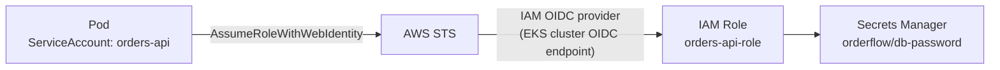

# Phase 9 — EKS: The Platform Layer

> **AWS services introduced:** EKS, ALB Ingress Controller, EBS CSI Driver, IRSA, Karpenter | **Daily cost:** ~$9.60/day

---

## AWS services introduced

| Service | What it does | Why we need it |
|---|---|---|
| **EKS** | Managed Kubernetes | Kubernetes control plane managed by AWS |
| **EKS Fargate profiles** | Serverless Kubernetes nodes | Run pods without managing EC2 node groups |
| **ALB Ingress Controller** | Kubernetes ingress via ALB | Routes external traffic to Kubernetes services |
| **EBS CSI Driver** | Persistent volumes on EKS | Provision EBS volumes for stateful workloads |
| **AWS Load Balancer Controller** | ALB/NLB from Kubernetes | Manages ALB resources from Kubernetes manifests |

## The problem

OrderFlow has grown. What started as one team with one service is now four teams working on five services. ECS is operationally simple but does not scale well for multi-team environments:
- No namespace-based isolation between teams
- No standard way to define service-to-service policies
- Each new service requires manual ECS infrastructure setup
- No self-service deployment without IAM changes

Kubernetes solves the multi-team problem with namespaces, RBAC, NetworkPolicies, and a standard deployment model that any engineer can learn once and apply everywhere.

## What moves to EKS

Not everything. Lambda functions stay Lambda. RDS stays RDS. S3 stays S3. What moves is the **long-running API services** that need the Kubernetes feature set:

| Workload | Before | After |
|---|---|---|
| Orders API | ECS Service | EKS Deployment |
| Inventory Service | ECS Service | EKS Deployment |
| Warehouse Notifier | ECS Service | EKS Deployment |
| Report Generator | Lambda | Lambda (unchanged) |
| Email Sender | Lambda | Lambda (unchanged) |
| Static Assets | CloudFront/S3 | CloudFront/S3 (unchanged) |

## Challenges

1. Provision an EKS cluster with Terraform. Use managed node groups (not Fargate profiles for the core API — Fargate on EKS has limitations around DaemonSets and storage).
2. Install the AWS Load Balancer Controller via Helm. This controller watches Kubernetes `Ingress` resources and creates ALBs in AWS automatically.
3. Deploy the Orders API as a Helm chart. Configure the `Ingress` with ALB annotations. Confirm external traffic routes through.
4. Configure IRSA (IAM Roles for Service Accounts) — the Kubernetes equivalent of ECS task roles. The Orders API pod gets an IAM role that can read from Secrets Manager. Other pods cannot.
5. Set up cluster autoscaler or Karpenter (Karpenter is preferred — it provisions the right instance type for the workload rather than scaling a fixed node group).
6. Apply NetworkPolicies: default-deny-all in the `orderflow` namespace, then explicit allow rules between services.

## AWS concept: IRSA



IRSA binds a Kubernetes ServiceAccount to an IAM role. The binding is verified by the EKS OIDC provider. No credentials in environment variables. No shared instance profiles. One IAM role per service.

## Outcome

All long-running services run on EKS with namespace isolation, RBAC, and NetworkPolicies. Each service has its own IAM role via IRSA. New services are deployed with `helm install` — no manual AWS console work.

## Cost breakdown

| Resource | $/day |
|---|---|
| 2× NAT Gateway | $2.16 |
| EKS control plane | $2.40 |
| 2× EC2 t3.medium nodes | $2.00 |
| RDS + ElastiCache + ALB | $2.29 |
| CloudFront + S3 | ~$0.06 |
| **Total** | **~$8.91** |

```bash
cd terraform && terraform destroy -auto-approve
```

---

[Back to main README](../README.md) | [Next: Phase 10 — Observability](../phase-10-observability/README.md)
