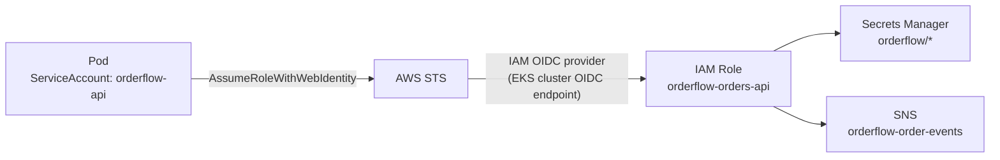

# Phase 9 — EKS: The Platform Layer

> **AWS services introduced:** EKS, ALB Ingress Controller, EBS CSI Driver, IRSA, Karpenter | **Daily cost:** ~$8.91/day

---

## AWS services introduced

| Service | What it does | Why we need it |
|---|---|---|
| **EKS** | Managed Kubernetes | Kubernetes control plane managed by AWS |
| **EKS managed node groups** | EC2-backed worker nodes | Run pods with full DaemonSet and storage support |
| **ALB Ingress Controller** | Kubernetes ingress via ALB | Routes external traffic to Kubernetes services |
| **EBS CSI Driver** | Persistent volumes on EKS | Provision EBS volumes for stateful workloads |
| **IRSA** | IAM Roles for Service Accounts | Per-pod IAM roles — no shared instance profiles |
| **Karpenter** | Just-in-time node provisioner | Provisions the right instance type for each workload |

## The problem

OrderFlow has grown. What started as one team with one service is now four teams working on five services. ECS is operationally simple but does not scale well for multi-team environments:
- No namespace-based isolation between teams
- No standard way to define service-to-service policies
- Each new service requires manual ECS infrastructure setup
- No self-service deployment without IAM changes

Kubernetes solves the multi-team problem with namespaces, RBAC, NetworkPolicies, and a standard deployment model that any engineer can learn once and apply everywhere.

## What moves to EKS

| Workload | Before | After |
|---|---|---|
| Orders API | ECS Service | EKS Deployment |
| Inventory Service | ECS Service | EKS Deployment |
| Warehouse Notifier | ECS Service | EKS Deployment |
| Report Generator | Lambda | Lambda (unchanged) |
| Email Sender | Lambda | Lambda (unchanged) |
| Static Assets | CloudFront/S3 | CloudFront/S3 (unchanged) |

---

## Challenges

### Challenge 1 — Provision the EKS cluster with Terraform

**Goal:** Create a production-grade EKS cluster with managed node groups across two AZs.

#### Step 1 — Create the Terraform file

Create `phase-9-eks/terraform/eks.tf`:

```hcl
# ── EKS Cluster ───────────────────────────────────────────────────────────────
resource "aws_eks_cluster" "orderflow" {
  name     = "orderflow"
  version  = "1.30"
  role_arn = aws_iam_role.eks_cluster.arn

  vpc_config {
    subnet_ids              = concat(var.private_subnet_ids, var.public_subnet_ids)
    endpoint_private_access = true
    endpoint_public_access  = true  # Restrict to your IP in production

    public_access_cidrs = ["0.0.0.0/0"]
  }

  # Enable envelope encryption for Kubernetes secrets at rest
  encryption_config {
    provider {
      key_arn = aws_kms_key.eks.arn
    }
    resources = ["secrets"]
  }

  enabled_cluster_log_types = ["api", "audit", "authenticator"]

  depends_on = [
    aws_iam_role_policy_attachment.eks_cluster_policy,
    aws_cloudwatch_log_group.eks,
  ]

  tags = { Name = "orderflow" }
}

resource "aws_cloudwatch_log_group" "eks" {
  name              = "/aws/eks/orderflow/cluster"
  retention_in_days = 7
}

resource "aws_kms_key" "eks" {
  description             = "EKS secrets encryption"
  deletion_window_in_days = 7
  enable_key_rotation     = true
  tags                    = { Name = "orderflow-eks" }
}

# ── IAM: cluster role ─────────────────────────────────────────────────────────
resource "aws_iam_role" "eks_cluster" {
  name = "orderflow-eks-cluster"

  assume_role_policy = jsonencode({
    Version = "2012-10-17"
    Statement = [{
      Effect    = "Allow"
      Action    = "sts:AssumeRole"
      Principal = { Service = "eks.amazonaws.com" }
    }]
  })
}

resource "aws_iam_role_policy_attachment" "eks_cluster_policy" {
  role       = aws_iam_role.eks_cluster.name
  policy_arn = "arn:aws:iam::aws:policy/AmazonEKSClusterPolicy"
}

# ── Managed node group ────────────────────────────────────────────────────────
resource "aws_eks_node_group" "core" {
  cluster_name    = aws_eks_cluster.orderflow.name
  node_group_name = "core"
  node_role_arn   = aws_iam_role.eks_node.arn
  subnet_ids      = var.private_subnet_ids  # Nodes in private subnets

  instance_types = ["t3.medium"]

  scaling_config {
    desired_size = 2
    min_size     = 2
    max_size     = 6
  }

  update_config {
    max_unavailable = 1
  }

  # Use the latest EKS-optimized AMI
  release_version = data.aws_eks_addon_version.latest["eks-node"].version

  labels = {
    role = "core"
  }

  tags = { Name = "orderflow-core" }

  depends_on = [
    aws_iam_role_policy_attachment.eks_node_worker,
    aws_iam_role_policy_attachment.eks_node_cni,
    aws_iam_role_policy_attachment.eks_node_ecr,
  ]
}

# ── IAM: node role ────────────────────────────────────────────────────────────
resource "aws_iam_role" "eks_node" {
  name = "orderflow-eks-node"

  assume_role_policy = jsonencode({
    Version = "2012-10-17"
    Statement = [{
      Effect    = "Allow"
      Action    = "sts:AssumeRole"
      Principal = { Service = "ec2.amazonaws.com" }
    }]
  })
}

resource "aws_iam_role_policy_attachment" "eks_node_worker" {
  role       = aws_iam_role.eks_node.name
  policy_arn = "arn:aws:iam::aws:policy/AmazonEKSWorkerNodePolicy"
}

resource "aws_iam_role_policy_attachment" "eks_node_cni" {
  role       = aws_iam_role.eks_node.name
  policy_arn = "arn:aws:iam::aws:policy/AmazonEKS_CNI_Policy"
}

resource "aws_iam_role_policy_attachment" "eks_node_ecr" {
  role       = aws_iam_role.eks_node.name
  policy_arn = "arn:aws:iam::aws:policy/AmazonEC2ContainerRegistryReadOnly"
}

# ── EKS Add-ons ───────────────────────────────────────────────────────────────
resource "aws_eks_addon" "coredns" {
  cluster_name                = aws_eks_cluster.orderflow.name
  addon_name                  = "coredns"
  resolve_conflicts_on_create = "OVERWRITE"
}

resource "aws_eks_addon" "kube_proxy" {
  cluster_name                = aws_eks_cluster.orderflow.name
  addon_name                  = "kube-proxy"
  resolve_conflicts_on_create = "OVERWRITE"
}

resource "aws_eks_addon" "vpc_cni" {
  cluster_name                = aws_eks_cluster.orderflow.name
  addon_name                  = "vpc-cni"
  resolve_conflicts_on_create = "OVERWRITE"
}

resource "aws_eks_addon" "ebs_csi" {
  cluster_name             = aws_eks_cluster.orderflow.name
  addon_name               = "aws-ebs-csi-driver"
  service_account_role_arn = aws_iam_role.ebs_csi.arn
  resolve_conflicts_on_create = "OVERWRITE"
}

# IRSA role for EBS CSI driver
resource "aws_iam_role" "ebs_csi" {
  name = "orderflow-ebs-csi"

  assume_role_policy = jsonencode({
    Version = "2012-10-17"
    Statement = [{
      Effect = "Allow"
      Action = "sts:AssumeRoleWithWebIdentity"
      Principal = {
        Federated = aws_iam_openid_connect_provider.eks.arn
      }
      Condition = {
        StringEquals = {
          "${replace(aws_iam_openid_connect_provider.eks.url, "https://", "")}:sub" = "system:serviceaccount:kube-system:ebs-csi-controller-sa"
          "${replace(aws_iam_openid_connect_provider.eks.url, "https://", "")}:aud" = "sts.amazonaws.com"
        }
      }
    }]
  })
}

resource "aws_iam_role_policy_attachment" "ebs_csi" {
  role       = aws_iam_role.ebs_csi.name
  policy_arn = "arn:aws:iam::aws:policy/service-role/AmazonEBSCSIDriverPolicy"
}

# ── OIDC provider for IRSA ────────────────────────────────────────────────────
data "tls_certificate" "eks" {
  url = aws_eks_cluster.orderflow.identity[0].oidc[0].issuer
}

resource "aws_iam_openid_connect_provider" "eks" {
  client_id_list  = ["sts.amazonaws.com"]
  thumbprint_list = [data.tls_certificate.eks.certificates[0].sha1_fingerprint]
  url             = aws_eks_cluster.orderflow.identity[0].oidc[0].issuer
}

output "cluster_name" {
  value = aws_eks_cluster.orderflow.name
}

output "cluster_endpoint" {
  value = aws_eks_cluster.orderflow.endpoint
}

output "oidc_provider_arn" {
  value = aws_iam_openid_connect_provider.eks.arn
}
```

#### Step 2 — Apply

```bash
cd phase-9-eks/terraform
terraform init
terraform apply -auto-approve
```

EKS takes 10–15 minutes to provision. Expected output (excerpt):

```
aws_eks_cluster.orderflow: Still creating... [10m0s elapsed]
aws_eks_cluster.orderflow: Creation complete after 12m34s

Outputs:
cluster_name     = "orderflow"
cluster_endpoint = "https://ABCDEF1234567890.gr7.us-east-1.eks.amazonaws.com"
```

#### Step 3 — Configure kubectl

```bash
aws eks update-kubeconfig \
  --region us-east-1 \
  --name orderflow

# Verify connectivity
kubectl get nodes
```

Expected:

```
NAME                          STATUS   ROLES    AGE   VERSION
ip-10-0-1-101.ec2.internal    Ready    <none>   2m    v1.30.2-eks-1234567
ip-10-0-2-102.ec2.internal    Ready    <none>   2m    v1.30.2-eks-1234567
```

```bash
# Verify add-ons
kubectl get pods -n kube-system
```

Expected — all pods Running:

```
NAME                       READY   STATUS    RESTARTS   AGE
coredns-xxx                1/1     Running   0          2m
coredns-yyy                1/1     Running   0          2m
aws-node-xxx               1/1     Running   0          2m
kube-proxy-xxx             1/1     Running   0          2m
ebs-csi-controller-xxx     2/2     Running   0          1m
```

---

### Challenge 2 — Install the AWS Load Balancer Controller

**Goal:** Install the controller that watches Kubernetes `Ingress` resources and creates ALBs in AWS automatically.

#### Step 1 — Create the IRSA role for the controller

Create `phase-9-eks/terraform/alb_controller.tf`:

```hcl
# Download the IAM policy from AWS
data "http" "alb_controller_policy" {
  url = "https://raw.githubusercontent.com/kubernetes-sigs/aws-load-balancer-controller/v2.7.2/docs/install/iam_policy.json"
}

resource "aws_iam_policy" "alb_controller" {
  name   = "AWSLoadBalancerControllerIAMPolicy"
  policy = data.http.alb_controller_policy.response_body
}

resource "aws_iam_role" "alb_controller" {
  name = "orderflow-alb-controller"

  assume_role_policy = jsonencode({
    Version = "2012-10-17"
    Statement = [{
      Effect = "Allow"
      Action = "sts:AssumeRoleWithWebIdentity"
      Principal = {
        Federated = aws_iam_openid_connect_provider.eks.arn
      }
      Condition = {
        StringEquals = {
          "${replace(aws_iam_openid_connect_provider.eks.url, "https://", "")}:sub" = "system:serviceaccount:kube-system:aws-load-balancer-controller"
          "${replace(aws_iam_openid_connect_provider.eks.url, "https://", "")}:aud" = "sts.amazonaws.com"
        }
      }
    }]
  })
}

resource "aws_iam_role_policy_attachment" "alb_controller" {
  role       = aws_iam_role.alb_controller.name
  policy_arn = aws_iam_policy.alb_controller.arn
}

output "alb_controller_role_arn" {
  value = aws_iam_role.alb_controller.arn
}
```

Apply:

```bash
terraform apply -auto-approve
```

#### Step 2 — Install via Helm

```bash
# Add the Helm repo
helm repo add eks https://aws.github.io/eks-charts
helm repo update

ALB_ROLE_ARN=$(terraform output -raw alb_controller_role_arn)
CLUSTER_NAME=$(terraform output -raw cluster_name)

# Install the controller
helm install aws-load-balancer-controller eks/aws-load-balancer-controller \
  -n kube-system \
  --set clusterName="${CLUSTER_NAME}" \
  --set serviceAccount.create=true \
  --set serviceAccount.name=aws-load-balancer-controller \
  --set serviceAccount.annotations."eks\.amazonaws\.com/role-arn"="${ALB_ROLE_ARN}" \
  --set region=us-east-1 \
  --set vpcId=$(terraform output -raw vpc_id)
```

#### Step 3 — Verify the controller is running

```bash
kubectl get deployment -n kube-system aws-load-balancer-controller
```

Expected:

```
NAME                           READY   UP-TO-DATE   AVAILABLE
aws-load-balancer-controller   2/2     2            2
```

```bash
kubectl logs -n kube-system \
  -l app.kubernetes.io/name=aws-load-balancer-controller \
  --tail=10
```

Expected (no errors):

```
{"level":"info","ts":"...","msg":"Starting EventSource","kind":"Ingress"}
{"level":"info","ts":"...","msg":"Starting workers"}
```

#### Step 4 — Tag the subnets (required for ALB controller)

The controller discovers subnets by tag. Add these tags in Terraform to your public subnets (for internet-facing ALBs):

```hcl
# In your VPC/subnet Terraform (phase-1-foundations/terraform/vpc.tf)
# Add to public subnet tags:
tags = {
  "kubernetes.io/role/elb"                    = "1"
  "kubernetes.io/cluster/orderflow"           = "shared"
}

# Add to private subnet tags:
tags = {
  "kubernetes.io/role/internal-elb"           = "1"
  "kubernetes.io/cluster/orderflow"           = "shared"
}
```

Apply the tag changes:

```bash
cd phase-1-foundations/terraform
terraform apply -auto-approve
```

---

### Challenge 3 — Deploy the Orders API as a Helm chart

**Goal:** Package the OrderFlow app as a Helm chart, deploy to the `orderflow` namespace, and expose it via an ALB-backed Ingress.

#### Step 1 — Create the Helm chart structure

```bash
mkdir -p phase-9-eks/helm/orderflow/{templates,}

cat > phase-9-eks/helm/orderflow/Chart.yaml <<'EOF'
apiVersion: v2
name: orderflow
description: OrderFlow Orders API
type: application
version: 0.1.0
appVersion: "1.0.0"
EOF

cat > phase-9-eks/helm/orderflow/values.yaml <<'EOF'
image:
  repository: 123456789012.dkr.ecr.us-east-1.amazonaws.com/orderflow
  tag: latest
  pullPolicy: Always

replicaCount: 2

service:
  type: ClusterIP
  port: 3000

ingress:
  enabled: true
  scheme: internet-facing
  certificateArn: ""      # ACM cert ARN — set via --set or values override
  subnets: ""             # Comma-separated public subnet IDs

resources:
  requests:
    cpu: 250m
    memory: 256Mi
  limits:
    cpu: 500m
    memory: 512Mi

env:
  NODE_ENV: production
  PORT: "3000"
  AWS_REGION: us-east-1

secrets:
  databaseUrlSecretArn: ""
  redisUrlSecretArn: ""
  cognitoUserPoolIdSecretArn: ""
  cognitoClientIdSecretArn: ""
  orderEventsTopicArnSecretArn: ""

serviceAccount:
  name: orderflow-api
  roleArn: ""   # IRSA role ARN — set in Challenge 4
EOF
```

Create `phase-9-eks/helm/orderflow/templates/deployment.yaml`:

```yaml
apiVersion: apps/v1
kind: Deployment
metadata:
  name: {{ .Release.Name }}
  namespace: {{ .Release.Namespace }}
  labels:
    app: {{ .Release.Name }}
spec:
  replicas: {{ .Values.replicaCount }}
  selector:
    matchLabels:
      app: {{ .Release.Name }}
  template:
    metadata:
      labels:
        app: {{ .Release.Name }}
    spec:
      serviceAccountName: {{ .Values.serviceAccount.name }}
      containers:
        - name: api
          image: "{{ .Values.image.repository }}:{{ .Values.image.tag }}"
          imagePullPolicy: {{ .Values.image.pullPolicy }}
          ports:
            - containerPort: 3000
          env:
            - name: NODE_ENV
              value: {{ .Values.env.NODE_ENV | quote }}
            - name: PORT
              value: {{ .Values.env.PORT | quote }}
            - name: AWS_REGION
              value: {{ .Values.env.AWS_REGION | quote }}
          envFrom: []
          # Secrets injected via AWS Secrets Manager CSI driver (see IRSA challenge)
          resources:
            {{- toYaml .Values.resources | nindent 12 }}
          livenessProbe:
            httpGet:
              path: /health
              port: 3000
            initialDelaySeconds: 15
            periodSeconds: 20
          readinessProbe:
            httpGet:
              path: /health
              port: 3000
            initialDelaySeconds: 5
            periodSeconds: 10
      terminationGracePeriodSeconds: 30
```

Create `phase-9-eks/helm/orderflow/templates/service.yaml`:

```yaml
apiVersion: v1
kind: Service
metadata:
  name: {{ .Release.Name }}
  namespace: {{ .Release.Namespace }}
spec:
  type: {{ .Values.service.type }}
  selector:
    app: {{ .Release.Name }}
  ports:
    - port: {{ .Values.service.port }}
      targetPort: 3000
      protocol: TCP
```

Create `phase-9-eks/helm/orderflow/templates/ingress.yaml`:

```yaml
{{- if .Values.ingress.enabled }}
apiVersion: networking.k8s.io/v1
kind: Ingress
metadata:
  name: {{ .Release.Name }}
  namespace: {{ .Release.Namespace }}
  annotations:
    kubernetes.io/ingress.class: alb
    alb.ingress.kubernetes.io/scheme: {{ .Values.ingress.scheme }}
    alb.ingress.kubernetes.io/target-type: ip
    alb.ingress.kubernetes.io/listen-ports: '[{"HTTPS":443},{"HTTP":80}]'
    alb.ingress.kubernetes.io/ssl-redirect: "443"
    alb.ingress.kubernetes.io/certificate-arn: {{ .Values.ingress.certificateArn | quote }}
    alb.ingress.kubernetes.io/subnets: {{ .Values.ingress.subnets | quote }}
    alb.ingress.kubernetes.io/healthcheck-path: /health
    alb.ingress.kubernetes.io/healthcheck-interval-seconds: "30"
spec:
  rules:
    - http:
        paths:
          - path: /
            pathType: Prefix
            backend:
              service:
                name: {{ .Release.Name }}
                port:
                  number: {{ .Values.service.port }}
{{- end }}
```

Create `phase-9-eks/helm/orderflow/templates/serviceaccount.yaml`:

```yaml
apiVersion: v1
kind: ServiceAccount
metadata:
  name: {{ .Values.serviceAccount.name }}
  namespace: {{ .Release.Namespace }}
  {{- if .Values.serviceAccount.roleArn }}
  annotations:
    eks.amazonaws.com/role-arn: {{ .Values.serviceAccount.roleArn | quote }}
  {{- end }}
```

#### Step 2 — Create the namespace and deploy

```bash
kubectl create namespace orderflow

CERT_ARN="arn:aws:acm:us-east-1:123456789012:certificate/your-cert-id"
PUBLIC_SUBNETS="subnet-aaaa1111,subnet-bbbb2222"
ECR_REGISTRY="123456789012.dkr.ecr.us-east-1.amazonaws.com"

helm install orderflow phase-9-eks/helm/orderflow \
  --namespace orderflow \
  --set image.repository="${ECR_REGISTRY}/orderflow" \
  --set image.tag="$(git rev-parse --short HEAD)" \
  --set ingress.certificateArn="${CERT_ARN}" \
  --set ingress.subnets="${PUBLIC_SUBNETS}"
```

#### Step 3 — Watch the deployment and ALB provisioning

```bash
# Watch pods come up
kubectl rollout status deployment/orderflow -n orderflow

# Watch for the ALB to be provisioned (takes ~2 minutes)
kubectl get ingress -n orderflow -w
```

Expected:

```
NAME        CLASS   HOSTS   ADDRESS                                                    PORTS   AGE
orderflow   alb     *       k8s-orderflow-xxx.us-east-1.elb.amazonaws.com              80      2m
```

Test the endpoint:

```bash
ALB_URL=$(kubectl get ingress orderflow -n orderflow \
  -o jsonpath='{.status.loadBalancer.ingress[0].hostname}')

curl -si "https://${ALB_URL}/health" | head -5
```

Expected:

```
HTTP/2 200
{"status":"ok","db":"ok","uptime":42.1}
```

---

### Challenge 4 — IRSA: per-pod IAM roles

**Goal:** Give the Orders API pod an IAM role that can read from Secrets Manager. Other pods in the cluster get no access.

#### Step 1 — Create the IRSA role in Terraform

Create `phase-9-eks/terraform/irsa_orders.tf`:

```hcl
locals {
  oidc_host = replace(aws_iam_openid_connect_provider.eks.url, "https://", "")
}

resource "aws_iam_role" "orders_api" {
  name = "orderflow-orders-api"

  assume_role_policy = jsonencode({
    Version = "2012-10-17"
    Statement = [{
      Effect = "Allow"
      Action = "sts:AssumeRoleWithWebIdentity"
      Principal = {
        Federated = aws_iam_openid_connect_provider.eks.arn
      }
      Condition = {
        StringEquals = {
          # Scope to exact namespace + service account
          "${local.oidc_host}:sub" = "system:serviceaccount:orderflow:orderflow-api"
          "${local.oidc_host}:aud" = "sts.amazonaws.com"
        }
      }
    }]
  })
}

data "aws_iam_policy_document" "orders_api" {
  # Read secrets scoped to orderflow/* only
  statement {
    effect    = "Allow"
    actions   = ["secretsmanager:GetSecretValue", "secretsmanager:DescribeSecret"]
    resources = [
      "arn:aws:secretsmanager:${var.aws_region}:${data.aws_caller_identity.current.account_id}:secret:orderflow/*"
    ]
  }

  # Publish to SNS order events topic
  statement {
    effect    = "Allow"
    actions   = ["sns:Publish"]
    resources = [var.order_events_topic_arn]
  }

  # Upload to S3 uploads bucket
  statement {
    effect    = "Allow"
    actions   = ["s3:PutObject", "s3:GetObject"]
    resources = ["${var.uploads_bucket_arn}/*"]
  }
}

resource "aws_iam_role_policy" "orders_api" {
  name   = "orders-api"
  role   = aws_iam_role.orders_api.id
  policy = data.aws_iam_policy_document.orders_api.json
}

output "orders_api_role_arn" {
  value = aws_iam_role.orders_api.arn
}
```

Apply:

```bash
terraform apply -auto-approve
```

#### Step 2 — Upgrade the Helm release with the role ARN

```bash
ROLE_ARN=$(terraform output -raw orders_api_role_arn)

helm upgrade orderflow phase-9-eks/helm/orderflow \
  --namespace orderflow \
  --reuse-values \
  --set serviceAccount.roleArn="${ROLE_ARN}"
```

The pod restarts. The ServiceAccount now has the IRSA annotation, and the kubelet injects temporary AWS credentials via a projected token volume.

#### Step 3 — Verify IRSA is working

```bash
# Exec into the running pod
POD=$(kubectl get pod -n orderflow -l app=orderflow -o jsonpath='{.items[0].metadata.name}')

kubectl exec -n orderflow "$POD" -- \
  aws sts get-caller-identity --output json
```

Expected — the role should match `orderflow-orders-api`:

```json
{
  "UserId": "AROAEXAMPLE:eks-orderflow-...",
  "Account": "123456789012",
  "Arn": "arn:aws:iam::123456789012:role/orderflow-orders-api"
}
```

Confirm that a pod in a different namespace cannot access the secrets:

```bash
# Launch a debug pod in default namespace (no IRSA)
kubectl run debug --image=amazon/aws-cli --restart=Never -- sleep 600

kubectl exec debug -- \
  aws secretsmanager get-secret-value \
  --secret-id orderflow/database-url 2>&1
```

Expected:

```
An error occurred (AccessDeniedException) when calling the GetSecretValue operation
```

Clean up:

```bash
kubectl delete pod debug
```

---

### Challenge 5 — Karpenter for just-in-time node provisioning

**Goal:** Replace fixed-size node groups with Karpenter, which provisions the right instance type for each workload on demand.

#### Step 1 — Create Karpenter IAM role and SQS queue

Create `phase-9-eks/terraform/karpenter.tf`:

```hcl
# Karpenter needs to listen for spot interruption events
resource "aws_sqs_queue" "karpenter_interruption" {
  name                      = "karpenter-orderflow"
  message_retention_seconds = 300
  sqs_managed_sse_enabled   = true
}

resource "aws_sqs_queue_policy" "karpenter_interruption" {
  queue_url = aws_sqs_queue.karpenter_interruption.url

  policy = jsonencode({
    Version = "2012-10-17"
    Statement = [
      {
        Effect    = "Allow"
        Principal = { Service = ["events.amazonaws.com", "sqs.amazonaws.com"] }
        Action    = "sqs:SendMessage"
        Resource  = aws_sqs_queue.karpenter_interruption.arn
      }
    ]
  })
}

# IRSA role for Karpenter controller
resource "aws_iam_role" "karpenter_controller" {
  name = "karpenter-controller-orderflow"

  assume_role_policy = jsonencode({
    Version = "2012-10-17"
    Statement = [{
      Effect = "Allow"
      Action = "sts:AssumeRoleWithWebIdentity"
      Principal = {
        Federated = aws_iam_openid_connect_provider.eks.arn
      }
      Condition = {
        StringEquals = {
          "${local.oidc_host}:sub" = "system:serviceaccount:karpenter:karpenter"
          "${local.oidc_host}:aud" = "sts.amazonaws.com"
        }
      }
    }]
  })
}

# Attach the Karpenter controller policy (manage EC2 instances)
resource "aws_iam_role_policy" "karpenter_controller" {
  name = "karpenter-controller"
  role = aws_iam_role.karpenter_controller.id

  policy = jsonencode({
    Version = "2012-10-17"
    Statement = [
      {
        Effect = "Allow"
        Action = [
          "ec2:CreateLaunchTemplate", "ec2:DeleteLaunchTemplate",
          "ec2:CreateFleet", "ec2:RunInstances", "ec2:CreateTags",
          "ec2:TerminateInstances", "ec2:DescribeInstances",
          "ec2:DescribeInstanceTypes", "ec2:DescribeLaunchTemplates",
          "ec2:DescribeSecurityGroups", "ec2:DescribeSubnets",
          "ec2:DescribeImages", "ec2:DescribeSpotPriceHistory",
          "iam:PassRole", "iam:CreateInstanceProfile",
          "iam:TagInstanceProfile", "iam:AddRoleToInstanceProfile",
          "iam:RemoveRoleFromInstanceProfile", "iam:DeleteInstanceProfile",
          "iam:GetInstanceProfile",
          "eks:DescribeCluster",
          "sqs:DeleteMessage", "sqs:GetQueueAttributes",
          "sqs:GetQueueUrl", "sqs:ReceiveMessage",
          "pricing:GetProducts", "ec2:DescribeAvailabilityZones",
        ]
        Resource = "*"
      }
    ]
  })
}

# Node IAM role (Karpenter-managed nodes assume this)
resource "aws_iam_role" "karpenter_node" {
  name = "karpenter-node-orderflow"

  assume_role_policy = jsonencode({
    Version = "2012-10-17"
    Statement = [{
      Effect    = "Allow"
      Action    = "sts:AssumeRole"
      Principal = { Service = "ec2.amazonaws.com" }
    }]
  })
}

resource "aws_iam_role_policy_attachment" "karpenter_node_worker" {
  role       = aws_iam_role.karpenter_node.name
  policy_arn = "arn:aws:iam::aws:policy/AmazonEKSWorkerNodePolicy"
}

resource "aws_iam_role_policy_attachment" "karpenter_node_cni" {
  role       = aws_iam_role.karpenter_node.name
  policy_arn = "arn:aws:iam::aws:policy/AmazonEKS_CNI_Policy"
}

resource "aws_iam_role_policy_attachment" "karpenter_node_ecr" {
  role       = aws_iam_role.karpenter_node.name
  policy_arn = "arn:aws:iam::aws:policy/AmazonEC2ContainerRegistryReadOnly"
}

resource "aws_iam_instance_profile" "karpenter_node" {
  name = "karpenter-node-orderflow"
  role = aws_iam_role.karpenter_node.name
}

output "karpenter_controller_role_arn" {
  value = aws_iam_role.karpenter_controller.arn
}

output "karpenter_node_role_arn" {
  value = aws_iam_role.karpenter_node.arn
}

output "karpenter_interruption_queue_name" {
  value = aws_sqs_queue.karpenter_interruption.name
}
```

Apply:

```bash
terraform apply -auto-approve
```

#### Step 2 — Install Karpenter via Helm

```bash
KARPENTER_VERSION="v0.37.0"
CLUSTER_NAME=$(terraform output -raw cluster_name)
CONTROLLER_ROLE=$(terraform output -raw karpenter_controller_role_arn)
INTERRUPTION_QUEUE=$(terraform output -raw karpenter_interruption_queue_name)

helm upgrade --install karpenter oci://public.ecr.aws/karpenter/karpenter \
  --version "${KARPENTER_VERSION}" \
  --namespace karpenter \
  --create-namespace \
  --set settings.clusterName="${CLUSTER_NAME}" \
  --set settings.interruptionQueue="${INTERRUPTION_QUEUE}" \
  --set serviceAccount.annotations."eks\.amazonaws\.com/role-arn"="${CONTROLLER_ROLE}" \
  --wait
```

#### Step 3 — Create a NodePool

Create `phase-9-eks/manifests/karpenter-nodepool.yaml`:

```yaml
apiVersion: karpenter.sh/v1beta1
kind: NodePool
metadata:
  name: default
spec:
  template:
    spec:
      nodeClassRef:
        apiVersion: karpenter.k8s.aws/v1beta1
        kind: EC2NodeClass
        name: default
      requirements:
        - key: karpenter.sh/capacity-type
          operator: In
          values: ["spot", "on-demand"]
        - key: kubernetes.io/arch
          operator: In
          values: ["amd64"]
        - key: node.kubernetes.io/instance-type
          operator: In
          values: ["t3.medium", "t3.large", "t3a.medium", "t3a.large"]
  limits:
    cpu: 20       # Maximum total CPU across all Karpenter nodes
  disruption:
    consolidationPolicy: WhenUnderutilized
    consolidateAfter: 30s
---
apiVersion: karpenter.k8s.aws/v1beta1
kind: EC2NodeClass
metadata:
  name: default
spec:
  amiFamily: AL2
  role: "karpenter-node-orderflow"
  subnetSelectorTerms:
    - tags:
        kubernetes.io/cluster/orderflow: shared
        kubernetes.io/role/internal-elb: "1"
  securityGroupSelectorTerms:
    - tags:
        aws:eks:cluster-name: orderflow
  tags:
    Name: karpenter-node-orderflow
```

Apply:

```bash
kubectl apply -f phase-9-eks/manifests/karpenter-nodepool.yaml
```

#### Step 4 — Test autoscaling

Scale the deployment to trigger node provisioning:

```bash
kubectl scale deployment orderflow -n orderflow --replicas=10

# Watch Karpenter provision a new node
kubectl get nodes -w
```

Expected — a new node appears within ~60 seconds:

```
NAME                          STATUS   ROLES    AGE   VERSION
ip-10-0-1-101.ec2.internal    Ready    <none>   20m   v1.30.2-eks-...
ip-10-0-2-102.ec2.internal    Ready    <none>   20m   v1.30.2-eks-...
ip-10-0-1-200.ec2.internal    Ready    <none>   45s   v1.30.2-eks-...  ← Karpenter node
```

Scale back down — Karpenter consolidates and terminates the node:

```bash
kubectl scale deployment orderflow -n orderflow --replicas=2
# Karpenter removes the underutilized node within ~30s
```

---

### Challenge 6 — NetworkPolicies: default-deny, explicit allow

**Goal:** Apply a default-deny-all NetworkPolicy in the `orderflow` namespace. Then add explicit allow rules so services can communicate with each other and with RDS/Redis, but not with arbitrary pods.

#### Step 1 — Apply default-deny-all

Create `phase-9-eks/manifests/network-policies.yaml`:

```yaml
# ── Default deny: all ingress and egress blocked in orderflow namespace ────────
apiVersion: networking.k8s.io/v1
kind: NetworkPolicy
metadata:
  name: default-deny-all
  namespace: orderflow
spec:
  podSelector: {}       # Applies to ALL pods in the namespace
  policyTypes:
    - Ingress
    - Egress
---
# ── Allow: ALB to reach the Orders API on port 3000 ──────────────────────────
apiVersion: networking.k8s.io/v1
kind: NetworkPolicy
metadata:
  name: allow-alb-ingress
  namespace: orderflow
spec:
  podSelector:
    matchLabels:
      app: orderflow
  policyTypes:
    - Ingress
  ingress:
    - ports:
        - port: 3000
          protocol: TCP
      # ALB uses node IPs — allow from VPC CIDR
      from:
        - ipBlock:
            cidr: 10.0.0.0/8
---
# ── Allow: Orders API egress to RDS (5432) and Redis (6379) ──────────────────
apiVersion: networking.k8s.io/v1
kind: NetworkPolicy
metadata:
  name: allow-orders-api-egress
  namespace: orderflow
spec:
  podSelector:
    matchLabels:
      app: orderflow
  policyTypes:
    - Egress
  egress:
    # RDS and Redis (private subnets in VPC)
    - to:
        - ipBlock:
            cidr: 10.0.0.0/8
      ports:
        - port: 5432   # PostgreSQL
        - port: 6379   # Redis
    # AWS API calls (Secrets Manager, SNS, STS) via HTTPS
    - to:
        - ipBlock:
            cidr: 0.0.0.0/0
            except:
              - 10.0.0.0/8   # Only external — internal handled above
      ports:
        - port: 443
    # DNS (CoreDNS in kube-system)
    - to:
        - namespaceSelector:
            matchLabels:
              kubernetes.io/metadata.name: kube-system
      ports:
        - port: 53
          protocol: UDP
        - port: 53
          protocol: TCP
```

Apply:

```bash
kubectl apply -f phase-9-eks/manifests/network-policies.yaml
```

#### Step 2 — Verify isolation

```bash
# Deploy a rogue pod in the orderflow namespace
kubectl run rogue --image=alpine -n orderflow -- sleep 600

# The rogue pod cannot reach the Orders API
kubectl exec -n orderflow rogue -- \
  wget -qO- --timeout=5 http://orderflow:3000/health 2>&1
```

Expected:

```
wget: download timed out
```

The API pod is not reachable from an unlabelled pod — even within the same namespace.

```bash
# The Orders API itself can still reach RDS
POD=$(kubectl get pod -n orderflow -l app=orderflow -o jsonpath='{.items[0].metadata.name}')

kubectl exec -n orderflow "$POD" -- \
  curl -s http://localhost:3000/health | jq .db
```

Expected: `"ok"` (DB connection works through the allow rule).

Clean up:

```bash
kubectl delete pod rogue -n orderflow
```

---

## AWS concept: IRSA



IRSA binds a Kubernetes ServiceAccount to an IAM role. The binding is verified by the EKS OIDC provider — the same mechanism as GitHub Actions OIDC in Phase 4. No credentials in environment variables. No shared instance profiles. One IAM role per service.

## Outcome

All long-running services run on EKS with namespace isolation, RBAC, and NetworkPolicies. Each service has its own IAM role via IRSA. New services are deployed with `helm install` — no manual AWS console work.

## Cost breakdown

| Resource | $/day |
|---|---|
| NAT instance (t2.micro, free tier) | ~$0 |
| EKS control plane | $2.40 |
| 2× EC2 t3.small nodes | $1.00 |
| RDS db.t3.micro + ElastiCache + ALB | $1.07 |
| CloudFront + S3 | ~$0.06 |
| **Total** | **~$4.53** |

> Free-tier optimizations: NAT instance replaces $2.16/day NAT Gateway pair; t3.small nodes ($0.021/hr) replace t3.medium ($0.042/hr). Complete this phase within 2 days to keep total cost under $10.

---

[Back to main README](../README.md) | [Next: Phase 10 — Observability](../phase-10-observability/README.md)
